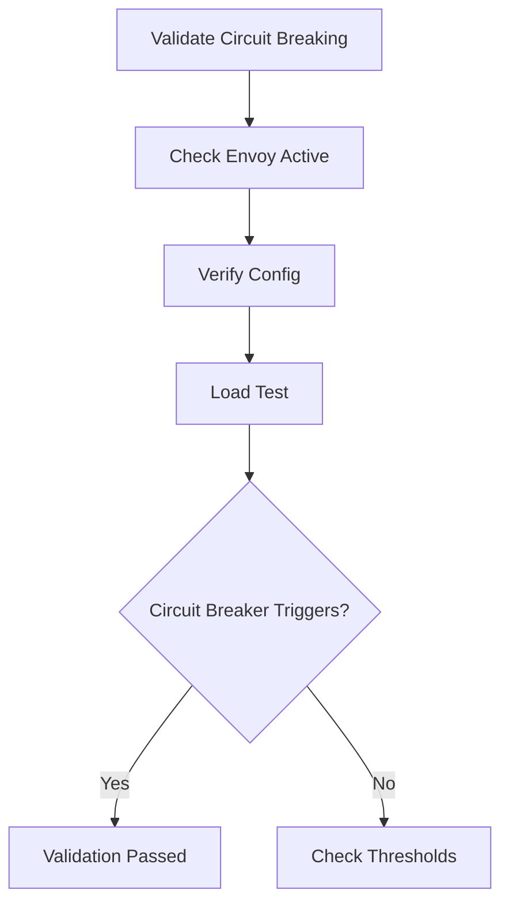

# Validating Cilium L7 Circuit Breaking Configuration

Author: [nawazdhandala](https://github.com/nawazdhandala)

Tags: Cilium, Kubernetes, L7, Circuit Breaking, Validation

Description: How to validate that Cilium L7 circuit breaking is correctly configured and functioning to protect backend services from overload.

---

## Introduction

Validating L7 circuit breaking ensures that your services are protected from cascading failures. Validation confirms that Envoy is in the traffic path, circuit breaker thresholds are configured, and the circuit breaker triggers under the expected conditions.

## Prerequisites

- Kubernetes cluster with Cilium and Envoy proxy enabled
- kubectl and Cilium CLI configured
- A test application to generate load

## Validating Envoy Proxy Activation

```bash
# Confirm Envoy is enabled
cilium status | grep "L7 Proxy"

# Verify Envoy is handling traffic for the target service
hubble observe --protocol http -n default --to-pod default/backend --last 10

# Check Envoy listeners
kubectl exec -n kube-system <cilium-pod> -- \
  curl -s localhost:9901/listeners
```

## Validating Circuit Breaker Configuration

```bash
# Check Envoy cluster configuration
kubectl exec -n kube-system <cilium-pod> -- \
  curl -s localhost:9901/config_dump | \
  jq '.configs[] | select(.["@type"] | contains("ClustersConfigDump"))'

# Check circuit breaker stats
kubectl exec -n kube-system <cilium-pod> -- \
  curl -s localhost:9901/stats | grep "circuit_breakers"
```

## Load Testing to Validate Triggering

```bash
# Generate load to trigger circuit breaking
kubectl run load-test --image=busybox:1.36 --restart=Never -- sh -c '
  for i in $(seq 1 1000); do
    wget -qO- --timeout=1 http://backend:8080/ &
  done
  wait
'

# Check if circuit breaker triggered
kubectl exec -n kube-system <cilium-pod> -- \
  curl -s localhost:9901/stats | grep "upstream_cx_overflow"
```



## Verification

```bash
cilium status
kubectl exec -n kube-system <cilium-pod> -- \
  curl -s localhost:9901/stats | grep overflow
kubectl delete pod load-test 2>/dev/null
```

## Troubleshooting

- **Envoy not active**: Enable with `--set l7Proxy=true`.
- **No circuit breaker stats**: Traffic may not be going through Envoy. Add L7 rules to your policy.
- **Circuit breaker does not trigger under load**: Thresholds may be too high. Reduce them for testing.

## Conclusion

Validate circuit breaking by confirming Envoy is active, checking configuration, and running load tests to verify triggering. This ensures your services have effective protection against cascading failures.