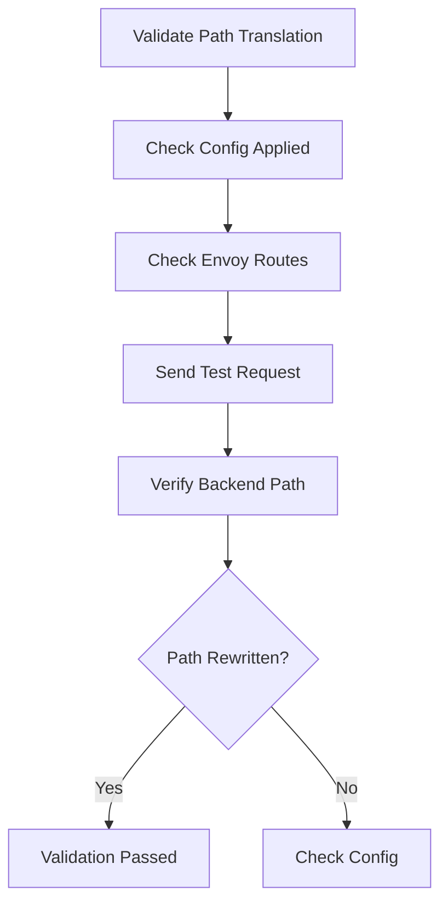

# Validating Cilium L7 Path Translation Configuration

Author: [nawazdhandala](https://github.com/nawazdhandala)

Tags: Cilium, Kubernetes, L7, Validation, Envoy

Description: How to validate that Cilium L7 path translation is correctly rewriting HTTP request paths between services.

---

## Introduction

Validating path translation ensures that HTTP requests are rewritten correctly as they pass through the Cilium Envoy proxy. Validation should confirm the CiliumEnvoyConfig is applied, routes are active in Envoy, and actual requests receive the expected path transformation.

## Prerequisites

- Kubernetes cluster with Cilium and L7 proxy enabled
- CiliumEnvoyConfig applied
- kubectl configured

## Validating Configuration Acceptance

```bash
#!/bin/bash
echo "=== Path Translation Validation ==="

# Check CiliumEnvoyConfig exists
CONFIGS=$(kubectl get ciliumenvoyconfigs -n default --no-headers 2>/dev/null | wc -l)
if [ "$CONFIGS" -gt 0 ]; then
  echo "PASS: $CONFIGS CiliumEnvoyConfig(s) found"
else
  echo "FAIL: No CiliumEnvoyConfig found"
fi

# Check Envoy is running
ENVOY=$(cilium status 2>/dev/null | grep -c "L7 Proxy.*enabled")
if [ "$ENVOY" -gt 0 ]; then
  echo "PASS: L7 Proxy enabled"
else
  echo "FAIL: L7 Proxy not enabled"
fi
```

## Validating Path Rewriting

```bash
# Send request with original path and verify backend receives rewritten path
kubectl exec deploy/client -- \
  curl -s http://backend-service:8080/api/v2/test -H "X-Trace: validate"

# Check backend logs for the received path
kubectl logs deploy/backend-service --tail=5 | grep "X-Trace: validate"
```



## Verification

```bash
kubectl get ciliumenvoyconfigs -n default
hubble observe --protocol http -n default --last 5
```

## Troubleshooting

- **Config exists but routes not active**: Restart Cilium agent to force Envoy reconfiguration.
- **Backend receives original path**: The route match may not be matching. Check path patterns.
- **Validation test shows 404**: The rewritten path may not exist on the backend.

## Conclusion

Validate path translation end-to-end: check configuration acceptance, verify Envoy routes, and test with actual HTTP requests. This confirms the translation works correctly before routing production traffic.