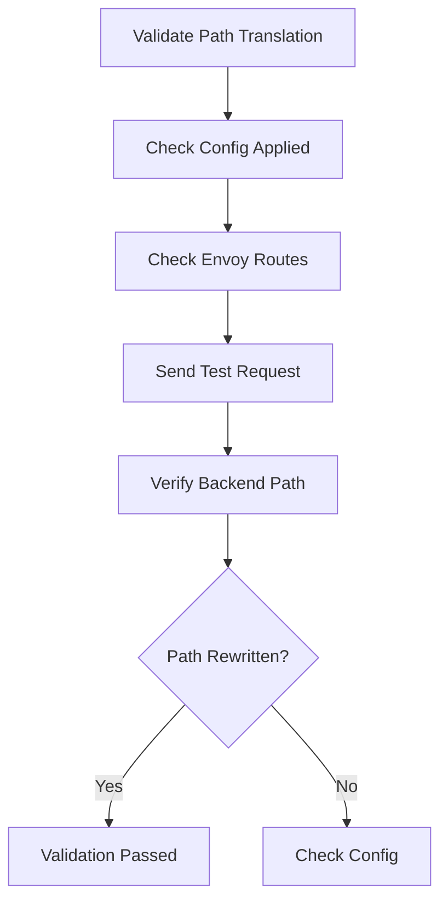

# Validating Cilium L7 Path Translation Configuration

Author: [nawazdhandala](https://github.com/nawazdhandala)

Tags: Cilium, Kubernetes, L7, Validation, Envoy

Description: How to validate that Cilium L7 path translation is correctly rewriting HTTP request paths between services.

---

## Introduction

Validating path translation ensures that HTTP requests are rewritten correctly as they pass through the Cilium Envoy proxy. Validation should confirm the CiliumEnvoyConfig is applied, routes are active in Envoy, and actual requests receive the expected path transformation.

## Prerequisites

- Kubernetes cluster with Cilium and L7 proxy enabled
- CiliumEnvoyConfig or CiliumClusterwideEnvoyConfig applied
- kubectl configured
- Hubble CLI installed, if using Hubble for HTTP flow verification

## Validating Configuration Acceptance

```bash
#!/bin/bash
echo "=== Path Translation Validation ==="

# Check Cilium Envoy config exists

CEC=$(kubectl get ciliumenvoyconfigs.cilium.io -A -o name 2>/dev/null | wc -l)
CCEC=$(kubectl get ciliumclusterwideenvoyconfigs.cilium.io -o name 2>/dev/null | wc -l)
CONFIGS=$((CEC + CCEC))
if [ "$CONFIGS" -gt 0 ]; then
  echo "PASS: $CONFIGS Cilium Envoy config resource(s) found"
else
  echo "FAIL: No Cilium Envoy config resources found"
fi

# Check Envoy is running
ENVOY=$(kubectl -n kube-system exec ds/cilium -c cilium-agent -- \
  cilium-dbg status --verbose 2>/dev/null | grep -c "Proxy Status:.*OK")
if [ "$ENVOY" -gt 0 ]; then
  echo "PASS: Cilium proxy status is OK"
else
  echo "FAIL: Cilium proxy status is not OK"
fi

# Check Envoy routes include the rewrite configuration
kubectl -n kube-system exec ds/cilium -c cilium-agent -- \
  cilium-dbg envoy admin config routes | grep -E "/api/v2|prefix_rewrite|prefixRewrite|regex_rewrite|regexRewrite"
```

## Validating Path Rewriting

```bash
# Send request with original path and verify backend receives rewritten path
kubectl exec deploy/client -- \
  curl -s http://backend-service:8080/api/v2/test -H "X-Trace: validate"

# Check backend logs for the received path
kubectl logs deploy/backend-service --tail=20 | \
  grep "X-Trace: validate" | grep "/expected/rewritten/path"
```


```mermaid
graph TD
    A[Validate Path Translation] --> B[Check Config Applied]
    B --> C[Check Envoy Routes]
    C --> D[Send Test Request]
    D --> E[Verify Backend Path]
    E --> F{Path Rewritten?}
    F -->|Yes| G[Validation Passed]
    F -->|No| H[Check Config]
```

## Verification

```bash
kubectl get ciliumenvoyconfigs -n default
hubble observe --protocol http -n default --last 5
```

## Troubleshooting

- **Config exists but routes not active**: Check Cilium agent logs for CiliumEnvoyConfig parsing or installation errors, then inspect Envoy routes with `cilium-dbg envoy admin config routes`.
- **Backend receives original path**: The route match may not be matching. Check path patterns.
- **Validation test shows 404**: The rewritten path may not exist on the backend.

## Conclusion

Validate path translation end-to-end: check configuration acceptance, verify Envoy routes, and test with actual HTTP requests. This confirms the translation works correctly before routing production traffic.
