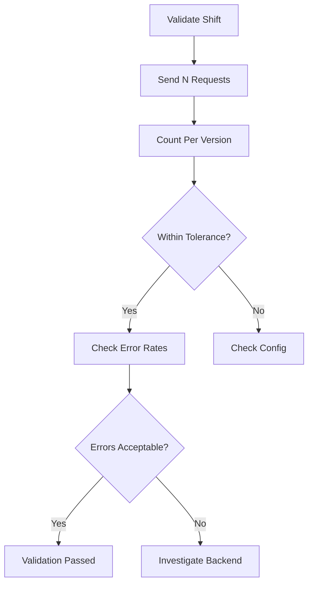

# Validating Cilium L7 Traffic Shifting

Author: [nawazdhandala](https://github.com/nawazdhandala)

Tags: Cilium, Kubernetes, L7, Traffic Shifting, Validation

Description: How to validate that Cilium L7 traffic shifting correctly distributes traffic between service versions according to configured weights.

---

## Introduction

Validating traffic shifting confirms that the configured weights are being respected in practice. Validation should test with sufficient request volume to overcome statistical variance and verify both that the split is correct and that responses from both backends are healthy.

## Prerequisites

- Kubernetes cluster with Cilium L7 traffic shifting configured
- kubectl configured
- Both service versions deployed and healthy

## Validating Weight Distribution

```bash
#!/bin/bash
# validate-traffic-shift.sh

echo "=== Traffic Shift Validation ==="
TOTAL=500

echo "Sending $TOTAL requests..."
for i in $(seq 1 $TOTAL); do
  kubectl exec deploy/client -- \
    curl -s http://backend/ -H "Host: backend" 2>/dev/null
done > /tmp/shift-results.txt

V1_COUNT=$(grep -c "v1" /tmp/shift-results.txt || echo 0)
V2_COUNT=$(grep -c "v2" /tmp/shift-results.txt || echo 0)

echo "v1: $V1_COUNT ($((V1_COUNT * 100 / TOTAL))%)"
echo "v2: $V2_COUNT ($((V2_COUNT * 100 / TOTAL))%)"
```

## Validating Backend Health

```bash
# Check both backends are responding correctly
kubectl exec deploy/client -- curl -s http://backend-v1/ | head -5
kubectl exec deploy/client -- curl -s http://backend-v2/ | head -5

# Check for errors
hubble observe --protocol http --to-label app=backend \
  --http-status 500-599 --last 20
```



## Verification

```bash
kubectl get ciliumenvoyconfigs -n default
kubectl get pods -l app=backend
```

## Troubleshooting

- **Distribution far from expected**: Test with more requests. 500+ needed for reasonable accuracy.
- **One version returns errors**: Check that version's deployment and readiness.
- **Cannot distinguish versions**: Add version-specific response headers to your backends.

## Conclusion

Validate traffic shifting with sufficient request volume and check both distribution accuracy and error rates. Automate validation as part of your canary deployment pipeline.