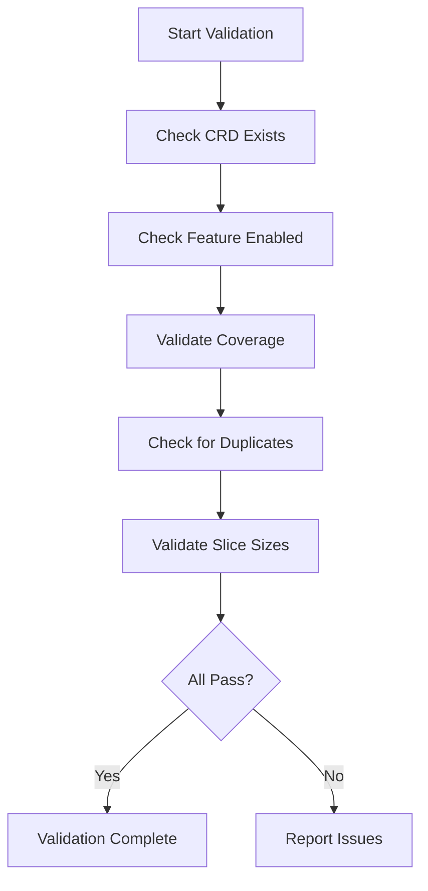

# Validating CiliumEndpointSlice Configuration and Health

Author: [nawazdhandala](https://github.com/nawazdhandala)

Tags: Cilium, Kubernetes, Validation, EndpointSlice, Networking

Description: How to validate CiliumEndpointSlice resources to ensure proper endpoint batching, data consistency, and correctness in large Kubernetes clusters.

---

## Introduction

CiliumEndpointSlice validation ensures endpoint batching works correctly and no endpoints are lost or stale. CES validation must check the relationship between individual endpoints and their slice representation, confirm the operator maintains slices correctly, and verify downstream consumers see a consistent view.

Validation is especially important after Cilium upgrades, operator restarts, or CES configuration changes.

This guide provides comprehensive validation checks for CES resources.

## Prerequisites

- Kubernetes cluster with Cilium and CES enabled
- kubectl and Cilium CLI configured
- jq installed for JSON processing

## Validating CES Feature Enablement

```bash
# Check the CRD is established
kubectl get crd ciliumendpointslices.cilium.io \
  -o jsonpath='{.status.conditions[?(@.type=="Established")].status}'

# Check Cilium configuration
kubectl get configmap cilium-config -n kube-system \
  -o jsonpath='{.data.enable-cilium-endpoint-slice}'
```

## Validating Endpoint Coverage

```bash
#!/bin/bash
# validate-ces-coverage.sh

echo "=== CES Coverage Validation ==="

CEP_NAMES=$(kubectl get ciliumendpoints --all-namespaces \
  -o jsonpath='{.items[*].metadata.name}' | tr ' ' '\n' | sort)
CEP_COUNT=$(echo "$CEP_NAMES" | wc -l)

CES_NAMES=$(kubectl get ciliumendpointslices --all-namespaces -o json | \
  jq -r '[.items[].endpoints[]?.name] | sort | .[]')
CES_EP_COUNT=$(echo "$CES_NAMES" | wc -l)

echo "Individual CiliumEndpoints: $CEP_COUNT"
echo "Endpoints in CiliumEndpointSlices: $CES_EP_COUNT"

DUPES=$(echo "$CES_NAMES" | sort | uniq -d)
if [ -n "$DUPES" ]; then
  echo "FAIL: Duplicate endpoints found in slices"
else
  echo "PASS: No duplicate endpoints in slices"
fi
```



## Validating Slice Size Distribution

```bash
# Show distribution of endpoints per slice
kubectl get ciliumendpointslices --all-namespaces -o json | \
  jq '[.items[] | {name: .metadata.name, count: (.endpoints // [] | length)}] |
  sort_by(.count) | reverse | .[:10]'

# Check for empty slices
kubectl get ciliumendpointslices --all-namespaces -o json | \
  jq '[.items[] | select((.endpoints // []) | length == 0)] | length'
```

## Validating Data Consistency

```bash
#!/bin/bash
# validate-ces-data.sh - Sample endpoints and compare

SAMPLE=$(kubectl get ciliumendpoints -n default \
  -o jsonpath='{.items[:3].metadata.name}')

for ep in $SAMPLE; do
  CEP_ID=$(kubectl get ciliumendpoint "$ep" -n default \
    -o jsonpath='{.status.identity.id}')
  CES_ID=$(kubectl get ciliumendpointslices --all-namespaces -o json | \
    jq -r --arg name "$ep" \
    '.items[].endpoints[]? | select(.name == $name) | .identityID')
  if [ "$CEP_ID" = "$CES_ID" ]; then
    echo "PASS: $ep identity matches (ID: $CEP_ID)"
  else
    echo "FAIL: $ep identity mismatch (CEP: $CEP_ID, CES: $CES_ID)"
  fi
done
```

## Verification

```bash
cilium status
echo "CES total: $(kubectl get ciliumendpointslices --all-namespaces -o json | \
  jq '[.items[].endpoints[]?] | length')"
echo "CEP total: $(kubectl get ciliumendpoints --all-namespaces --no-headers | wc -l)"
```

## Troubleshooting

- **Missing endpoints in slices**: Operator may be behind on reconciliation. Wait or restart operator.
- **Empty slices persist**: Check operator logs for GC errors.
- **Data consistency failures**: Restart operator and re-validate.
- **Large variance in slice sizes**: Normal during scaling events. Re-validate after stabilization.

## Conclusion

Validating CiliumEndpointSlice ensures the scalability optimization works correctly without losing endpoint data. Run coverage checks after upgrades and data consistency checks during audits.