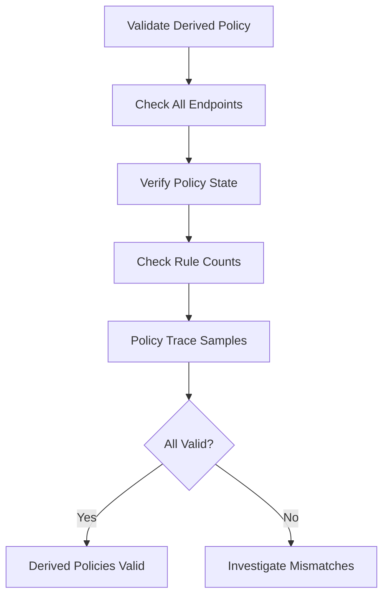

# Validating Derived Policy Creation in Cilium

Author: [nawazdhandala](https://github.com/nawazdhandala)

Tags: Cilium, Kubernetes, Derived Policy, Validation, Security

Description: How to validate that Cilium correctly creates derived policies from CiliumNetworkPolicy definitions for each endpoint in the cluster.

---

## Introduction

Validating derived policy creation confirms that every endpoint with matching policies has the correct effective rules computed. This validation catches cases where policies are not being applied, where the merge produces unexpected results, or where datapath rules are stale.

## Prerequisites

- Kubernetes cluster with Cilium and policies applied
- kubectl and Cilium CLI configured

## Validating Policy Application

```bash
#!/bin/bash
echo "=== Derived Policy Validation ==="

# Check every endpoint has policy state
cilium endpoint list -o json | jq '.[] | {
  id: .id,
  state: .status.state,
  policy_enabled: (.status.policy != null),
  ingress_enforcing: .status.policy.spec."policy-enabled",
  identity: .status.identity.id
}' | jq 'select(.policy_enabled != true)'
```

## Validating Policy Correctness

```bash
# For each endpoint, verify the derived policy includes expected rules
for ep in $(cilium endpoint list -o json | jq -r '.[].id'); do
  INGRESS=$(cilium endpoint get "$ep" -o json | \
    jq '.status.policy.realized."allowed-ingress-identities" // [] | length')
  EGRESS=$(cilium endpoint get "$ep" -o json | \
    jq '.status.policy.realized."allowed-egress-identities" // [] | length')
  STATE=$(cilium endpoint get "$ep" -o json | jq -r '.status.state')
  
  if [ "$STATE" = "ready" ]; then
    echo "OK: Endpoint $ep - ingress:$INGRESS egress:$EGRESS"
  else
    echo "WARN: Endpoint $ep in state $STATE"
  fi
done
```



## Verification

```bash
cilium endpoint list
cilium policy get
```

## Troubleshooting

- **Endpoints without policy state**: Agent may not have processed the policy yet. Wait and re-check.
- **Unexpected rule counts**: Multiple policies may be matching. Review all policies for the endpoint.
- **Endpoints not ready**: Check agent logs for regeneration errors.

## Conclusion

Validate derived policy creation by checking every endpoint has policy state, verifying rule counts match expectations, and using policy trace for sample connections. This ensures your security policies are effective in the datapath.