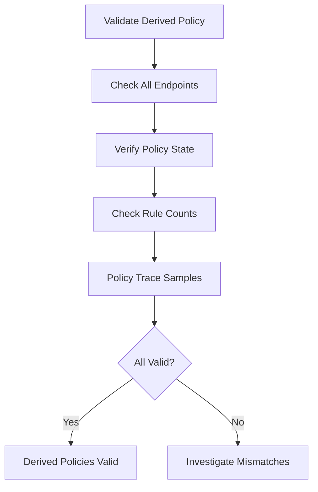

# Validating Derived Policy Creation in Cilium

Author: [nawazdhandala](https://github.com/nawazdhandala)

Tags: Cilium, Kubernetes, Derived Policy, Validation, Security

Description: How to validate that Cilium correctly creates derived policies from CiliumNetworkPolicy definitions for each endpoint in the cluster.

---

## Introduction

Validating derived policy creation confirms that every endpoint with matching policies has the correct effective rules computed. This validation catches cases where policies are not being applied, where the merge produces unexpected results, or where datapath rules are stale.

## Prerequisites

- Kubernetes cluster with Cilium and policies applied
- kubectl configured with access to the cilium-agent pods

## Validating Policy Application

```bash
#!/bin/bash
echo "=== Derived Policy Validation ==="

# Check every endpoint on every Cilium agent has policy state

kubectl -n kube-system get pods -l k8s-app=cilium -o name | while read -r agent; do
  kubectl -n kube-system exec "$agent" -- cilium-dbg endpoint list -o json | \
    jq --arg agent "$agent" '.[] | {
      agent: $agent,
      id: .id,
      state: .status.state,
      desired_policy: (.status.policy.spec."policy-enabled" // "unknown"),
      realized_policy: (.status.policy.realized."policy-enabled" // "unknown"),
      identity: .status.identity.id
    } | select(.desired_policy == "unknown" or .realized_policy == "unknown")'
done
```

## Validating Policy Correctness

```bash
# For each endpoint, verify the derived policy includes expected rules
kubectl -n kube-system get pods -l k8s-app=cilium -o name | while read -r agent; do
  for ep in $(kubectl -n kube-system exec "$agent" -- cilium-dbg endpoint list -o json | jq -r '.[].id'); do
    ENDPOINT_JSON=$(kubectl -n kube-system exec "$agent" -- cilium-dbg endpoint get "$ep" -o json)
    INGRESS=$(printf '%s' "$ENDPOINT_JSON" | \
      jq '.status.policy.realized."allowed-ingress-identities" // [] | length')
    EGRESS=$(printf '%s' "$ENDPOINT_JSON" | \
      jq '.status.policy.realized."allowed-egress-identities" // [] | length')
    STATE=$(printf '%s' "$ENDPOINT_JSON" | jq -r '.status.state')
  
    if [ "$STATE" = "ready" ]; then
      echo "OK: $agent endpoint $ep - ingress:$INGRESS egress:$EGRESS"
    else
      echo "WARN: $agent endpoint $ep in state $STATE"
    fi
  done
done
```


```mermaid
graph TD
    A[Validate Derived Policy] --> B[Check All Endpoints]
    B --> C[Verify Policy State]
    C --> D[Check Rule Counts]
    D --> E[Policy Trace Samples]
    E --> F{All Valid?}
    F -->|Yes| G[Derived Policies Valid]
    F -->|No| H[Investigate Mismatches]
```

## Verification

```bash
kubectl get ciliumendpoints --all-namespaces
kubectl -n kube-system exec ds/cilium -- cilium-dbg bpf policy get --all
```

## Troubleshooting

- **Endpoints without policy state**: Agent may not have processed the policy yet. Wait and re-check.
- **Unexpected rule counts**: Multiple policies may be matching. Review all policies for the endpoint.
- **Endpoints not ready**: Check agent logs for regeneration errors.

## Conclusion

Validate derived policy creation by checking every endpoint has policy state, verifying rule counts match expectations, and using policy trace for sample connections. This ensures your security policies are effective in the datapath.
