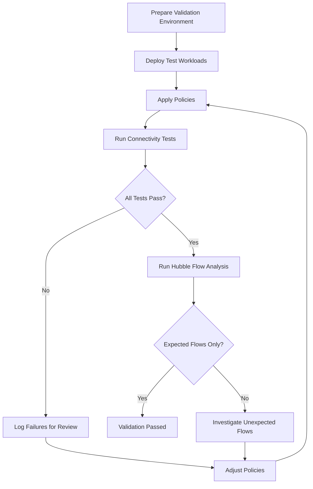

# Validating Policy Audit Mode Disabling in Cilium

Author: [nawazdhandala](https://github.com/nawazdhandala)

Tags: Cilium, Kubernetes, Network Security, Security Auditing, Validation, Policy Audit

Description: Learn how to validate audit mode transition in Cilium for Kubernetes. This guide covers practical testing procedures with real examples and commands.

---

## Introduction

Validating audit mode transition in Cilium ensures that your security policies are enforced correctly and that your cluster behaves as expected. Without proper validation, policy gaps may go undetected until they are exploited.

A robust validation strategy combines automated testing, flow observation, and policy state inspection. This guide provides a structured approach to validating your enforcement mode activation across different scenarios.

By integrating these validation steps into your deployment workflow, you can catch misconfigurations early and maintain confidence in your security posture.

## Prerequisites

- Kubernetes cluster with Cilium (v1.14+) installed
- `cilium` CLI and Hubble CLI available
- `kubectl` access to the cluster
- A staging or test namespace for validation
- Familiarity with CiliumNetworkPolicy syntax

## Setting Up Validation Tests

Create a dedicated test environment for policy validation:

```bash
# Create a validation namespace

kubectl create namespace cilium-validate

# Deploy test workloads
kubectl -n cilium-validate run server \
  --image=nginx:1.25 --labels="app=server" --port=80
kubectl -n cilium-validate expose pod server --port=80

kubectl -n cilium-validate run client \
  --image=busybox:1.36 --labels="app=client" \
  --command -- sleep 3600
```



## Validating Policy Enforcement

Disable daemon-level audit mode, apply the policy, and verify it is enforced:

```bash
CILIUM_NAMESPACE=kube-system

kubectl patch -n "$CILIUM_NAMESPACE" configmap cilium-config \
  --type merge --patch '{"data":{"policy-audit-mode":"false"}}'
kubectl -n "$CILIUM_NAMESPACE" rollout restart ds/cilium
kubectl -n "$CILIUM_NAMESPACE" rollout status ds/cilium
```

```yaml
# Test policy for validation
apiVersion: "cilium.io/v2"
kind: CiliumNetworkPolicy
metadata:
  name: enforce-mode-policy
  namespace: cilium-validate
spec:
  endpointSelector:
    matchLabels:
      app: server
  ingress:
    - fromEndpoints:
        - matchLabels:
            app: client
      toPorts:
        - ports:
            - port: "80"
              protocol: TCP
```

```bash
# Validate all endpoints have policies applied
kubectl -n cilium-validate get ciliumendpoints -o json | \
  jq '.items[] | {name: .metadata.name, policy: .status.policy}'
```

### Running Connectivity Tests

```bash
# Run Cilium connectivity test suite
cilium connectivity test
```

### Observing Flows with Hubble

```bash
# Monitor all flows in the validation namespace
hubble observe --namespace cilium-validate --output compact --last 50

# Verify allowed traffic succeeds
kubectl -n cilium-validate exec client -- \
  wget --timeout=5 -q -O - http://server

# Verify unauthorized traffic is blocked
kubectl -n cilium-validate run unauthorized \
  --image=busybox:1.36 --rm -it --restart=Never \
  --labels="app=unauthorized" -- \
  wget --timeout=3 -q -O - http://server

# Check Hubble for the expected drop
hubble observe --namespace cilium-validate --verdict DROPPED --last 10
```

## Automated Validation Script

```bash
#!/bin/bash
# validate-cilium.sh
# Automated validation script for Cilium policies

set -euo pipefail

NAMESPACE="cilium-validate"
PASS=0
FAIL=0

echo "=== Cilium Policy Validation ==="

# Test 1: Cilium agent health
echo -n "Test 1: Cilium agent health... "
if cilium status > /dev/null 2>&1; then
  echo "PASS"; ((PASS+=1))
else
  echo "FAIL"; ((FAIL+=1))
fi

# Test 2: All endpoints ready
echo -n "Test 2: All endpoints ready... "
NOT_READY=$(kubectl -n "$NAMESPACE" get ciliumendpoints -o json | \
  jq '[.items[] | select(.status.state != "ready")] | length')
if [ "$NOT_READY" -eq 0 ]; then
  echo "PASS"; ((PASS+=1))
else
  echo "FAIL ($NOT_READY not ready)"; ((FAIL+=1))
fi

# Test 3: Policies applied
echo -n "Test 3: Policies applied... "
POLICY_COUNT=$(kubectl -n "$NAMESPACE" get cnp -o json | jq '.items | length')
if [ "$POLICY_COUNT" -gt 0 ]; then
  echo "PASS ($POLICY_COUNT policies)"; ((PASS+=1))
else
  echo "FAIL (no policies)"; ((FAIL+=1))
fi

echo ""
echo "Results: $PASS passed, $FAIL failed"
exit $FAIL
```


### Compliance Documentation and Evidence Collection

Maintaining proper documentation of your audit findings is critical for compliance frameworks such as SOC 2, ISO 27001, and PCI DSS. Generate structured evidence that maps to specific control requirements.

```bash
# Generate a timestamped evidence package
EVIDENCE_DIR="audit-evidence-$(date +%Y%m%d)"
mkdir -p "$EVIDENCE_DIR"

# Capture policy state as evidence
kubectl get cnp --all-namespaces -o yaml > "$EVIDENCE_DIR/all-policies.yaml"
kubectl get ccnp -o yaml > "$EVIDENCE_DIR/clusterwide-policies.yaml"

# Capture endpoint security state
kubectl get ciliumendpoints --all-namespaces -o json > "$EVIDENCE_DIR/endpoint-state.json"

# Capture identity mappings
kubectl get ciliumidentities -o json > "$EVIDENCE_DIR/identities.json"

# Capture Cilium configuration
cilium config view > "$EVIDENCE_DIR/cilium-config.txt"

# Generate a summary for auditors
echo "Audit Evidence Generated: $(date -u)" > "$EVIDENCE_DIR/summary.txt"
echo "Policies: $(kubectl get cnp -A --no-headers | wc -l)" >> "$EVIDENCE_DIR/summary.txt"
echo "Endpoints: $(kubectl get ciliumendpoints -A -o json | jq '.items | length')" >> "$EVIDENCE_DIR/summary.txt"

tar -czf "$EVIDENCE_DIR.tar.gz" "$EVIDENCE_DIR"
echo "Evidence package created: $EVIDENCE_DIR.tar.gz"
```

Store audit evidence in a tamper-proof location with proper access controls. Retain evidence according to your organization's data retention policies, typically for a minimum of one year for most compliance frameworks.

## Verification

```bash
# Final validation check
cilium status
```

```bash
# Confirm all Cilium endpoints in the validation namespace are ready
kubectl -n cilium-validate get ciliumendpoints
```

```bash
# Verify no policy violations
hubble observe --verdict DROPPED --last 20 --output compact
```

## Troubleshooting

- **Connectivity test failures**: Check if Hubble relay is running and if test pods have correct labels.
- **Validation namespace conflicts**: Ensure no pre-existing policies in the validation namespace interfere with tests.
- **Inconsistent test results**: Run tests multiple times to rule out timing issues with policy propagation.
- **Test pods stuck in Pending**: Verify cluster has sufficient resources and the test images are accessible.

## Conclusion

Validating audit mode transition in Cilium is an ongoing practice that should be embedded in your CI/CD pipeline. The combination of Cilium's connectivity tests, Hubble flow observation, and custom validation scripts provides comprehensive coverage. Regular validation catches configuration drift, policy regressions, and enforcement gaps before they impact production. Always maintain your validation test suite alongside your policy definitions.
