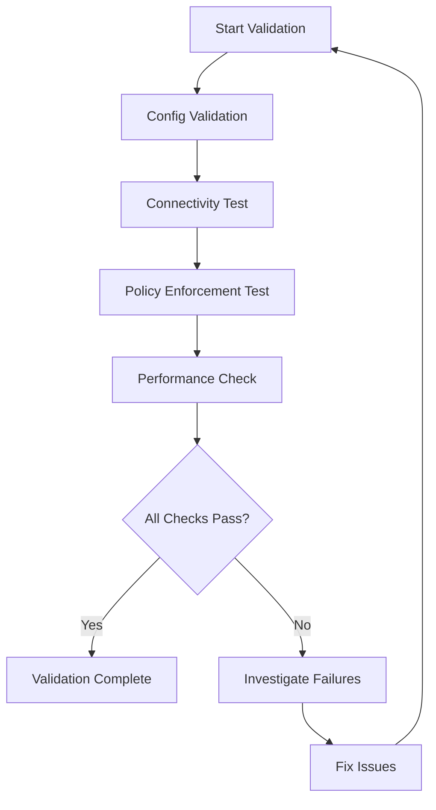

# How to Validate Helm template with serviceMonitor enabled fails in Cilium configuration

Author: [nawazdhandala](https://github.com/nawazdhandala)

Tags: Cilium, Helm, Monitoring, Configuration

Description: A practical guide covering how to validate helm template with servicemonitor enabled fails in cilium configuration with step-by-step instructions and real-world examples for production Kubernetes c...

---

## Introduction

The ServiceMonitor resource from the Prometheus Operator enables automatic discovery and scraping of Cilium metrics. However, Helm template rendering requires the ServiceMonitor CRDs to be present in the cluster.

In this guide, we cover Cilium Helm template and ServiceMonitor configuration in a Kubernetes environment. Cilium leverages eBPF technology to provide high-performance networking, security, and observability for cloud-native workloads. The eBPF programs are loaded directly into the Linux kernel, enabling efficient packet processing without the overhead of traditional iptables-based networking stacks.

Whether you are running a small development cluster or a large production environment with thousands of pods, the techniques in this guide will help you maintain a reliable Cilium deployment. We provide step-by-step instructions with real commands and configuration examples that you can adapt to your environment.

## Prerequisites

- A running Kubernetes cluster (v1.21+) with Cilium installed (v1.14+)
- `kubectl` configured for cluster access
- `cilium` CLI installed (matching your Cilium version)
- Helm 3.x for configuration management
- Basic familiarity with Kubernetes networking concepts
- Access to cluster nodes for troubleshooting (recommended)
- Prometheus and Grafana for metrics visualization (recommended)

## Validation Approach

Validation ensures that your configuration and deployment are working as intended. A thorough validation covers configuration correctness, functional behavior, and performance characteristics.

```bash
# Step 1: Validate Cilium configuration is applied correctly
cilium config view | head -30

# Step 2: Validate all agents are running and healthy
kubectl get pods -n kube-system -l k8s-app=cilium -o wide
cilium status --verbose
```

## Functional Validation

Test that Cilium is correctly providing networking, policy enforcement, and observability.

```bash
# Test basic connectivity between pods
cilium connectivity test --single-node

# For cross-node connectivity validation
cilium connectivity test

# Validate DNS resolution through Cilium
kubectl run dns-test --image=busybox:1.36 --rm -it --restart=Never -- nslookup kubernetes.default.svc.cluster.local

# Validate network policy enforcement
kubectl create namespace validation-test
kubectl run web --image=nginx:alpine -n validation-test --labels="app=web" --port=80
kubectl expose pod web -n validation-test --port=80
```

```yaml
# validation-policy.yaml
# Apply a test policy and verify enforcement
apiVersion: "cilium.io/v2"
kind: CiliumNetworkPolicy
metadata:
  name: validation-policy
  namespace: validation-test
spec:
  endpointSelector:
    matchLabels:
      app: web
  ingress:
    - fromEndpoints:
        - matchLabels:
            app: allowed-client
      toPorts:
        - ports:
            - port: "80"
              protocol: TCP
```

```bash
# Apply the test policy
kubectl apply -f validation-policy.yaml

# Test that allowed traffic works
kubectl run allowed --image=curlimages/curl -n validation-test --labels="app=allowed-client" --rm -it --restart=Never -- curl -s --max-time 5 http://web.validation-test.svc

# Test that denied traffic is blocked
kubectl run denied --image=curlimages/curl -n validation-test --labels="app=denied-client" --rm -it --restart=Never -- curl -s --max-time 5 http://web.validation-test.svc
# Expected: connection timeout
```

## Performance Validation

```bash
# Check endpoint count and identity management
cilium endpoint list | wc -l
cilium identity list | wc -l

# Verify metrics are being collected
cilium metrics list | head -10

# Check resource consumption is within expected bounds
kubectl top pods -n kube-system -l k8s-app=cilium

# Verify no packet drops
cilium metrics list | grep -E "drop|error"
```



## Cleanup

```bash
# Remove validation resources
kubectl delete namespace validation-test --ignore-not-found
```


## Verification

After completing the steps above, run a comprehensive verification to confirm everything is working as expected.

```bash
# Check overall Cilium deployment health
cilium status --verbose

# Verify inter-node connectivity
cilium health status

# Confirm all Cilium pods are running and ready
kubectl get pods -n kube-system -l k8s-app=cilium -o wide

# Verify the Cilium operator is healthy
kubectl get pods -n kube-system -l name=cilium-operator

# Check for recent error events
kubectl get events -n kube-system --sort-by='.lastTimestamp' | grep cilium | tail -10

# Run a connectivity test to validate the data plane
cilium connectivity test --single-node

# Verify endpoint count matches expected pod count
echo "Cilium endpoints: $(cilium endpoint list -o json 2>/dev/null | python3 -c 'import json,sys; print(len(json.load(sys.stdin)))' 2>/dev/null || echo 'N/A')"
```

## Troubleshooting

If you encounter issues during or after the steps in this guide, use the following troubleshooting procedures:

- **Cilium agent not starting**: Check resource limits and node capacity with `kubectl describe pod -n kube-system -l k8s-app=cilium`. Verify the BPF filesystem is mounted at `/sys/fs/bpf` and the kernel version is 4.19 or later. Check init container logs with `kubectl logs -n kube-system <pod> -c cilium-init`.

- **Connectivity failures**: Run `cilium connectivity test` and inspect the specific failing test case. Check for conflicting network policies with `cilium policy get`. Verify inter-node tunnel connectivity with `cilium bpf tunnel list`.

- **Configuration not applied**: Verify the Helm values or ConfigMap are correctly formatted. Run `kubectl rollout restart daemonset/cilium -n kube-system` and wait for the rollout to complete. Confirm with `cilium config view`.

- **High resource usage**: Review resource consumption with `kubectl top pods -n kube-system -l k8s-app=cilium`. Consider tuning label exclusion to reduce identity count. Increase agent memory limits if needed. Check `cilium metrics list | grep process_resident_memory`.

- **Endpoints stuck in regenerating state**: This usually indicates the agent is overloaded or encountering errors during BPF program compilation. Check agent logs with `kubectl logs -n kube-system -l k8s-app=cilium --tail=200 | grep -i error`.

- **Policy not being enforced**: Verify the policy selectors match the intended pods using `cilium endpoint list`. Confirm the policy is applied with `cilium policy get`. Check that the endpoint has the correct identity with `cilium endpoint get <id>`.

To collect a comprehensive diagnostic bundle for further analysis:

```bash
# Generate a Cilium sysdump containing all diagnostic information
# This collects logs, configs, BPF maps, and cluster state
cilium sysdump --output-filename cilium-diag-$(date +%Y%m%d)
```

## Conclusion

This guide covered Cilium Helm template and ServiceMonitor configuration with practical steps you can apply to your Kubernetes cluster. Regular monitoring, systematic validation, and proactive management are essential for maintaining a healthy Cilium deployment at any scale.

Key takeaways from this guide:

- Always assess the current state before making changes to your Cilium configuration
- Use Helm for configuration management to ensure consistency and reproducibility across environments
- Monitor Cilium metrics through Prometheus to detect issues before they impact workloads
- Test changes in a staging environment before applying them to production clusters
- Maintain runbooks documenting your Cilium configuration decisions and operational procedures
- Use `cilium sysdump` to collect comprehensive diagnostic data when investigating issues

As your cluster grows and evolves, revisit these configurations periodically and adjust them to match your current requirements. The Cilium community and documentation are excellent resources for staying current with best practices and new features.
