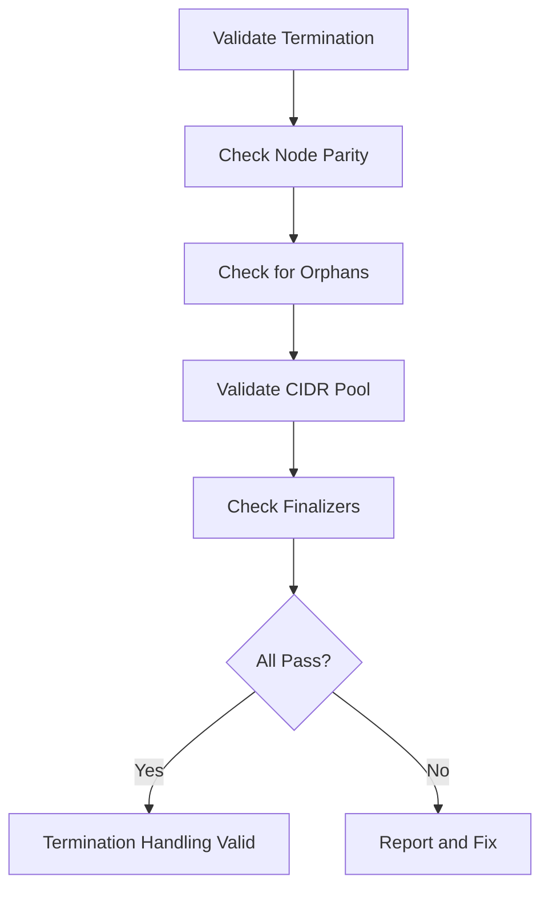

# Validating Node Termination Handling in Cilium IPAM

Author: [nawazdhandala](https://github.com/nawazdhandala)

Tags: Cilium, Kubernetes, IPAM, Validation, Node Management

Description: How to validate that Cilium IPAM properly handles node termination by cleaning up CiliumNodes, releasing CIDRs, and maintaining pool accuracy.

---

## Introduction

Validating node termination handling ensures that when nodes leave your cluster, their IP resources are properly reclaimed. This validation should be part of your regular operational checks, especially in environments with autoscaling where nodes are added and removed frequently.

The key validations are: CiliumNode count matches Kubernetes node count, no orphaned CiliumNode resources exist, CIDR pool has expected free space, and cleanup happens within expected timeframes.

## Prerequisites

- Kubernetes cluster with Cilium installed
- kubectl and jq configured
- Optional: ability to cordon/drain a test node

## Validating Node-CiliumNode Parity

```bash
#!/bin/bash
# validate-node-termination.sh

echo "=== Node Termination Validation ==="

NODE_COUNT=$(kubectl get nodes --no-headers | wc -l)
CN_COUNT=$(kubectl get ciliumnodes --no-headers | wc -l)

echo "Kubernetes nodes: $NODE_COUNT"
echo "CiliumNodes: $CN_COUNT"

if [ "$NODE_COUNT" -ne "$CN_COUNT" ]; then
  echo "FAIL: Node count mismatch"
  
  # Show orphans
  NODES=$(kubectl get nodes -o jsonpath='{.items[*].metadata.name}' | tr ' ' '\n' | sort)
  CNS=$(kubectl get ciliumnodes -o jsonpath='{.items[*].metadata.name}' | tr ' ' '\n' | sort)
  
  echo "Orphaned CiliumNodes:"
  comm -13 <(echo "$NODES") <(echo "$CNS")
else
  echo "PASS: Node counts match"
fi
```

## Validating CIDR Pool Integrity

```bash
# Verify all allocated CIDRs belong to active nodes
kubectl get ciliumnodes -o json | jq -r '.items[] | {
  name: .metadata.name,
  cidrs: .spec.ipam.podCIDRs
}'

# Check for CIDR overlaps
kubectl get ciliumnodes -o json | jq -r '
  [.items[].spec.ipam.podCIDRs[]?] | sort |
  . as $all | range(length - 1) |
  if $all[.] == $all[. + 1] then "DUPLICATE: \($all[.])" else empty end'
```



## Testing Termination Handling

```bash
# Simulate node termination by cordoning and draining
kubectl cordon <test-node>
kubectl drain <test-node> --ignore-daemonsets --delete-emptydir-data

# Wait for pods to reschedule
sleep 30

# Verify endpoints moved
kubectl get ciliumendpoints --all-namespaces \
  --field-selector spec.nodeName=<test-node> --no-headers | wc -l

# Uncordon to restore
kubectl uncordon <test-node>
```

## Verification

```bash
cilium status
echo "Nodes: $(kubectl get nodes --no-headers | wc -l)"
echo "CiliumNodes: $(kubectl get ciliumnodes --no-headers | wc -l)"
```

## Troubleshooting

- **Parity check fails**: Run the orphan cleanup script from the configuration guide.
- **CIDR duplicates found**: Serious issue. Delete the orphaned CiliumNode and restart operator.
- **Finalizers blocking deletion**: Patch to remove finalizers.
- **Drain test fails**: Check PodDisruptionBudgets that may prevent pod eviction.

## Conclusion

Regular validation of node termination handling prevents IP pool leaks. Check node-CiliumNode parity, verify CIDR pool integrity, and test termination handling periodically. These checks are especially important in autoscaling environments.