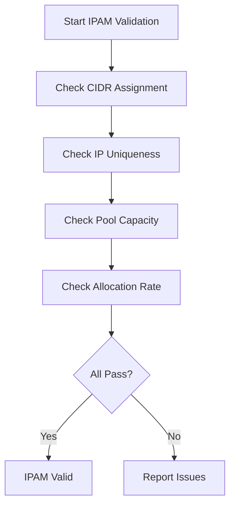

# Validating Cilium IPAM Operational Configuration

Author: [nawazdhandala](https://github.com/nawazdhandala)

Tags: Cilium, Kubernetes, IPAM, Validation, Networking

Description: How to validate Cilium IPAM operational settings including CIDR allocation, pool utilization, and IP assignment correctness for production clusters.

---

## Introduction

Validating Cilium IPAM configuration ensures that IP address allocation is working correctly, that there is sufficient capacity for growth, and that no conflicts or inconsistencies exist. IPAM validation is especially important before scaling events, after configuration changes, and as part of regular operational audits.

Key validation checks include verifying that every node has an assigned CIDR, that no IP addresses are duplicated, that pools have sufficient free space, and that the allocation rate can keep up with pod creation demands.

## Prerequisites

- Kubernetes cluster with Cilium installed
- kubectl and Cilium CLI configured
- jq installed for JSON processing

## Validating CIDR Assignment

```bash
#!/bin/bash
# validate-ipam-cidrs.sh

echo "=== IPAM CIDR Validation ==="

# Check every node has a CIDR
NODES=$(kubectl get nodes -o jsonpath='{.items[*].metadata.name}')
for node in $NODES; do
  CIDRS=$(kubectl get ciliumnode "$node" -o jsonpath='{.spec.ipam.podCIDRs}' 2>/dev/null)
  if [ -z "$CIDRS" ] || [ "$CIDRS" = "null" ]; then
    echo "FAIL: Node $node has no CIDR assigned"
  else
    echo "OK: Node $node has CIDR $CIDRS"
  fi
done
```

## Validating IP Uniqueness

```bash
# Check for duplicate IPs across all endpoints
DUPES=$(kubectl get ciliumendpoints --all-namespaces -o json | jq -r '
  [.items[] | .status.networking.addressing[]? | .ipv4 // empty] |
  group_by(.) | .[] | select(length > 1) | .[0]')

if [ -z "$DUPES" ]; then
  echo "PASS: No duplicate IPs found"
else
  echo "FAIL: Duplicate IPs detected: $DUPES"
fi
```



## Validating Pool Capacity

```bash
#!/bin/bash
# validate-ipam-capacity.sh

echo "=== IPAM Capacity Validation ==="
THRESHOLD=20  # Minimum free IPs per node

kubectl get ciliumnodes -o json | jq -r --argjson thresh "$THRESHOLD" '
  .items[] | {
    name: .metadata.name,
    used: (.status.ipam.used // {} | length),
    total: (if .spec.ipam.podCIDRs then
      (.spec.ipam.podCIDRs | length) * 254 else 0 end)
  } | .free = (.total - .used) |
  if .free < $thresh then
    "WARN: \(.name) has only \(.free) free IPs (used: \(.used)/\(.total))"
  else
    "OK: \(.name) has \(.free) free IPs"
  end'
```

## Validating CIDR Non-Overlap

```bash
# Ensure pod CIDRs do not overlap with service CIDR or node networks
echo "Service CIDR:"
kubectl cluster-info dump | grep service-cluster-ip-range | head -1

echo "Pod CIDRs:"
kubectl get configmap cilium-config -n kube-system \
  -o jsonpath='{.data.cluster-pool-ipv4-cidr}'

echo "Node IPs:"
kubectl get nodes -o jsonpath='{.items[*].status.addresses[?(@.type=="InternalIP")].address}'
```

## Verification

```bash
cilium status | grep IPAM
cilium status --verbose | grep -A20 "IPAM"
kubectl get ciliumnodes --no-headers | wc -l
```

## Troubleshooting

- **Nodes without CIDRs**: Operator may not have reconciled. Restart operator and wait.
- **Duplicate IPs found**: Restart agents on affected nodes immediately.
- **Low capacity warnings**: Expand CIDRs or reduce mask size before running out.
- **CIDR overlap detected**: Plan CIDR migration. This requires careful coordination.

## Conclusion

IPAM validation should be part of your regular operational checks. Verify CIDR assignment, IP uniqueness, pool capacity, and non-overlap. Catching IPAM issues early prevents pod scheduling failures and IP conflicts in production.