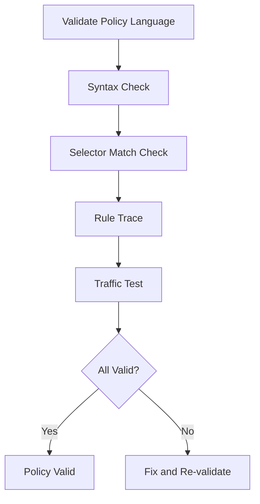

# Validating Cilium Policy Language Constructs

Author: [nawazdhandala](https://github.com/nawazdhandala)

Tags: Cilium, Kubernetes, Policy Language, Validation, Security

Description: How to validate CiliumNetworkPolicy language constructs to ensure correct syntax, proper selector matching, and intended rule behavior.

---

## Introduction

Validating policy language constructs ensures your policies are syntactically correct, select the intended endpoints, and enforce the rules you expect. This is especially important when using advanced features like entity selectors, FQDN rules, and L7 filtering.

## Prerequisites

- Kubernetes cluster with Cilium
- kubectl configured

## Syntax Validation

```bash
# Dry-run validation
kubectl apply --dry-run=server -f policy.yaml

# Check all policies for status errors
kubectl get ciliumnetworkpolicies --all-namespaces -o json | jq '
  .items[] | select(.status.conditions // [] | length > 0) |
  {name: .metadata.name, ns: .metadata.namespace, conditions: .status.conditions}'
```

## Selector Validation

```bash
#!/bin/bash
echo "=== Policy Selector Validation ==="

for policy in $(kubectl get ciliumnetworkpolicies -n default -o jsonpath='{.items[*].metadata.name}'); do
  MATCH_COUNT=$(kubectl get ciliumendpoints -n default -o json | jq --argjson sel "$(kubectl get ciliumnetworkpolicy "$policy" -n default -o json | jq '.spec.endpointSelector.matchLabels')" '
    [.items[] | select(.metadata.labels as $l | $sel | to_entries | all(.key as $k | .value as $v | $l[$k] == $v))] | length')
  echo "Policy '$policy' matches $MATCH_COUNT endpoints"
done
```

## Rule Behavior Validation

```bash
# Use policy trace to validate specific rules
cilium policy trace -s <src-labels> -d <dst-labels> --dport 8080

# Verify L7 rules with actual traffic
hubble observe --protocol http -n default --last 20
```



## Verification

```bash
kubectl get ciliumnetworkpolicies --all-namespaces
cilium policy get
```

## Troubleshooting

- **Dry-run passes but policy does not work**: Syntax is valid but semantics may be wrong. Check selectors.
- **Policy trace shows allow but traffic blocked**: Check for conflicting deny policies.
- **Selector matches zero endpoints**: Labels may not match. Use exact label format from `cilium endpoint list`.

## Conclusion

Validate policy language with syntax checks, selector matching, policy trace, and traffic testing. Each layer catches different types of issues.