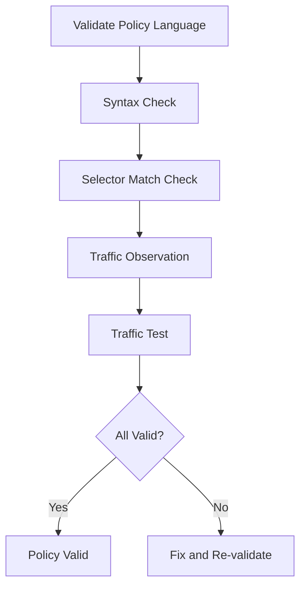

# Validating Cilium Policy Language Constructs

Author: [nawazdhandala](https://github.com/nawazdhandala)

Tags: Cilium, Kubernetes, Policy Language, Validation, Security

Description: How to validate CiliumNetworkPolicy language constructs to ensure correct syntax, proper selector matching, and intended rule behavior.

---

## Introduction

Validating policy language constructs ensures your policies are syntactically correct, select the intended endpoints, and enforce the rules you expect. This is especially important when using advanced features like entity selectors, FQDN rules, and L7 filtering.

## Prerequisites

- Kubernetes cluster with Cilium
- kubectl configured
- Hubble enabled and the Hubble CLI configured, if you want to inspect L7 flows

## Syntax Validation

```bash
# Dry-run validation

kubectl apply --dry-run=server -f policy.yaml

# Check all policies for status errors
kubectl get ciliumnetworkpolicies --all-namespaces -o json | jq '
  .items[] | select(.status.conditions // [] | length > 0) |
  {name: .metadata.name, ns: .metadata.namespace, conditions: .status.conditions}'
```

## Selector Validation

```bash
#!/bin/bash
echo "=== Policy Selector Validation ==="

for policy in $(kubectl get ciliumnetworkpolicies -n default -o jsonpath='{.items[*].metadata.name}'); do
  SELECTOR=$(kubectl get ciliumnetworkpolicy "$policy" -n default -o json | jq -r '
    (.spec.endpointSelector.matchLabels // {}) |
    to_entries |
    map("\(.key)=\(.value)") |
    join(",")')
  if [ -n "$SELECTOR" ]; then
    MATCH_COUNT=$(kubectl get pods -n default -l "$SELECTOR" --no-headers 2>/dev/null | wc -l | tr -d ' ')
  else
    MATCH_COUNT=$(kubectl get pods -n default --no-headers 2>/dev/null | wc -l | tr -d ' ')
  fi
  echo "Policy '$policy' matches $MATCH_COUNT pods"
done
```

## Rule Behavior Validation

```bash
# Generate traffic that should match the policy
kubectl exec -n default <source-pod> -- curl -sS http://<service-name>:8080

# Verify L7 rules with actual traffic
hubble observe --protocol http

# Check policy drops
hubble observe --verdict DROPPED
```


```mermaid
graph TD
    A[Validate Policy Language] --> B[Syntax Check]
    B --> C[Selector Match Check]
    C --> D[Traffic Observation]
    D --> E[Traffic Test]
    E --> F{All Valid?}
    F -->|Yes| G[Policy Valid]
    F -->|No| H[Fix and Re-validate]
```

## Verification

```bash
kubectl get ciliumnetworkpolicies --all-namespaces
cilium status
```

## Troubleshooting

- **Dry-run passes but policy does not work**: Syntax is valid but semantics may be wrong. Check selectors.
- **Hubble shows traffic blocked unexpectedly**: Check for conflicting deny policies.
- **Selector matches zero endpoints**: Labels may not match. Compare against `kubectl get ciliumendpoints -o json` or `cilium-dbg endpoint list`.

## Conclusion

Validate policy language with syntax checks, selector matching, traffic observation, and traffic testing. Each layer catches different types of issues.
