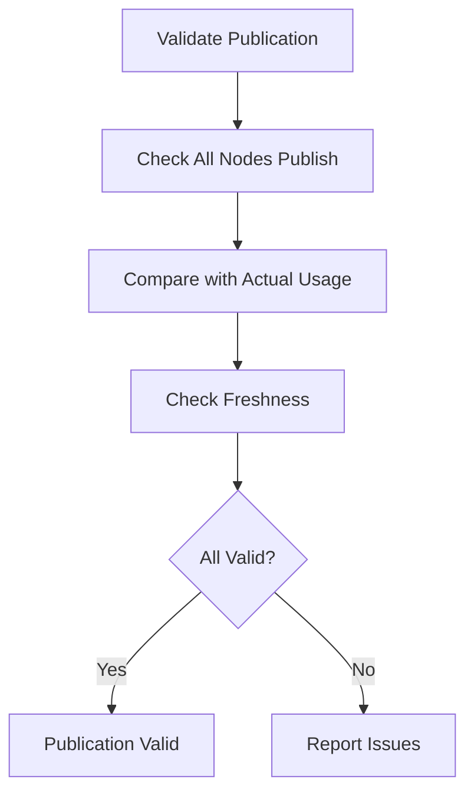

# Validating IP Availability Publication in Cilium IPAM

Author: [nawazdhandala](https://github.com/nawazdhandala)

Tags: Cilium, Kubernetes, IPAM, Validation, Networking

Description: How to validate that Cilium IPAM correctly publishes available IP counts in CiliumNode resources for each cluster node.

---

## Introduction

Validating IP availability publication ensures that every node correctly reports its IP capacity and usage. This validation is important for clusters that rely on published IP data for autoscaling or scheduling decisions.

Validation checks include confirming every node publishes data, verifying the data is consistent with actual usage, and ensuring publication updates reflect recent changes.

## Prerequisites

- Kubernetes cluster with Cilium installed
- kubectl and jq configured

## Validating Publication Completeness

```bash
#!/bin/bash
# validate-ip-publication.sh

echo "=== IP Publication Validation ==="
ERRORS=0

NODES=$(kubectl get nodes -o jsonpath='{.items[*].metadata.name}')
for node in $NODES; do
  POOL=$(kubectl get ciliumnode "$node" -o json 2>/dev/null | \
    jq '.spec.ipam.pool // empty')
  if [ -z "$POOL" ] || [ "$POOL" = "null" ]; then
    echo "FAIL: $node has no IP pool data published"
    ERRORS=$((ERRORS + 1))
  else
    POOL_SIZE=$(echo "$POOL" | jq 'length')
    echo "OK: $node publishes $POOL_SIZE IPs in pool"
  fi
done

echo "Errors: $ERRORS"
exit $ERRORS
```

## Validating Data Consistency

```bash
# Compare published data with endpoint count
kubectl get ciliumnodes -o json | jq '.items[] | {
  node: .metadata.name,
  published_used: (.status.ipam.used // {} | length)
}' > /tmp/published.json

kubectl get ciliumendpoints --all-namespaces -o json | jq '
  [.items[] | .metadata.name as $ep |
   .status.networking.addressing[]? | .ipv4 // empty] | length
' > /tmp/actual.json

echo "Published used IPs:"
cat /tmp/published.json
echo "Actual endpoints:"
cat /tmp/actual.json
```



## Verification

```bash
cilium status | grep IPAM
kubectl get ciliumnodes --no-headers | wc -l
kubectl get nodes --no-headers | wc -l
```

## Troubleshooting

- **Nodes missing publication data**: Agent may not be running. Check DaemonSet status.
- **Data inconsistency**: Small differences are normal (router IPs, health IPs). Large differences indicate a sync issue.
- **Publication delay**: Agent updates CiliumNode periodically. Wait for sync cycle.

## Conclusion

Regular validation of IP publication data ensures autoscalers and schedulers have accurate information. Check publication completeness, data consistency, and update freshness as part of your operational validation suite.