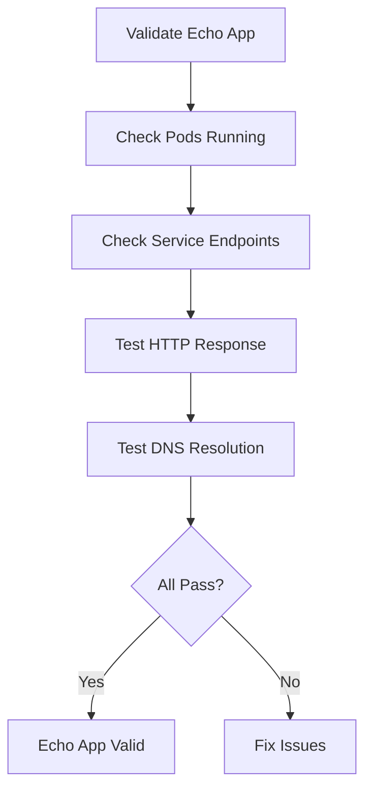

# Validating the Cilium Echo App Configuration

Author: [nawazdhandala](https://github.com/nawazdhandala)

Tags: Cilium, Kubernetes, Testing, Validation, Echo App

Description: How to validate that the Cilium echo app is correctly deployed and functioning for connectivity and policy testing.

---

## Introduction

Validating the echo app setup ensures you have a reliable test environment for Cilium features. Validation checks confirm pods are running, services resolve correctly, and the echo app responds to HTTP requests as expected.

## Prerequisites

- Kubernetes cluster with Cilium installed
- Echo app deployed in cilium-test namespace
- kubectl configured

## Validating Deployment Health

```bash
#!/bin/bash
# validate-echo-app.sh

echo "=== Echo App Validation ==="
ERRORS=0

# Check echo server pods
READY=$(kubectl get deployment echo-server -n cilium-test \
  -o jsonpath='{.status.readyReplicas}' 2>/dev/null)
DESIRED=$(kubectl get deployment echo-server -n cilium-test \
  -o jsonpath='{.spec.replicas}' 2>/dev/null)

if [ "$READY" = "$DESIRED" ] && [ -n "$READY" ]; then
  echo "PASS: Echo server: $READY/$DESIRED ready"
else
  echo "FAIL: Echo server: ${READY:-0}/${DESIRED:-?} ready"
  ERRORS=$((ERRORS + 1))
fi

# Check service endpoints
EP_COUNT=$(kubectl get endpoints echo-server -n cilium-test \
  -o json 2>/dev/null | jq '.subsets[0].addresses | length')
if [ "$EP_COUNT" -gt 0 ]; then
  echo "PASS: Echo service has $EP_COUNT endpoints"
else
  echo "FAIL: Echo service has no endpoints"
  ERRORS=$((ERRORS + 1))
fi

echo "Errors: $ERRORS"
```

## Validating HTTP Responses

```bash
# Test echo server returns valid responses
RESPONSE=$(kubectl exec -n cilium-test deploy/echo-client -- \
  curl -s -w "\n%{http_code}" http://echo-server:8080/)
HTTP_CODE=$(echo "$RESPONSE" | tail -1)

if [ "$HTTP_CODE" = "200" ]; then
  echo "PASS: Echo server returns 200"
else
  echo "FAIL: Echo server returns $HTTP_CODE"
fi
```



## Running Full Connectivity Test

```bash
# The built-in test validates everything
cilium connectivity test

# Or run specific tests
cilium connectivity test --test pod-to-pod
cilium connectivity test --test pod-to-service
```

## Verification

```bash
kubectl get pods -n cilium-test -o wide
kubectl get svc -n cilium-test
kubectl get ciliumendpoints -n cilium-test
```

## Troubleshooting

- **Pods not ready**: Check readiness probe configuration and container health.
- **Service returns 503**: Backend pods may be unhealthy. Check pod logs.
- **DNS resolution fails**: Verify DNS policy allows traffic to kube-dns.

## Conclusion

Validate the echo app before using it for policy testing. Confirm pods are running, services have endpoints, and HTTP responses are successful. The built-in connectivity test suite is the most comprehensive validation available.