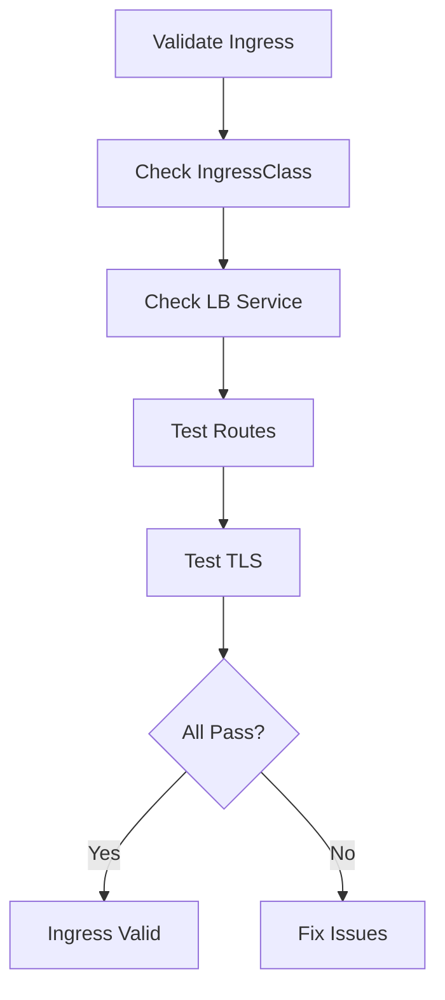

# Validating Cilium Ingress Configuration

Author: [nawazdhandala](https://github.com/nawazdhandala)

Tags: Cilium, Kubernetes, Ingress, Validation, Networking

Description: How to validate that Cilium Ingress is correctly configured and routing traffic to backend services with proper TLS termination and path matching.

---

## Introduction

Validating Cilium Ingress ensures that external traffic reaches your services correctly through the Cilium Envoy proxy. Validation should confirm that the Ingress controller is enabled, LoadBalancer has an IP, routes match the expected backends, and TLS terminates correctly.

Run validation after initial setup, after configuration changes, and as part of your deployment pipeline.

## Prerequisites

- Kubernetes cluster with Cilium Ingress enabled
- kubectl configured
- curl or a similar HTTP client

## Validating Ingress Controller Setup

```bash
#!/bin/bash
# validate-cilium-ingress.sh

echo "=== Cilium Ingress Validation ==="
ERRORS=0

# Check IngressClass exists
if kubectl get ingressclass cilium &>/dev/null; then
  echo "PASS: IngressClass 'cilium' exists"
else
  echo "FAIL: IngressClass 'cilium' not found"
  ERRORS=$((ERRORS + 1))
fi

# Check Ingress controller is enabled in config
INGRESS_ENABLED=$(kubectl get configmap cilium-config -n kube-system \
  -o jsonpath='{.data.enable-ingress-controller}')
if [ "$INGRESS_ENABLED" = "true" ]; then
  echo "PASS: Ingress controller enabled"
else
  echo "FAIL: Ingress controller not enabled"
  ERRORS=$((ERRORS + 1))
fi

# Check LoadBalancer service
LB_IP=$(kubectl get svc -n kube-system cilium-ingress \
  -o jsonpath='{.status.loadBalancer.ingress[0].ip}' 2>/dev/null)
if [ -n "$LB_IP" ]; then
  echo "PASS: LoadBalancer IP: $LB_IP"
else
  echo "WARN: No LoadBalancer IP assigned"
fi

echo "Errors: $ERRORS"
```

## Validating Routing

```bash
# Test each Ingress route
for ingress in $(kubectl get ingress --all-namespaces \
    -o jsonpath='{.items[*].metadata.name}'); do
  NS=$(kubectl get ingress --all-namespaces -o json | \
    jq -r --arg name "$ingress" '.items[] | select(.metadata.name == $name) | .metadata.namespace')
  HOST=$(kubectl get ingress "$ingress" -n "$NS" \
    -o jsonpath='{.spec.rules[0].host}')
  echo "Testing $ingress ($HOST)..."
  
  RESPONSE=$(curl -s -o /dev/null -w "%{http_code}" \
    -H "Host: $HOST" http://$LB_IP/ --max-time 5)
  echo "  Response: $RESPONSE"
done
```



## Validating TLS

```bash
# Check TLS configuration on Ingress
kubectl get ingress <name> -o jsonpath='{.spec.tls}'

# Test TLS connection
curl -v https://test.example.com --resolve test.example.com:443:$LB_IP 2>&1 | \
  grep "SSL connection"
```

## Verification

```bash
cilium status | grep -i ingress
kubectl get ingress --all-namespaces
kubectl get svc -n kube-system | grep cilium-ingress
```

## Troubleshooting

- **IngressClass missing**: Re-run Helm upgrade with `ingressController.enabled=true`.
- **Routes return 404**: Check path matching rules and backend service endpoints.
- **TLS validation fails**: Verify certificate secret exists and is valid.
- **Intermittent failures**: Check Envoy proxy health and resource limits.

## Conclusion

Validate Cilium Ingress by checking the IngressClass, LoadBalancer IP, route responses, and TLS configuration. Automate these checks to catch regressions after upgrades or configuration changes.