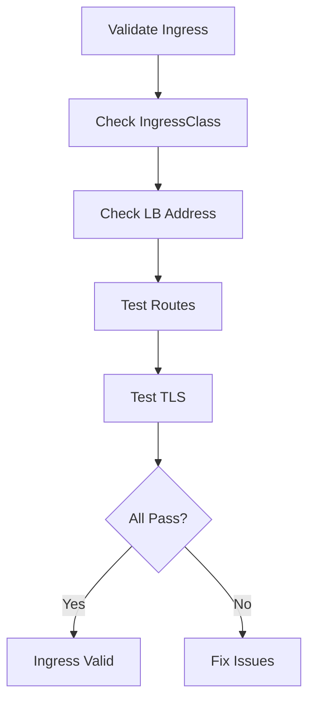

# Validating Cilium Ingress Configuration

Author: [nawazdhandala](https://github.com/nawazdhandala)

Tags: Cilium, Kubernetes, Ingress, Validation, Networking

Description: How to validate that Cilium Ingress is correctly configured and routing traffic to backend services with proper TLS termination and path matching.

---

## Introduction

Validating Cilium Ingress ensures that external traffic reaches your services correctly through the Cilium Envoy proxy. Validation should confirm that the Ingress controller is enabled, the Ingress or LoadBalancer has an external IP or hostname, routes match the expected backends, and TLS terminates correctly.

Run validation after initial setup, after configuration changes, and as part of your deployment pipeline.

## Prerequisites

- Kubernetes cluster with Cilium Ingress enabled
- kubectl configured
- curl or a similar HTTP client

## Validating Ingress Controller Setup

```bash
#!/bin/bash
# validate-cilium-ingress.sh

echo "=== Cilium Ingress Validation ==="
ERRORS=0

# Check IngressClass exists

if kubectl get ingressclass cilium &>/dev/null; then
  echo "PASS: IngressClass 'cilium' exists"
else
  echo "FAIL: IngressClass 'cilium' not found"
  ERRORS=$((ERRORS + 1))
fi

# Check Ingress controller is enabled in config
INGRESS_ENABLED=$(kubectl get configmap cilium-config -n kube-system \
  -o go-template='{{ index .data "enable-ingress-controller" }}')
if [ "$INGRESS_ENABLED" = "true" ]; then
  echo "PASS: Ingress controller enabled"
else
  echo "FAIL: Ingress controller not enabled"
  ERRORS=$((ERRORS + 1))
fi

# Check Envoy config is enabled
ENVOY_ENABLED=$(kubectl get configmap cilium-config -n kube-system \
  -o go-template='{{ index .data "enable-envoy-config" }}')
if [ "$ENVOY_ENABLED" = "true" ]; then
  echo "PASS: Envoy config enabled"
else
  echo "FAIL: Envoy config not enabled"
  ERRORS=$((ERRORS + 1))
fi

# Check LoadBalancer address from Ingress status first
LB_ADDRESS=$(kubectl get ingress --all-namespaces \
  -o jsonpath='{.items[0].status.loadBalancer.ingress[0].ip}' 2>/dev/null)
if [ -z "$LB_ADDRESS" ]; then
  LB_ADDRESS=$(kubectl get ingress --all-namespaces \
    -o jsonpath='{.items[0].status.loadBalancer.ingress[0].hostname}' 2>/dev/null)
fi

# Shared mode also exposes a cilium-ingress Service in kube-system
if [ -z "$LB_ADDRESS" ]; then
  LB_ADDRESS=$(kubectl get svc -n kube-system cilium-ingress \
    -o jsonpath='{.status.loadBalancer.ingress[0].ip}' 2>/dev/null)
fi
if [ -z "$LB_ADDRESS" ]; then
  LB_ADDRESS=$(kubectl get svc -n kube-system cilium-ingress \
    -o jsonpath='{.status.loadBalancer.ingress[0].hostname}' 2>/dev/null)
fi

if [ -n "$LB_ADDRESS" ]; then
  echo "PASS: LoadBalancer address: $LB_ADDRESS"
else
  echo "WARN: No LoadBalancer IP or hostname assigned"
fi

echo "Errors: $ERRORS"
```

## Validating Routing

```bash
# Test each Ingress route
kubectl get ingress --all-namespaces \
  -o jsonpath='{range .items[*]}{.metadata.namespace}{" "}{.metadata.name}{"\n"}{end}' |
while read -r NS ingress; do
  HOST=$(kubectl get ingress "$ingress" -n "$NS" \
    -o jsonpath='{.spec.rules[0].host}')
  PATH_PREFIX=$(kubectl get ingress "$ingress" -n "$NS" \
    -o jsonpath='{.spec.rules[0].http.paths[0].path}')
  ADDRESS=$(kubectl get ingress "$ingress" -n "$NS" \
    -o jsonpath='{.status.loadBalancer.ingress[0].ip}')
  if [ -z "$ADDRESS" ]; then
    ADDRESS=$(kubectl get ingress "$ingress" -n "$NS" \
      -o jsonpath='{.status.loadBalancer.ingress[0].hostname}')
  fi

  [ -z "$PATH_PREFIX" ] && PATH_PREFIX="/"

  echo "Testing $NS/$ingress ($HOST$PATH_PREFIX)..."

  if [ -z "$ADDRESS" ]; then
    echo "  Skipping: no LoadBalancer address assigned"
    continue
  fi
  
  if [ -n "$HOST" ]; then
    RESPONSE=$(curl -s -o /dev/null -w "%{http_code}" \
      -H "Host: $HOST" "http://$ADDRESS$PATH_PREFIX" --max-time 5)
  else
    RESPONSE=$(curl -s -o /dev/null -w "%{http_code}" \
      "http://$ADDRESS$PATH_PREFIX" --max-time 5)
  fi
  echo "  Response: $RESPONSE"
done
```


```mermaid
graph TD
    A[Validate Ingress] --> B[Check IngressClass]
    B --> C[Check LB Address]
    C --> D[Test Routes]
    D --> E[Test TLS]
    E --> F{All Pass?}
    F -->|Yes| G[Ingress Valid]
    F -->|No| H[Fix Issues]
```

## Validating TLS

```bash
# Check TLS configuration on Ingress
kubectl get ingress <name> -n <namespace> -o jsonpath='{.spec.tls}'

# Test TLS connection when the LoadBalancer address is an IP
curl -v https://test.example.com --resolve test.example.com:443:$LB_ADDRESS 2>&1 | \
  grep "SSL connection"
```

## Verification

```bash
cilium status
kubectl get ingress --all-namespaces
kubectl get svc --all-namespaces | grep cilium-ingress
```

## Troubleshooting

- **IngressClass missing**: Re-run Helm upgrade with `ingressController.enabled=true`.
- **Routes return 404**: Check path matching rules and backend service endpoints.
- **TLS validation fails**: Verify certificate secret exists and is valid.
- **Intermittent failures**: Check Envoy proxy health and resource limits.

## Conclusion

Validate Cilium Ingress by checking the IngressClass, LoadBalancer address, route responses, and TLS configuration. Automate these checks to catch regressions after upgrades or configuration changes.
