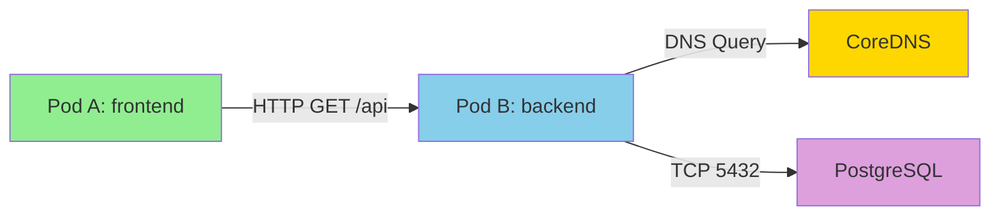

# How to Use Kubernetes with Cilium Observability

Author: [nawazdhandala](https://github.com/nawazdhandala)

Tags: Cilium, Kubernetes, Observability, Hubble, Networking

Description: Learn how to leverage Kubernetes-native tools alongside Cilium and Hubble for comprehensive network observability, including flow monitoring, service map visualization, and integration with the Kubernetes API.

---

## Introduction

Cilium transforms Kubernetes networking by replacing traditional iptables-based routing with eBPF programs that run directly in the Linux kernel. This shift brings a new level of observability that goes far beyond what standard Kubernetes networking provides. With Cilium, you can see individual network flows, DNS queries, HTTP transactions, and policy decisions in real time.

The integration between Kubernetes and Cilium observability is bidirectional. Kubernetes labels and metadata enrich Cilium flow data, while Cilium metrics feed back into Kubernetes-native monitoring tools like Prometheus and Grafana. Hubble, Cilium's observability layer, uses Kubernetes identity information to provide human-readable context for every network event.

This guide shows you how to combine Kubernetes APIs, Cilium tools, and Hubble to build a complete observability stack for your cluster networking.

## Prerequisites

- Kubernetes cluster v1.24 or later
- Cilium 1.14+ installed with Hubble enabled
- kubectl and cilium CLI installed
- Helm 3 for configuration management
- Prometheus and Grafana for metrics visualization

## Enabling Hubble for Kubernetes Flow Observability

Hubble is Cilium's observability component. Enable it with full Kubernetes context:

```yaml
# cilium-hubble-values.yaml
hubble:
  enabled: true
  relay:
    enabled: true
  ui:
    enabled: true
  metrics:
    enabled:
      - dns
      - drop
      - tcp
      - flow
      - httpV2:exemplars=true;labelsContext=source_ip,source_namespace,source_workload,destination_ip,destination_namespace,destination_workload
    serviceMonitor:
      enabled: true
```

```bash
helm upgrade cilium cilium/cilium -n kube-system \
  --reuse-values \
  --values cilium-hubble-values.yaml

# Wait for Hubble components to be ready
kubectl -n kube-system rollout status deployment/hubble-relay
kubectl -n kube-system rollout status deployment/hubble-ui
```

## Observing Kubernetes Network Flows with Hubble

Hubble CLI provides rich flow data annotated with Kubernetes metadata:

```bash
# Port-forward Hubble relay for local CLI access
cilium hubble port-forward &

# Observe all flows in a specific namespace
hubble observe --namespace default

# Filter by Kubernetes pod labels
hubble observe --pod default/frontend --protocol TCP

# Watch DNS queries from a specific workload
hubble observe --namespace production --type l7 --protocol dns

# Filter by Kubernetes service name
hubble observe --to-service kube-system/kube-dns

# View flows with full Kubernetes context (labels, namespace, pod name)
hubble observe --namespace default -o json | python3 -c "
import json, sys
for line in sys.stdin:
    flow = json.loads(line)
    src = flow.get('flow',{}).get('source',{})
    dst = flow.get('flow',{}).get('destination',{})
    print(f\"{src.get('namespace','?')}/{src.get('pod_name','?')} -> {dst.get('namespace','?')}/{dst.get('pod_name','?')}: {flow.get('flow',{}).get('verdict','?')}\")
"
```



## Correlating Kubernetes Events with Cilium Metrics

Kubernetes events and Cilium metrics often tell complementary stories. Here is how to correlate them:

```bash
# Watch Kubernetes events that affect networking
kubectl get events --field-selector reason=NetworkNotReady --all-namespaces
kubectl get events --field-selector involvedObject.kind=NetworkPolicy --all-namespaces

# Correlate with Cilium endpoint state
kubectl -n kube-system exec ds/cilium -- cilium endpoint list -o json | python3 -c "
import json, sys
eps = json.load(sys.stdin)
for ep in eps:
    status = ep.get('status', {})
    identity = status.get('identity', {})
    state = status.get('state', 'unknown')
    labels = identity.get('labels', [])
    k8s_labels = [l for l in labels if l.startswith('k8s:')]
    if state != 'ready':
        print(f'Endpoint {ep[\"id\"]} ({state}): {k8s_labels}')
"

# Check policy verdict metrics by namespace
curl -s 'http://localhost:9090/api/v1/query?query=sum by (source_namespace, destination_namespace, verdict) (rate(hubble_flows_processed_total[5m]))' | python3 -m json.tool
```

## Setting Up the Hubble UI Service Map

The Hubble UI provides a visual service map showing Kubernetes workload communication:

```bash
# Access the Hubble UI
kubectl port-forward -n kube-system svc/hubble-ui 12000:80 &
echo "Open http://localhost:12000 in your browser"

# If Hubble UI is not installed, enable it
helm upgrade cilium cilium/cilium -n kube-system \
  --reuse-values \
  --set hubble.ui.enabled=true

# For production, expose via Ingress
```

```yaml
# hubble-ui-ingress.yaml
apiVersion: networking.k8s.io/v1
kind: Ingress
metadata:
  name: hubble-ui
  namespace: kube-system
  annotations:
    nginx.ingress.kubernetes.io/auth-type: basic
    nginx.ingress.kubernetes.io/auth-secret: hubble-ui-basic-auth
spec:
  ingressClassName: nginx
  rules:
    - host: hubble.internal.example.com
      http:
        paths:
          - path: /
            pathType: Prefix
            backend:
              service:
                name: hubble-ui
                port:
                  number: 80
```

Create basic auth for the UI:

```bash
# Generate htpasswd file
htpasswd -c auth admin
kubectl create secret generic hubble-ui-basic-auth \
  --from-file=auth \
  -n kube-system
kubectl apply -f hubble-ui-ingress.yaml
```

## Verification

Confirm that Kubernetes and Cilium observability are working together:

```bash
# 1. Verify Hubble is connected and receiving flows
hubble observe --last 10

# 2. Check that Kubernetes metadata is present in flows
hubble observe --last 5 -o json | python3 -c "
import json, sys
for line in sys.stdin:
    f = json.loads(line).get('flow', {})
    src = f.get('source', {})
    if src.get('namespace') and src.get('pod_name'):
        print(f'K8s context present: {src[\"namespace\"]}/{src[\"pod_name\"]}')
        break
else:
    print('WARNING: No Kubernetes context found in flows')
"

# 3. Verify Hubble UI is accessible
curl -s -o /dev/null -w '%{http_code}' http://localhost:12000

# 4. Check Hubble metrics in Prometheus
curl -s 'http://localhost:9090/api/v1/query?query=hubble_flows_processed_total' | python3 -c "
import json, sys
data = json.load(sys.stdin)
results = data.get('data', {}).get('result', [])
print(f'Hubble metrics series count: {len(results)}')
"
```

## Troubleshooting

- **Hubble flows missing Kubernetes metadata**: Ensure Cilium can reach the Kubernetes API server. Check with `kubectl -n kube-system exec ds/cilium -- cilium status | grep Kubernetes`.

- **Hubble UI shows empty service map**: Generate some traffic first. The UI only shows flows observed during the selected time window. Try `kubectl run curl --image=curlimages/curl --rm -it -- curl http://kubernetes.default`.

- **Hubble relay not connecting**: Check relay logs with `kubectl -n kube-system logs -l k8s-app=hubble-relay`. Common issue is TLS certificate mismatch between agent and relay.

- **Flow data is incomplete**: Hubble has a ring buffer with limited capacity. High-traffic clusters may lose flows. Increase the buffer size with `hubble.eventBufferCapacity` in Helm values.

## Conclusion

Combining Kubernetes-native tools with Cilium's observability features gives you unmatched visibility into your cluster networking. Hubble enriches every network flow with Kubernetes context, making it easy to understand which workloads are communicating, what policies are being enforced, and where problems are occurring. Use the Hubble CLI for real-time debugging, the Hubble UI for service map visualization, and Prometheus metrics for long-term trend analysis.
