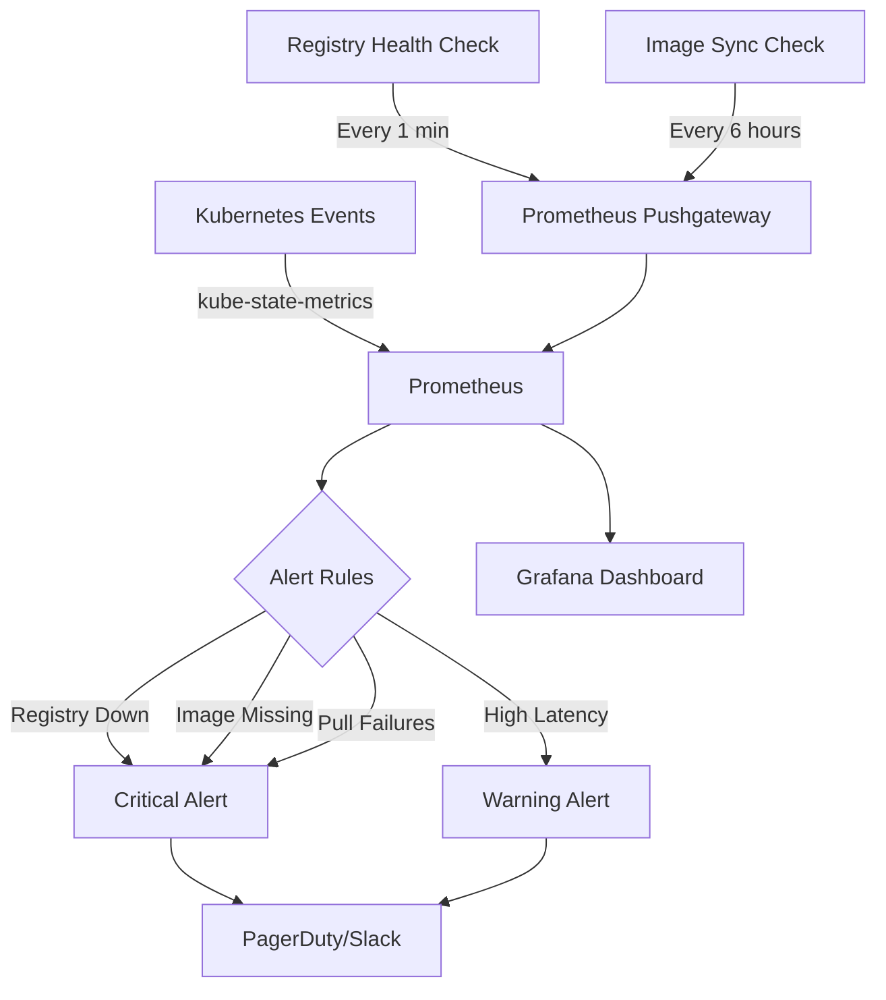

# Monitoring Calico Alternate Registry Configuration

Author: [nawazdhandala](https://github.com/nawazdhandala)

Tags: Calico, Container Registry, Monitoring, Kubernetes, Observability

Description: Learn how to monitor your Calico alternate registry configuration to detect image pull failures, registry availability issues, and synchronization drift between public and private registries.

---

## Introduction

When Calico relies on a private alternate registry, the registry becomes a critical dependency for cluster operations. Any registry downtime, authentication failure, or missing image prevents Calico components from starting, upgrading, or recovering after node restarts. Monitoring the alternate registry configuration proactively catches these issues before they impact cluster networking.

Effective monitoring covers three key areas: registry availability and performance, image pull success rates on Kubernetes nodes, and synchronization status between your private registry and upstream Calico releases.

This guide covers practical monitoring strategies for Calico alternate registry configurations using Kubernetes events, Prometheus metrics, and custom health checks.

## Prerequisites

- Kubernetes cluster with Calico using an alternate registry
- Prometheus and Grafana deployed
- kubectl access with appropriate permissions
- crane CLI for registry health checks
- Basic familiarity with PromQL

## Monitoring Image Pull Events

Kubernetes events provide immediate visibility into image pull issues:

```bash
#!/bin/bash
# monitor-calico-image-pulls.sh
# Monitors Calico image pull events and reports failures

set -euo pipefail

echo "=== Calico Image Pull Status ==="

# Check for recent image pull failures
FAILURES=$(kubectl get events -n calico-system \
  --field-selector reason=Failed \
  --sort-by='.lastTimestamp' \
  -o json | python3 -c "
import sys, json
events = json.load(sys.stdin)['items']
pull_failures = [e for e in events if 'pull' in e.get('message', '').lower() or 'image' in e.get('message', '').lower()]
for e in pull_failures[-10:]:
    print(f\"  {e['lastTimestamp']} - {e['involvedObject']['name']}: {e['message']}\")
print(f'Total pull failures: {len(pull_failures)}')
")

echo "$FAILURES"

# Check current pod image status
echo ""
echo "=== Current Calico Pod Images ==="
kubectl get pods -n calico-system -o jsonpath='{range .items[*]}{.metadata.name}{"\t"}{.status.phase}{"\t"}{.spec.containers[*].image}{"\n"}{end}'
```

## Registry Availability Health Check

Monitor the private registry's availability and response time:

```bash
#!/bin/bash
# registry-health-check.sh
# Check private registry health and push metrics to Pushgateway

set -euo pipefail

REGISTRY="${REGISTRY:-registry.example.com}"
PUSHGATEWAY="${PUSHGATEWAY:-http://prometheus-pushgateway:9091}"
CALICO_VERSION="${CALICO_VERSION:-v3.27.0}"

# Check registry API availability
start_time=$(date +%s%N)
if crane ls "${REGISTRY}/calico/node" > /dev/null 2>&1; then
  registry_up=1
else
  registry_up=0
fi
end_time=$(date +%s%N)
latency_ms=$(( (end_time - start_time) / 1000000 ))

# Check if expected Calico version exists
if crane manifest "${REGISTRY}/calico/node:${CALICO_VERSION}" > /dev/null 2>&1; then
  image_available=1
else
  image_available=0
fi

# Push metrics
cat <<EOF | curl -s --data-binary @- "${PUSHGATEWAY}/metrics/job/calico_registry_health"
# HELP calico_registry_up Registry availability (1=up, 0=down)
# TYPE calico_registry_up gauge
calico_registry_up{registry="${REGISTRY}"} ${registry_up}
# HELP calico_registry_latency_ms Registry response latency in milliseconds
# TYPE calico_registry_latency_ms gauge
calico_registry_latency_ms{registry="${REGISTRY}"} ${latency_ms}
# HELP calico_image_available Expected Calico image availability (1=available, 0=missing)
# TYPE calico_image_available gauge
calico_image_available{registry="${REGISTRY}",version="${CALICO_VERSION}"} ${image_available}
EOF

echo "Registry: up=$registry_up, latency=${latency_ms}ms, image_available=$image_available"
```

## Image Synchronization Monitoring

Detect when your private registry falls behind upstream releases:

```bash
#!/bin/bash
# check-calico-image-sync.sh
# Compares private registry images against upstream Calico releases

set -euo pipefail

PRIVATE_REGISTRY="${PRIVATE_REGISTRY:-registry.example.com/calico}"
PUBLIC_REGISTRY="docker.io/calico"

IMAGES=("node" "cni" "kube-controllers" "typha")

echo "=== Calico Image Sync Status ==="
for image in "${IMAGES[@]}"; do
  # Get latest tags from both registries
  private_tags=$(crane ls "${PRIVATE_REGISTRY}/${image}" 2>/dev/null | sort -V | tail -5)
  public_latest=$(crane ls "${PUBLIC_REGISTRY}/${image}" 2>/dev/null | grep -E '^v[0-9]+\.[0-9]+\.[0-9]+$' | sort -V | tail -1)

  echo "Image: ${image}"
  echo "  Public latest: ${public_latest:-unknown}"
  echo "  Private latest tags: $(echo "$private_tags" | tail -1)"

  if echo "$private_tags" | grep -q "$public_latest" 2>/dev/null; then
    echo "  Status: IN SYNC"
  else
    echo "  Status: OUT OF SYNC - missing ${public_latest}"
  fi
  echo ""
done
```

## Prometheus Alerting Rules

```yaml
# calico-registry-alerts.yaml
apiVersion: monitoring.coreos.com/v1
kind: PrometheusRule
metadata:
  name: calico-registry-alerts
  namespace: monitoring
spec:
  groups:
    - name: calico-registry
      interval: 60s
      rules:
        - alert: CalicoRegistryDown
          expr: calico_registry_up == 0
          for: 5m
          labels:
            severity: critical
          annotations:
            summary: "Calico private registry is unreachable"
            description: "The private registry {{ $labels.registry }} has been unreachable for 5 minutes. Calico pods may fail to start or restart."

        - alert: CalicoRegistryHighLatency
          expr: calico_registry_latency_ms > 5000
          for: 10m
          labels:
            severity: warning
          annotations:
            summary: "Calico registry response time is high"
            description: "Registry {{ $labels.registry }} latency is {{ $value }}ms, which may cause image pull timeouts."

        - alert: CalicoImageMissing
          expr: calico_image_available == 0
          for: 1m
          labels:
            severity: critical
          annotations:
            summary: "Expected Calico image is missing from registry"
            description: "Calico version {{ $labels.version }} is not available in registry {{ $labels.registry }}."

        - alert: CalicoImagePullFailures
          expr: increase(kube_pod_container_status_waiting_reason{namespace="calico-system", reason="ImagePullBackOff"}[10m]) > 0
          for: 5m
          labels:
            severity: critical
          annotations:
            summary: "Calico pods have image pull failures"
            description: "One or more Calico pods in calico-system namespace cannot pull images."
```



## Verification

```bash
# Verify registry health check runs successfully
bash registry-health-check.sh

# Check Prometheus has the metrics
curl -s "http://prometheus:9090/api/v1/query?query=calico_registry_up" | python3 -m json.tool

# Verify alerting rules are loaded
curl -s "http://prometheus:9090/api/v1/rules" | python3 -c "
import sys, json
data = json.load(sys.stdin)
for g in data['data']['groups']:
    if 'calico' in g['name'].lower():
        for r in g['rules']:
            print(f\"{r['name']}: {r['state']}\")
"

# Check no Calico pods have image pull issues
kubectl get pods -n calico-system | grep -v Running
```

## Troubleshooting

- **Registry health check reports down but registry is accessible from browser**: The health check may be running inside the cluster where DNS or network policies differ. Run the check from a pod in the cluster to test internal connectivity.
- **kube-state-metrics not reporting Calico pod status**: Ensure kube-state-metrics has access to the calico-system namespace. Check RBAC permissions.
- **Image sync check shows false positives**: Some Calico versions have different image tags across registries. Use specific version patterns rather than comparing all tags.
- **Alerts firing during planned registry maintenance**: Configure Alertmanager silences before maintenance windows.

## Conclusion

Monitoring your Calico alternate registry configuration provides early warning of image availability issues, registry outages, and synchronization drift. By combining registry health checks, Kubernetes event monitoring, and Prometheus alerting, you ensure that your Calico deployment can always pull the images it needs from your private registry. Integrate these monitoring checks into your existing observability platform and establish runbooks for each alert scenario.
