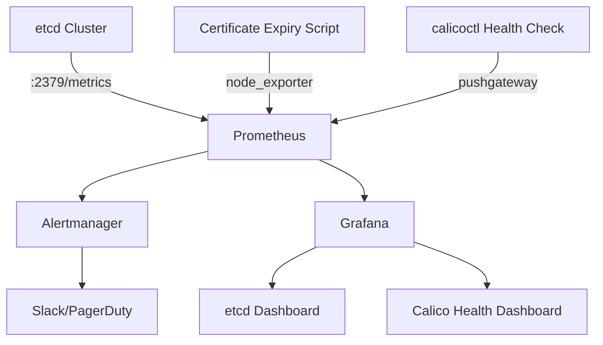

# Monitoring Calicoctl etcd Configuration

Author: [nawazdhandala](https://github.com/nawazdhandala)

Tags: Calico, etcd, Monitoring, Prometheus, Calicoctl

Description: Learn how to monitor your calicoctl etcd datastore configuration with Prometheus metrics, certificate expiry alerts, connection health checks, and etcd performance tracking.

---

## Introduction

When calicoctl uses etcd as its datastore, the health of the etcd cluster directly determines whether you can manage Calico network policies. etcd cluster degradation, certificate expiry, or connectivity issues can silently prevent policy updates, leaving your cluster in an unmanageable state.

Monitoring the calicoctl etcd configuration requires tracking multiple layers: etcd cluster health, TLS certificate lifetimes, calicoctl connectivity, and Calico data consistency. Integrating these signals into your monitoring stack provides early warning before issues impact production.

This guide covers practical monitoring strategies for calicoctl etcd configurations, including Prometheus metrics, Grafana dashboards, alerting rules, and automated health checks.

## Prerequisites

- Calico cluster using the etcd datastore backend
- calicoctl v3.27 or later configured for etcd
- Prometheus and Grafana deployed
- etcdctl for direct etcd monitoring
- Basic familiarity with PromQL

## Monitoring etcd Cluster Health

etcd exposes Prometheus metrics on port 2379 by default. Configure Prometheus to scrape etcd:

```yaml
# prometheus-etcd-scrape.yaml
# Add to Prometheus scrape configuration
scrape_configs:
  - job_name: 'etcd'
    scheme: https
    tls_config:
      cert_file: /etc/prometheus/certs/etcd-client-cert.pem
      key_file: /etc/prometheus/certs/etcd-client-key.pem
      ca_file: /etc/prometheus/certs/etcd-ca.pem
    static_configs:
      - targets:
          - 'etcd1:2379'
          - 'etcd2:2379'
          - 'etcd3:2379'
    metrics_path: /metrics
```

Key etcd metrics to monitor for Calico health:

```bash
# etcd cluster health indicators
etcd_server_has_leader                    # 1 if the member has a leader
etcd_server_leader_changes_seen_total     # Leader changes (instability indicator)
etcd_disk_wal_fsync_duration_seconds      # Disk latency affecting writes
etcd_network_peer_round_trip_time_seconds # Network latency between members

# Calico-specific data metrics
etcd_debugging_mvcc_keys_total            # Total number of keys (includes Calico data)
etcd_mvcc_db_total_size_in_bytes          # Database size
```

## Certificate Expiry Monitoring

Monitor TLS certificate expiration to prevent connectivity failures:

```bash
#!/bin/bash
# check-cert-expiry.sh
# Outputs certificate expiry as Prometheus metrics

CERT_DIR="/etc/calicoctl/certs"
METRICS_FILE="/var/lib/node_exporter/calico_cert_expiry.prom"

# Calculate days until expiry for each certificate
for cert_file in "$CERT_DIR"/*.pem; do
    [ -f "$cert_file" ] || continue
    cert_name=$(basename "$cert_file" .pem)

    # Get expiry date in epoch seconds
    expiry_epoch=$(openssl x509 -in "$cert_file" -noout -enddate 2>/dev/null | \
      cut -d= -f2 | xargs -I{} date -d {} +%s 2>/dev/null || echo "0")

    if [ "$expiry_epoch" != "0" ]; then
        now_epoch=$(date +%s)
        days_remaining=$(( (expiry_epoch - now_epoch) / 86400 ))
        echo "calico_cert_expiry_days{cert=\"${cert_name}\"} ${days_remaining}" >> "${METRICS_FILE}.tmp"
    fi
done

# Atomically replace the metrics file
mv "${METRICS_FILE}.tmp" "$METRICS_FILE" 2>/dev/null || true
```

## Alerting Rules for etcd and Calico

```yaml
# calico-etcd-alerts.yaml
apiVersion: monitoring.coreos.com/v1
kind: PrometheusRule
metadata:
  name: calico-etcd-alerts
  namespace: monitoring
spec:
  groups:
    - name: calico-etcd-health
      interval: 30s
      rules:
        # Alert when etcd has no leader
        - alert: EtcdNoLeader
          expr: etcd_server_has_leader == 0
          for: 1m
          labels:
            severity: critical
          annotations:
            summary: "etcd member {{ $labels.instance }} has no leader"
            description: "The etcd member has no leader, which will prevent calicoctl from writing to the datastore."

        # Alert on frequent leader elections
        - alert: EtcdFrequentLeaderChanges
          expr: increase(etcd_server_leader_changes_seen_total[1h]) > 3
          for: 5m
          labels:
            severity: warning
          annotations:
            summary: "Frequent etcd leader elections detected"
            description: "More than 3 leader elections in the past hour indicate cluster instability."

        # Alert on high disk latency
        - alert: EtcdHighDiskLatency
          expr: histogram_quantile(0.99, rate(etcd_disk_wal_fsync_duration_seconds_bucket[5m])) > 0.5
          for: 10m
          labels:
            severity: warning
          annotations:
            summary: "High etcd disk latency on {{ $labels.instance }}"
            description: "etcd WAL fsync latency is above 500ms, which may cause calicoctl timeouts."

        # Alert on certificate expiry
        - alert: CalicoCertExpiringSoon
          expr: calico_cert_expiry_days < 30
          for: 1h
          labels:
            severity: warning
          annotations:
            summary: "Calico certificate {{ $labels.cert }} expires in {{ $value }} days"
            description: "Rotate the certificate before expiry to prevent calicoctl connectivity failures."

        # Alert when etcd database is too large
        - alert: EtcdDatabaseTooLarge
          expr: etcd_mvcc_db_total_size_in_bytes > 4294967296
          for: 5m
          labels:
            severity: warning
          annotations:
            summary: "etcd database exceeds 4GB on {{ $labels.instance }}"
            description: "Large etcd databases degrade performance. Consider compaction and defragmentation."
```



## Automated calicoctl Health Check with Pushgateway

Create a health check that pushes results to Prometheus Pushgateway:

```bash
#!/bin/bash
# calico-etcd-healthcheck.sh
# Run as a cron job every 5 minutes

set -euo pipefail

export DATASTORE_TYPE=etcdv3
PUSHGATEWAY_URL="${PUSHGATEWAY_URL:-http://prometheus-pushgateway:9091}"

# Check calicoctl connectivity
start_time=$(date +%s%N)
if calicoctl get nodes > /dev/null 2>&1; then
    status=1
else
    status=0
fi
end_time=$(date +%s%N)
latency_ms=$(( (end_time - start_time) / 1000000 ))

# Push metrics to Prometheus Pushgateway
cat <<EOF | curl -s --data-binary @- "${PUSHGATEWAY_URL}/metrics/job/calico_etcd_health"
# HELP calico_etcd_connectivity calicoctl etcd connectivity status (1=ok, 0=fail)
# TYPE calico_etcd_connectivity gauge
calico_etcd_connectivity ${status}
# HELP calico_etcd_latency_ms calicoctl etcd operation latency in milliseconds
# TYPE calico_etcd_latency_ms gauge
calico_etcd_latency_ms ${latency_ms}
EOF

echo "Health check: status=${status}, latency=${latency_ms}ms"
```

## Verification

```bash
# Verify etcd metrics are being scraped
curl -s http://prometheus:9090/api/v1/targets | \
  python3 -c "import sys,json; [print(t['labels']['job'], t['health']) for t in json.load(sys.stdin)['data']['activeTargets'] if 'etcd' in t['labels'].get('job','')]"

# Verify alerting rules are loaded
curl -s http://prometheus:9090/api/v1/rules | \
  python3 -c "import sys,json; [print(r['name'], r['state']) for g in json.load(sys.stdin)['data']['groups'] for r in g['rules'] if 'calico' in g['name'].lower() or 'etcd' in g['name'].lower()]"

# Test health check script
bash calico-etcd-healthcheck.sh
```

## Troubleshooting

- **etcd metrics endpoint unreachable**: Ensure Prometheus has the correct TLS client certificates to scrape etcd. The scrape config needs valid cert/key/ca files.
- **Certificate expiry metrics not appearing**: Verify the node_exporter textfile collector is configured to read from `/var/lib/node_exporter/` and the script has write permission.
- **Pushgateway metrics stale**: Check that the cron job is running. Inspect cron logs with `journalctl -u cron` or `crontab -l`.
- **False alerts during maintenance**: Use Alertmanager silences during planned etcd maintenance windows to suppress expected alerts.

## Conclusion

Monitoring calicoctl etcd configuration requires visibility into the etcd cluster health, certificate lifetimes, and calicoctl connectivity. By combining Prometheus metrics from etcd, automated certificate expiry checks, and calicoctl health probes, you build a comprehensive monitoring layer that alerts you before issues impact your ability to manage Calico network policies. Integrate these checks into your existing observability platform and establish runbooks for each alert to ensure rapid response.
