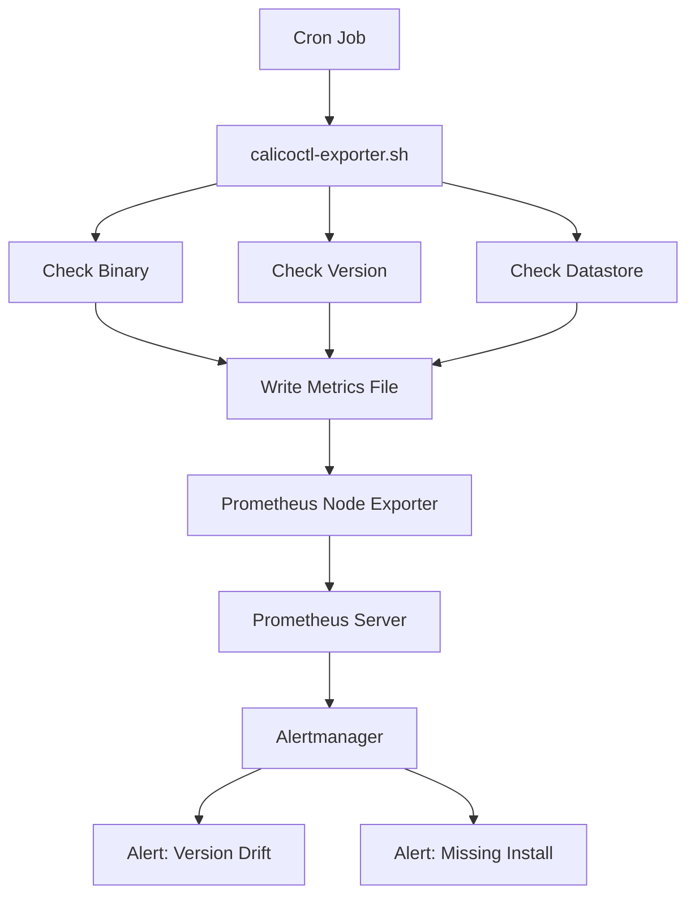

# How to Monitor Calicoctl Installation

Author: [nawazdhandala](https://github.com/nawazdhandala)

Tags: Calico, calicoctl, Monitoring, Installation, Operations

Description: A guide to monitoring calicoctl installations across your fleet, covering version tracking, availability checks, and configuration drift detection to ensure consistent tooling.

---

## Introduction

In environments with many machines that have calicoctl installed, monitoring the installation across the fleet prevents version drift, missing installations, and configuration inconsistencies. When an incident occurs, you need to know that calicoctl is available and correctly configured on every machine where operators might need it.

This guide covers setting up monitoring for calicoctl installations, including version tracking across the fleet, availability checks, configuration drift detection, and automated alerting when installations become outdated or broken.

Monitoring calicoctl installations is part of broader infrastructure tooling management, but it is especially important because calicoctl is often needed during incidents when there is no time to troubleshoot the tool itself.

## Prerequisites

- Multiple systems with calicoctl installed
- A monitoring system (Prometheus, Nagios, or custom scripts)
- SSH access to managed systems or a configuration management agent
- A central inventory of expected calicoctl versions

## Fleet-Wide Version Monitoring

Track calicoctl versions across all managed systems.

```bash
#!/bin/bash
# monitor-calicoctl-fleet.sh
# Monitor calicoctl installations across the fleet

HOSTS_FILE="${1:-/etc/calico/managed-hosts.txt}"
EXPECTED_VERSION="v3.27.0"

echo "=== Calicoctl Fleet Monitor ==="
echo "Date: $(date)"
echo "Expected version: ${EXPECTED_VERSION}"
echo ""

TOTAL=0
CORRECT=0
MISSING=0
WRONG_VERSION=0
ERRORS=0

while read host; do
  ((TOTAL++))
  echo -n "${host}: "

  # Check if calicoctl exists
  VERSION=$(ssh -o ConnectTimeout=5 "${host}" 'calicoctl version 2>/dev/null | grep "Client Version" | awk "{print \$NF}"' 2>/dev/null)

  if [ -z "${VERSION}" ]; then
    echo "MISSING or UNREACHABLE"
    ((MISSING++))
  elif [ "${VERSION}" = "${EXPECTED_VERSION}" ]; then
    echo "OK (${VERSION})"
    ((CORRECT++))
  else
    echo "WRONG VERSION (${VERSION}, expected ${EXPECTED_VERSION})"
    ((WRONG_VERSION++))
  fi
done < "${HOSTS_FILE}"

echo ""
echo "=== Summary ==="
echo "Total hosts: ${TOTAL}"
echo "Correct version: ${CORRECT}"
echo "Missing/unreachable: ${MISSING}"
echo "Wrong version: ${WRONG_VERSION}"

# Exit with error if any hosts are non-compliant
if [ ${MISSING} -gt 0 ] || [ ${WRONG_VERSION} -gt 0 ]; then
  echo ""
  echo "ALERT: Non-compliant hosts detected"
  exit 1
fi
```

## Prometheus-Based Monitoring

Create a custom exporter for calicoctl monitoring.

```bash
#!/bin/bash
# calicoctl-exporter.sh
# Expose calicoctl installation metrics for Prometheus
# Run this as a cron job that writes to a textfile collector

METRICS_DIR="/var/lib/prometheus/node-exporter"
METRICS_FILE="${METRICS_DIR}/calicoctl.prom"

mkdir -p ${METRICS_DIR}

# Check if calicoctl is installed
if which calicoctl > /dev/null 2>&1; then
  echo "calicoctl_installed 1" > ${METRICS_FILE}

  # Get version as a label
  VERSION=$(calicoctl version 2>/dev/null | grep "Client Version" | awk '{print $NF}')
  echo "calicoctl_version_info{version="${VERSION}"} 1" >> ${METRICS_FILE}

  # Check datastore connectivity
  if calicoctl get nodes > /dev/null 2>&1; then
    echo "calicoctl_datastore_connected 1" >> ${METRICS_FILE}
  else
    echo "calicoctl_datastore_connected 0" >> ${METRICS_FILE}
  fi
else
  echo "calicoctl_installed 0" > ${METRICS_FILE}
  echo "calicoctl_datastore_connected 0" >> ${METRICS_FILE}
fi

# Add timestamp
echo "calicoctl_last_check_timestamp $(date +%s)" >> ${METRICS_FILE}
```

Set up the cron job:

```bash
# Run every 5 minutes
echo "*/5 * * * * root /usr/local/bin/calicoctl-exporter.sh" |   sudo tee /etc/cron.d/calicoctl-monitor
```



## Configuration Drift Detection

Monitor for changes in calicoctl configuration.

```bash
#!/bin/bash
# detect-config-drift.sh
# Detect calicoctl configuration drift

EXPECTED_CONFIG_HASH="abc123"  # Set to hash of known-good config
CONFIG_FILE="/etc/calico/calicoctl.cfg"

echo "=== Configuration Drift Check ==="

if [ -f "${CONFIG_FILE}" ]; then
  CURRENT_HASH=$(md5sum "${CONFIG_FILE}" | awk '{print $1}')
  echo "Config file: ${CONFIG_FILE}"
  echo "Current hash: ${CURRENT_HASH}"
  echo "Expected hash: ${EXPECTED_CONFIG_HASH}"

  if [ "${CURRENT_HASH}" = "${EXPECTED_CONFIG_HASH}" ]; then
    echo "Status: MATCH (no drift)"
  else
    echo "Status: DRIFT DETECTED"
    echo "Current configuration:"
    cat "${CONFIG_FILE}"
  fi
else
  echo "Status: CONFIG FILE MISSING"
fi
```

## Automated Health Checks

Create a comprehensive health check that runs on schedule.

```bash
#!/bin/bash
# calicoctl-health-check.sh
# Automated health check for calicoctl installation

HEALTH_LOG="/var/log/calicoctl-health.log"

{
  echo "=== Health Check: $(date) ==="

  # Binary health
  if which calicoctl > /dev/null 2>&1; then
    echo "binary: ok"
  else
    echo "binary: missing"
  fi

  # Version health
  VERSION=$(calicoctl version 2>/dev/null | grep "Client Version" | awk '{print $NF}')
  echo "version: ${VERSION:-unknown}"

  # Connectivity health
  if calicoctl get nodes > /dev/null 2>&1; then
    echo "connectivity: ok"
  else
    echo "connectivity: failed"
  fi

  echo "---"
} >> ${HEALTH_LOG}

# Keep only last 1000 lines
tail -1000 ${HEALTH_LOG} > ${HEALTH_LOG}.tmp && mv ${HEALTH_LOG}.tmp ${HEALTH_LOG}
```

## Verification

```bash
#!/bin/bash
# verify-monitoring.sh
echo "=== Monitoring Setup Verification ==="

echo "Cron job configured:"
cat /etc/cron.d/calicoctl-monitor 2>/dev/null || echo "NOT FOUND"

echo ""
echo "Metrics file exists:"
ls -la /var/lib/prometheus/node-exporter/calicoctl.prom 2>/dev/null || echo "NOT FOUND"

echo ""
echo "Health log exists:"
ls -la /var/log/calicoctl-health.log 2>/dev/null || echo "NOT FOUND"

echo ""
echo "Latest metrics:"
cat /var/lib/prometheus/node-exporter/calicoctl.prom 2>/dev/null || echo "No metrics yet"
```

## Troubleshooting

- **Monitoring shows incorrect version**: The monitoring script caches results. Check the script's run interval and verify manually with `calicoctl version`.
- **Prometheus not scraping metrics**: Verify the node exporter textfile collector is configured to read from the metrics directory. Check file permissions.
- **Fleet monitoring SSH timeouts**: Increase the SSH timeout in the fleet monitoring script. Consider using a push-based monitoring approach instead of SSH polling.
- **Configuration drift detected unexpectedly**: Check if automated tools (Ansible, Puppet) are modifying the configuration file. Align the expected hash with the latest approved configuration.

## Conclusion

Monitoring calicoctl installations across your fleet ensures that the tool is available, correctly versioned, and properly configured when operators need it. By implementing version tracking, Prometheus metrics, configuration drift detection, and automated health checks, you prevent the scenario where a broken calicoctl installation delays incident response. Integrate this monitoring into your existing infrastructure monitoring dashboard.
