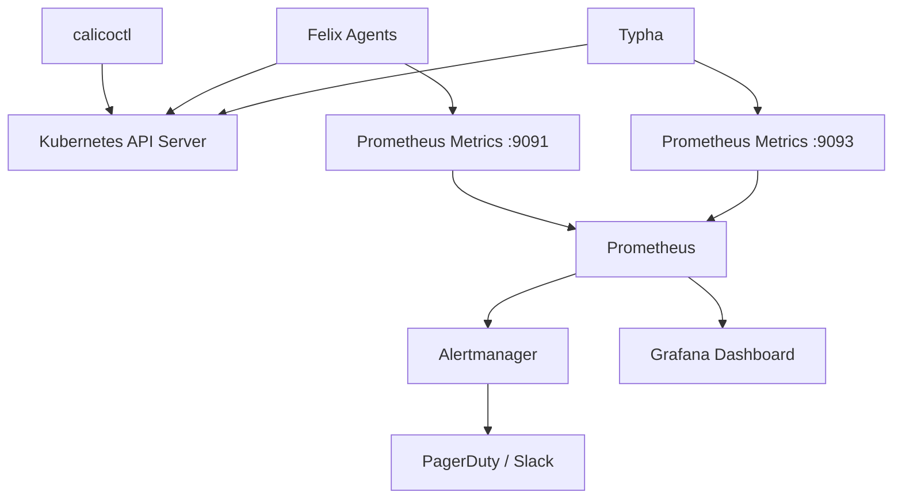

# Monitoring Calicoctl Kubernetes API Datastore Configuration

Author: [nawazdhandala](https://github.com/nawazdhandala)

Tags: Calico, Kubernetes, Monitoring, Observability, calicoctl

Description: Learn how to monitor your calicoctl Kubernetes API datastore configuration with Prometheus metrics, health checks, and alerting to ensure reliable Calico network policy management.

---

## Introduction

When calicoctl uses the Kubernetes API datastore, monitoring the health of this configuration is essential for maintaining reliable network policy management. Connection failures, RBAC permission changes, or API server issues can silently break your ability to manage Calico resources, leaving your cluster in an unmanageable state.

Effective monitoring of the calicoctl-to-Kubernetes API connection involves tracking API server availability, authentication success rates, Calico resource counts, and configuration drift. By integrating these checks into your existing monitoring stack, you gain visibility into problems before they affect production workloads.

This guide covers practical monitoring strategies including health check scripts, Prometheus metrics collection, Grafana dashboards, and alerting rules for calicoctl Kubernetes API datastore configurations.

## Prerequisites

- A running Kubernetes cluster with Calico installed (Kubernetes API datastore)
- calicoctl v3.27 or later installed
- Prometheus and Grafana deployed (or equivalent monitoring stack)
- kubectl access with appropriate permissions
- Basic familiarity with PromQL

## Building Health Check Scripts for Calicoctl

Create a comprehensive health check script that validates calicoctl connectivity and configuration:

```bash
#!/bin/bash
# calico-health-check.sh
# Validates calicoctl can communicate with the Kubernetes API datastore

set -euo pipefail

export DATASTORE_TYPE=kubernetes
HEALTH_STATUS=0

# Check 1: Verify calicoctl can reach the API server
echo "Checking API server connectivity..."
if ! calicoctl get clusterinformation default -o yaml > /dev/null 2>&1; then
    echo "CRITICAL: Cannot reach Kubernetes API datastore"
    HEALTH_STATUS=1
fi

# Check 2: Verify node count matches kubectl
CALICO_NODES=$(calicoctl get nodes -o json 2>/dev/null | python3 -c "import sys,json; print(len(json.load(sys.stdin)['items']))")
KUBE_NODES=$(kubectl get nodes --no-headers 2>/dev/null | wc -l | tr -d ' ')

if [ "$CALICO_NODES" != "$KUBE_NODES" ]; then
    echo "WARNING: Calico node count ($CALICO_NODES) does not match Kubernetes node count ($KUBE_NODES)"
    HEALTH_STATUS=2
fi

# Check 3: Verify IPPool configuration exists
IPPOOL_COUNT=$(calicoctl get ippools -o json 2>/dev/null | python3 -c "import sys,json; print(len(json.load(sys.stdin)['items']))")
if [ "$IPPOOL_COUNT" -eq 0 ]; then
    echo "CRITICAL: No IPPools configured"
    HEALTH_STATUS=1
fi

# Check 4: Verify Felix is reporting status
echo "Checking Felix status on nodes..."
if ! calicoctl node status > /dev/null 2>&1; then
    echo "WARNING: Cannot retrieve node status"
    HEALTH_STATUS=2
fi

echo "Health check complete. Status: $HEALTH_STATUS"
exit $HEALTH_STATUS
```

## Collecting Prometheus Metrics from Calico Components

Calico's Felix and Typha components expose Prometheus metrics. Configure scraping to monitor the datastore interaction:

```yaml
# prometheus-calico-servicemonitor.yaml
apiVersion: monitoring.coreos.com/v1
kind: ServiceMonitor
metadata:
  name: calico-felix-metrics
  namespace: monitoring
  labels:
    app: calico
spec:
  selector:
    matchLabels:
      k8s-app: calico-node
  namespaceSelector:
    matchNames:
      - calico-system
  endpoints:
    - port: http-metrics
      path: /metrics
      interval: 30s
---
apiVersion: monitoring.coreos.com/v1
kind: ServiceMonitor
metadata:
  name: calico-typha-metrics
  namespace: monitoring
  labels:
    app: calico
spec:
  selector:
    matchLabels:
      k8s-app: calico-typha
  namespaceSelector:
    matchNames:
      - calico-system
  endpoints:
    - port: http-metrics
      path: /metrics
      interval: 30s
```

Key metrics to monitor:

```bash
# Felix datastore connection metrics
felix_cluster_num_policies        # Total number of active policies
felix_cluster_num_profiles        # Total number of active profiles
felix_cluster_num_host_endpoints  # Total number of host endpoints

# Typha metrics (if using Typha)
typha_connections_accepted        # Number of connections from Felix
typha_connections_dropped         # Dropped connections (indicates issues)

# API server latency from Felix's perspective
felix_calc_graph_update_time_seconds  # Time to process datastore updates
```

## Setting Up Alerting Rules

```yaml
# calico-alerting-rules.yaml
apiVersion: monitoring.coreos.com/v1
kind: PrometheusRule
metadata:
  name: calico-datastore-alerts
  namespace: monitoring
spec:
  groups:
    - name: calico-datastore
      interval: 60s
      rules:
        # Alert when Felix loses datastore connection
        - alert: CalicoFelixDatastoreFailure
          expr: felix_resync_state != 3
          for: 5m
          labels:
            severity: critical
          annotations:
            summary: "Felix datastore sync failure on {{ $labels.instance }}"
            description: "Felix on node {{ $labels.instance }} has not been in sync with the datastore for over 5 minutes."

        # Alert when policy count drops unexpectedly
        - alert: CalicoPolicyCountDrop
          expr: felix_cluster_num_policies < 1
          for: 2m
          labels:
            severity: warning
          annotations:
            summary: "No Calico policies detected"
            description: "The cluster has zero active Calico policies, which may indicate a datastore connectivity issue."

        # Alert when Typha drops connections
        - alert: CalicoTyphaConnectionDrops
          expr: rate(typha_connections_dropped[5m]) > 0
          for: 5m
          labels:
            severity: warning
          annotations:
            summary: "Typha dropping Felix connections"
            description: "Typha is dropping connections from Felix agents, which may indicate resource constraints."

        # Alert on high API server latency for Calico operations
        - alert: CalicoHighDatastoreLatency
          expr: histogram_quantile(0.99, rate(felix_calc_graph_update_time_seconds_bucket[5m])) > 5
          for: 10m
          labels:
            severity: warning
          annotations:
            summary: "High Calico datastore update latency"
            description: "The 99th percentile of Felix graph update time exceeds 5 seconds."
```



## Creating a Monitoring CronJob

Deploy an in-cluster CronJob that periodically validates calicoctl configuration:

```yaml
# calico-monitor-cronjob.yaml
apiVersion: batch/v1
kind: CronJob
metadata:
  name: calico-config-monitor
  namespace: calico-system
spec:
  schedule: "*/5 * * * *"
  jobTemplate:
    spec:
      template:
        spec:
          serviceAccountName: calico-monitor
          containers:
            - name: monitor
              image: calico/ctl:v3.27.0
              command:
                - /bin/sh
                - -c
                - |
                  # Verify calicoctl can list resources
                  echo "Checking Calico resource access..."
                  calicoctl get nodes -o wide || exit 1
                  calicoctl get ippools -o yaml || exit 1
                  calicoctl get felixconfigurations default -o yaml || exit 1
                  echo "All checks passed at $(date)"
              env:
                - name: DATASTORE_TYPE
                  value: "kubernetes"
          restartPolicy: OnFailure
```

## Verification

```bash
# Verify Prometheus is scraping Calico metrics
kubectl port-forward -n monitoring svc/prometheus 9090:9090 &
curl -s "http://localhost:9090/api/v1/targets" | python3 -c "
import sys, json
data = json.load(sys.stdin)
for target in data['data']['activeTargets']:
    if 'calico' in target.get('labels', {}).get('job', ''):
        print(f\"Target: {target['labels']['job']} - State: {target['health']}\")
"

# Check the CronJob is running
kubectl get cronjob calico-config-monitor -n calico-system
kubectl get jobs -n calico-system --sort-by=.metadata.creationTimestamp | tail -5

# Verify alerting rules are loaded
curl -s "http://localhost:9090/api/v1/rules" | python3 -c "
import sys, json
data = json.load(sys.stdin)
for group in data['data']['groups']:
    if 'calico' in group['name']:
        for rule in group['rules']:
            print(f\"Rule: {rule['name']} - State: {rule['state']}\")
"
```

## Troubleshooting

- **Metrics endpoint not found**: Verify Felix metrics are enabled in the FelixConfiguration. Check that `prometheusMetricsEnabled` is set to `true` with `calicoctl get felixconfiguration default -o yaml`.
- **ServiceMonitor not discovered**: Ensure Prometheus has the correct label selectors for ServiceMonitor discovery. Check the Prometheus operator configuration.
- **CronJob failing**: Inspect the job logs with `kubectl logs -n calico-system job/<job-name>`. Common causes include missing RBAC permissions for the service account.
- **Stale metrics**: If metrics are not updating, check that the Felix and Typha pods are running and healthy with `kubectl get pods -n calico-system`.

## Conclusion

Monitoring your calicoctl Kubernetes API datastore configuration provides early warning of connectivity issues, permission changes, and configuration drift. By combining Prometheus metrics from Felix and Typha, scheduled health checks via CronJobs, and proactive alerting rules, you can ensure that your Calico management plane remains healthy and responsive. Integrate these monitoring practices into your existing observability stack to maintain full visibility into your cluster networking infrastructure.
