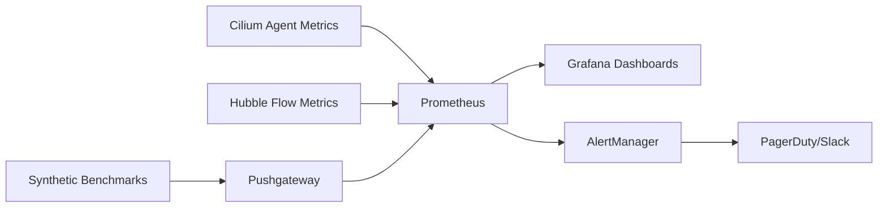

# Monitoring Request/Response Rate (TCP_RR) in Cilium Performance

Author: [nawazdhandala](https://github.com/nawazdhandala)

Tags: Cilium, Kubernetes, Networking, Performance, TCP_RR, Monitoring, Prometheus

Description: Set up comprehensive monitoring for TCP request/response latency in Cilium clusters using Prometheus, Grafana, and Hubble metrics.

---

## Introduction

Monitoring TCP_RR (request/response) performance in production is essential for microservices architectures where end-to-end latency directly impacts user experience. While synthetic benchmarks like netperf give you a controlled measurement, production monitoring must capture real-world transaction latency across all pod-to-pod communication paths.

Cilium provides multiple monitoring integration points: Hubble flow metrics expose per-flow latency data, the Cilium agent exports eBPF datapath metrics to Prometheus, and kernel-level TCP metrics reveal socket behavior. Combining these gives a complete picture of TCP_RR performance in production.

This guide walks through setting up each monitoring layer and creating dashboards that surface latency regressions before they affect users.

## Prerequisites

- Kubernetes cluster with Cilium v1.14+
- Prometheus Operator installed
- Grafana for dashboards
- Hubble enabled in Cilium
- `cilium` and `hubble` CLI tools

## Enabling Cilium and Hubble Metrics

Configure Cilium to export comprehensive metrics:

```bash
helm upgrade cilium cilium/cilium --namespace kube-system \
  --set prometheus.enabled=true \
  --set operator.prometheus.enabled=true \
  --set hubble.enabled=true \
  --set hubble.relay.enabled=true \
  --set hubble.metrics.enabled="{dns:query;ignoreAAAA,drop,tcp,flow,flows-to-world,port-distribution,httpV2:exemplars=true;labelsContext=source_ip\,source_namespace\,source_workload\,destination_ip\,destination_namespace\,destination_workload}"
```

Create a ServiceMonitor to scrape Cilium metrics:

```yaml
apiVersion: monitoring.coreos.com/v1
kind: ServiceMonitor
metadata:
  name: cilium-agent
  namespace: kube-system
spec:
  selector:
    matchLabels:
      k8s-app: cilium
  endpoints:
  - port: metrics
    interval: 15s
  - port: hubble-metrics
    interval: 15s
```

## Key Metrics for TCP_RR Monitoring

### Hubble TCP Metrics

```yaml
# Important Hubble TCP metrics:
# hubble_tcp_flags_total - TCP flag distribution (SYN, FIN, RST)
# hubble_flows_processed_total - Total flow count
# hubble_drop_total - Packet drops by reason
```

### Cilium Agent Metrics

```bash
# Key metrics to monitor
cilium metrics list | grep -E "bpf|forward|drop|policy"

# Critical ones:
# cilium_forward_count_total - Packets forwarded
# cilium_forward_bytes_total - Bytes forwarded
# cilium_drop_count_total - Packets dropped
# cilium_policy_l7_total - L7 policy decisions
# cilium_bpf_map_ops_total - BPF map operations (conntrack lookups)
```

## Grafana Dashboard for TCP_RR

Create a comprehensive dashboard:

```json
{
  "dashboard": {
    "title": "Cilium TCP_RR Performance",
    "panels": [
      {
        "title": "TCP Flow Rate (flows/sec)",
        "type": "graph",
        "targets": [
          {
            "expr": "rate(hubble_flows_processed_total{type=\"TRACE\",protocol=\"TCP\"}[5m])",
            "legendFormat": "{{source_workload}} -> {{destination_workload}}"
          }
        ]
      },
      {
        "title": "TCP Retransmissions",
        "type": "graph",
        "targets": [
          {
            "expr": "rate(hubble_tcp_flags_total{flag=\"SYN\"}[5m]) - rate(hubble_tcp_flags_total{flag=\"SYN-ACK\"}[5m])",
            "legendFormat": "SYN without SYN-ACK (potential retransmits)"
          }
        ]
      },
      {
        "title": "BPF Conntrack Operations",
        "type": "graph",
        "targets": [
          {
            "expr": "rate(cilium_bpf_map_ops_total{map_name=~\".*ct.*\",operation=\"update\"}[5m])",
            "legendFormat": "CT updates/sec"
          }
        ]
      },
      {
        "title": "Packet Drop Rate",
        "type": "graph",
        "targets": [
          {
            "expr": "rate(cilium_drop_count_total[5m])",
            "legendFormat": "{{reason}}"
          }
        ]
      }
    ]
  }
}
```

## Synthetic TCP_RR Monitoring

Deploy continuous netperf monitoring:

```yaml
apiVersion: batch/v1
kind: CronJob
metadata:
  name: tcp-rr-monitor
  namespace: monitoring
spec:
  schedule: "*/10 * * * *"
  jobTemplate:
    spec:
      template:
        spec:
          containers:
          - name: netperf
            image: cilium/netperf
            command:
            - /bin/sh
            - -c
            - |
              RESULT=$(netperf -H netperf-server.monitoring -t TCP_RR -l 10 -- -r 1,1 -o throughput,mean_latency,p99_latency 2>/dev/null)
              TPS=$(echo "$RESULT" | tail -1 | awk '{print $1}')
              MEAN_LAT=$(echo "$RESULT" | tail -1 | awk '{print $2}')
              P99_LAT=$(echo "$RESULT" | tail -1 | awk '{print $3}')

              cat <<METRICS | curl --data-binary @- http://pushgateway.monitoring:9091/metrics/job/tcp_rr
              cilium_tcp_rr_tps $TPS
              cilium_tcp_rr_mean_latency_us $MEAN_LAT
              cilium_tcp_rr_p99_latency_us $P99_LAT
              METRICS
          restartPolicy: OnFailure
```

## Alerting Rules

```yaml
apiVersion: monitoring.coreos.com/v1
kind: PrometheusRule
metadata:
  name: tcp-rr-alerts
  namespace: monitoring
spec:
  groups:
  - name: tcp-rr-performance
    rules:
    - alert: TCPRRLatencyHigh
      expr: cilium_tcp_rr_p99_latency_us > 1000
      for: 10m
      labels:
        severity: warning
      annotations:
        summary: "TCP_RR p99 latency exceeds 1ms"
    - alert: TCPRRThroughputLow
      expr: cilium_tcp_rr_tps < 0.8 * avg_over_time(cilium_tcp_rr_tps[7d])
      for: 30m
      labels:
        severity: warning
      annotations:
        summary: "TCP_RR transactions/sec dropped 20% below weekly average"
    - alert: CiliumHighDropRate
      expr: rate(cilium_drop_count_total[5m]) > 100
      for: 5m
      labels:
        severity: critical
      annotations:
        summary: "Cilium dropping >100 packets/sec"
```

## Verification

```bash
# Verify metrics are being collected
curl -s http://prometheus:9090/api/v1/query?query=cilium_tcp_rr_tps

# Check Hubble metrics endpoint
kubectl port-forward -n kube-system svc/hubble-metrics 9965:9965
curl -s http://localhost:9965/metrics | grep hubble_tcp

# Verify CronJob
kubectl get cronjobs -n monitoring
kubectl get jobs -n monitoring --sort-by=.metadata.creationTimestamp | tail -5
```

## Troubleshooting

- **Hubble metrics not appearing**: Verify Hubble is enabled with `cilium status`. Check that the `hubble-metrics` port is exposed in the Cilium DaemonSet.
- **Pushgateway metrics stale**: Check CronJob execution logs with `kubectl logs job/<job-name> -n monitoring`.
- **Dashboard shows no data**: Verify Prometheus is scraping the correct targets with `kubectl port-forward svc/prometheus 9090` and check Targets page.
- **Alerting not working**: Confirm PrometheusRule CRD is installed and the operator is watching the monitoring namespace.

## Building a Monitoring Pipeline

A complete monitoring pipeline for Cilium performance includes data collection, storage, visualization, and alerting:

### Data Collection Architecture



### Essential Dashboards

Create three dashboards for complete visibility:

1. **Overview Dashboard**: High-level cluster performance metrics
   - Aggregate throughput across all nodes
   - P99 latency percentile
   - Active identity and endpoint counts
   - BPF map utilization gauges

2. **Node Detail Dashboard**: Per-node performance metrics
   - Per-node throughput and latency
   - CPU utilization breakdown (user, system, softirq)
   - NIC statistics (drops, errors, queue depth)
   - Cilium agent resource usage

3. **Trend Dashboard**: Long-term performance trends
   - Weekly throughput trend with regression detection
   - Identity count growth rate
   - Policy computation time trend
   - Conntrack table utilization over time

### Alert Tuning

Avoid alert fatigue by tuning thresholds appropriately:

```yaml
# Start with loose thresholds and tighten based on data
# Week 1: Alert at 50% degradation (catch major issues)
# Week 2: Tighten to 30% based on observed variance
# Week 3: Final threshold at 15-20% degradation
```

Regular review of alert history helps identify flapping alerts and adjust thresholds. Aim for zero false positives while still catching real regressions within your SLA.

## Conclusion

Comprehensive TCP_RR monitoring in Cilium requires a multi-layered approach: Hubble flow metrics for real-world traffic patterns, Cilium agent metrics for datapath health, and synthetic benchmarks for controlled latency tracking. By combining these into Grafana dashboards with Prometheus alerting, you can detect latency regressions within minutes and correlate them with specific datapath changes. This monitoring foundation is essential for maintaining low-latency microservices communication at scale.
