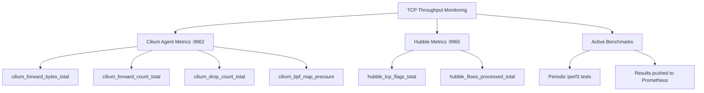

# How to Monitor TCP Throughput (TCP_STREAM) in Cilium Performance

Author: [nawazdhandala](https://github.com/nawazdhandala)

Tags: Cilium, TCP, Performance, Monitoring, Prometheus

Description: Learn how to set up continuous monitoring for TCP throughput in Cilium, including Prometheus metrics, Grafana dashboards, and alerting for throughput degradation.

---

## Introduction

Monitoring TCP throughput continuously is essential for detecting performance regressions before they impact your workloads. A one-time benchmark tells you the current state, but only ongoing monitoring can catch gradual degradation caused by configuration drift, increasing traffic, or infrastructure changes.

Cilium provides several metrics that correlate with TCP throughput, including forwarded byte counters, connection tracking table usage, and packet processing rates. Combined with periodic active measurements, these metrics give you a complete picture of your cluster's TCP performance over time.

This guide shows you how to set up continuous TCP throughput monitoring using Cilium metrics, Prometheus, and Grafana.

## Prerequisites

- Kubernetes cluster with Cilium and Hubble enabled
- Prometheus with Cilium ServiceMonitors configured
- Grafana for dashboard visualization
- kubectl and Helm 3 access

## Key Metrics for TCP Throughput Monitoring

Cilium and Hubble expose several metrics that indicate TCP throughput health:

```bash
# Forwarded bytes and packets (overall throughput indicator)
kubectl -n kube-system exec ds/cilium -- \
  wget -qO- http://localhost:9962/metrics 2>/dev/null | \
  grep -E "cilium_forward_bytes_total|cilium_forward_count_total" | grep -v "^#"

# TCP connection metrics from Hubble
kubectl -n kube-system exec ds/cilium -- \
  wget -qO- http://localhost:9965/metrics 2>/dev/null | \
  grep "hubble_tcp" | grep -v "^#"

# Connection tracking table usage (affects throughput when full)
kubectl -n kube-system exec ds/cilium -- \
  wget -qO- http://localhost:9962/metrics 2>/dev/null | \
  grep "cilium_bpf_map_pressure" | grep -v "^#"

# Drop count (drops reduce effective throughput)
kubectl -n kube-system exec ds/cilium -- \
  wget -qO- http://localhost:9962/metrics 2>/dev/null | \
  grep "cilium_drop_count_total" | grep -v "^#"
```



## Setting Up Prometheus Alerting

Create alerts for TCP throughput degradation:

```yaml
# tcp-throughput-alerts.yaml
apiVersion: monitoring.coreos.com/v1
kind: PrometheusRule
metadata:
  name: cilium-tcp-throughput-alerts
  namespace: monitoring
  labels:
    release: prometheus
spec:
  groups:
    - name: cilium-tcp-throughput
      rules:
        # Alert on high drop rate (affects throughput)
        - alert: CiliumHighDropRate
          expr: |
            sum by (instance) (rate(cilium_drop_count_total[5m])) > 1000
          for: 5m
          labels:
            severity: warning
          annotations:
            summary: "High packet drop rate on {{ $labels.instance }}: {{ $value }} drops/s"

        # Alert on CT table pressure (causes connection failures)
        - alert: CiliumCTTablePressure
          expr: |
            cilium_bpf_map_pressure{map_name=~".*ct.*"} > 0.75
          for: 5m
          labels:
            severity: warning
          annotations:
            summary: "CT table {{ $labels.map_name }} at {{ $value | humanizePercentage }} on {{ $labels.instance }}"

        # Alert on TCP RST spike (indicates connection problems)
        - alert: CiliumTCPResetSpike
          expr: |
            sum(rate(hubble_tcp_flags_total{flag="RST"}[5m])) > 100
          for: 5m
          labels:
            severity: warning
          annotations:
            summary: "TCP RST rate: {{ $value }}/s - potential throughput issue"

        # Alert on forwarding rate drop (traffic baseline alert)
        - alert: CiliumForwardingRateDrop
          expr: |
            sum(rate(cilium_forward_bytes_total[5m])) < 1e6
            and sum(rate(cilium_forward_bytes_total[5m] offset 1h)) > 1e8
          for: 10m
          labels:
            severity: critical
          annotations:
            summary: "Forwarding rate dropped significantly compared to 1 hour ago"
```

```bash
kubectl apply -f tcp-throughput-alerts.yaml
```

## Building a TCP Throughput Dashboard

Create Grafana dashboard panels for TCP throughput monitoring:

```bash
# PromQL queries for dashboard panels:

# Panel 1: Total forwarded bytes per second (cluster throughput)
sum(rate(cilium_forward_bytes_total[5m])) * 8  # Convert to bits/s

# Panel 2: Forwarded bytes per node
sum by (instance) (rate(cilium_forward_bytes_total[5m])) * 8

# Panel 3: TCP connection rate (SYN flags = new connections)
sum(rate(hubble_tcp_flags_total{flag="SYN"}[5m]))

# Panel 4: TCP error indicators
sum by (flag) (rate(hubble_tcp_flags_total{flag=~"RST|FIN"}[5m]))

# Panel 5: Drop rate that affects throughput
sum(rate(cilium_drop_count_total[5m]))

# Panel 6: BPF map pressure
cilium_bpf_map_pressure{map_name=~".*ct.*|.*nat.*"}
```

Create the dashboard ConfigMap:

```yaml
# tcp-throughput-dashboard.yaml
apiVersion: v1
kind: ConfigMap
metadata:
  name: cilium-tcp-throughput-dashboard
  namespace: monitoring
  labels:
    grafana_dashboard: "1"
data:
  cilium-tcp-throughput.json: |
    {
      "dashboard": {
        "title": "Cilium TCP Throughput",
        "rows": [
          {
            "panels": [
              {
                "title": "Cluster Throughput (bits/s)",
                "type": "timeseries",
                "targets": [
                  {"expr": "sum(rate(cilium_forward_bytes_total[5m])) * 8"}
                ]
              },
              {
                "title": "TCP Connection Rate",
                "type": "timeseries",
                "targets": [
                  {"expr": "sum(rate(hubble_tcp_flags_total{flag=\"SYN\"}[5m]))"}
                ]
              }
            ]
          }
        ]
      }
    }
```

```bash
kubectl apply -f tcp-throughput-dashboard.yaml
```

## Setting Up Active Throughput Monitoring

Run periodic benchmarks to track actual throughput over time:

```yaml
# throughput-monitor-cronjob.yaml
apiVersion: batch/v1
kind: CronJob
metadata:
  name: tcp-throughput-monitor
  namespace: monitoring
spec:
  schedule: "0 */4 * * *"  # Every 4 hours
  jobTemplate:
    spec:
      template:
        spec:
          containers:
            - name: iperf3-test
              image: networkstatic/iperf3
              command:
                - sh
                - -c
                - |
                  # Run a 10-second throughput test
                  RESULT=$(iperf3 -c iperf3-server.monitoring -t 10 -P 4 --json 2>/dev/null)
                  THROUGHPUT=$(echo "$RESULT" | python3 -c "
                  import json, sys
                  try:
                      data = json.load(sys.stdin)
                      bps = data['end']['sum_received']['bits_per_second']
                      print(f'{bps/1e9:.2f}')
                  except:
                      print('0')
                  ")
                  echo "TCP throughput: ${THROUGHPUT} Gbps"

                  # Push to Prometheus Pushgateway if available
                  if [ -n "$PUSHGATEWAY_URL" ]; then
                    echo "cilium_tcp_throughput_gbps $THROUGHPUT" | \
                      curl --data-binary @- "$PUSHGATEWAY_URL/metrics/job/tcp_benchmark"
                  fi
              env:
                - name: PUSHGATEWAY_URL
                  value: "http://prometheus-pushgateway.monitoring:9091"
          restartPolicy: OnFailure
```

```bash
# Deploy an iperf3 server for monitoring
kubectl -n monitoring run iperf3-server --image=networkstatic/iperf3 --port=5201 -- -s
kubectl -n monitoring expose pod iperf3-server --port=5201

kubectl apply -f throughput-monitor-cronjob.yaml
```

## Verification

Confirm monitoring is working:

```bash
# 1. Alert rules loaded
curl -s 'http://localhost:9090/api/v1/rules' | python3 -c "
import json, sys
data = json.load(sys.stdin)
tcp_rules = [r['name'] for g in data['data']['groups'] for r in g['rules'] if 'tcp' in r.get('name','').lower() or 'throughput' in r.get('name','').lower()]
print(f'TCP-related alert rules: {tcp_rules}')
"

# 2. Metrics are being collected
curl -s 'http://localhost:9090/api/v1/query?query=sum(rate(cilium_forward_bytes_total[5m]))*8' | python3 -c "
import json, sys
data = json.load(sys.stdin)
result = data.get('data',{}).get('result',[])
if result:
    bps = float(result[0]['value'][1])
    print(f'Current cluster throughput: {bps/1e9:.2f} Gbps')
"

# 3. Dashboard exists
kubectl -n monitoring get configmap cilium-tcp-throughput-dashboard

# 4. CronJob is scheduled
kubectl -n monitoring get cronjobs tcp-throughput-monitor
```

## Troubleshooting

- **Forward bytes metric is zero**: Cilium may not be forwarding traffic yet. Generate test traffic and check again.

- **TCP flag metrics missing**: Ensure `tcp` is in the Hubble metrics enabled list in Helm values.

- **Active benchmark CronJob failing**: Check that the iperf3 server pod is running and the service DNS resolves correctly.

- **Dashboard shows no data**: Verify the Prometheus data source is configured in Grafana and the queries match the metric names in your Cilium version.

## Conclusion

Continuous TCP throughput monitoring combines passive metric collection with active benchmarking. Cilium's forward bytes counter gives you a real-time view of cluster throughput, while TCP flag metrics reveal connection health. BPF map pressure alerts warn you before capacity limits affect performance. Periodic iperf3 benchmarks provide ground-truth throughput numbers you can track over time. Together, these monitoring layers ensure you catch throughput degradation early and can respond before it impacts your workloads.
