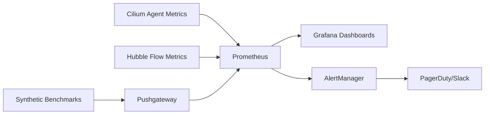

# Monitoring WireGuard Request/Response Performance in Cilium

Author: [nawazdhandala](https://github.com/nawazdhandala)

Tags: Cilium, Kubernetes, WireGuard, Monitoring, Latency, Prometheus

Description: Set up monitoring for WireGuard's impact on request/response latency in Cilium, including per-transaction latency tracking and crypto overhead dashboards.

---

## Introduction

Monitoring WireGuard's impact on request/response latency requires tracking both the absolute latency and the overhead compared to unencrypted paths. In production, latency regressions from encryption can be subtle and gradual, making continuous monitoring essential.

Unlike throughput monitoring where you can observe interface byte counters, latency monitoring requires synthetic benchmarks or application-level instrumentation. This guide covers both approaches to give comprehensive visibility into WireGuard's latency impact.

The monitoring framework should answer two questions at all times: What is the current request/response latency? And how much of that latency is due to WireGuard encryption?

## Prerequisites

- Kubernetes cluster with Cilium v1.14+ and WireGuard enabled
- Prometheus and Grafana
- `netperf` for synthetic benchmarks
- Hubble metrics enabled

## Synthetic Latency Monitoring

```yaml
apiVersion: batch/v1
kind: CronJob
metadata:
  name: wg-latency-monitor
  namespace: monitoring
spec:
  schedule: "*/10 * * * *"
  jobTemplate:
    spec:
      template:
        spec:
          containers:
          - name: monitor
            image: cilium/netperf
            command:
            - /bin/sh
            - -c
            - |
              RR=$(netperf -H netperf-server.monitoring -t TCP_RR -l 10 -- -r 1,1 2>/dev/null | tail -1 | awk '{print $1}')
              cat <<METRIC | curl --data-binary @- http://pushgateway.monitoring:9091/metrics/job/wg_latency
              cilium_wireguard_tcp_rr_tps $RR
              METRIC
          restartPolicy: OnFailure
```

## Alerting on Latency Regression

```yaml
apiVersion: monitoring.coreos.com/v1
kind: PrometheusRule
metadata:
  name: wg-latency-alerts
  namespace: monitoring
spec:
  groups:
  - name: wireguard-latency
    rules:
    - alert: WireGuardLatencyRegression
      expr: |
        cilium_wireguard_tcp_rr_tps
        < 0.8 * avg_over_time(cilium_wireguard_tcp_rr_tps[7d])
      for: 30m
      labels:
        severity: warning
      annotations:
        summary: "WireGuard TCP_RR dropped 20% below weekly average"
```

## Hubble Flow Latency Metrics

```bash
# Enable Hubble TCP metrics for flow-level latency
helm upgrade cilium cilium/cilium --namespace kube-system \
  --set hubble.metrics.enabled="{dns,drop,tcp,flow}"

# Monitor TCP connection duration (proxy for latency)
hubble observe --protocol TCP -o json | \
  jq 'select(.Type == "L3_L4") | .time'
```

## Grafana Dashboard

```json
{
  "panels": [
    {
      "title": "WireGuard TCP_RR Rate",
      "targets": [{"expr": "cilium_wireguard_tcp_rr_tps"}]
    },
    {
      "title": "WireGuard Peer Handshake Latency",
      "targets": [{"expr": "cilium_wireguard_peers"}]
    }
  ]
}
```

## Verification

```bash
# Verify monitoring
kubectl get cronjobs -n monitoring | grep wg
curl -s http://prometheus:9090/api/v1/query?query=cilium_wireguard_tcp_rr_tps
```

## Troubleshooting

- **No metrics from CronJob**: Check netperf server connectivity and Pushgateway availability.
- **Hubble metrics not showing TCP data**: Ensure `tcp` is in the Hubble metrics list.
- **Alerts not firing**: Verify PrometheusRule is in a namespace watched by Prometheus operator.
- **Dashboard shows gaps**: CronJob may be failing -- check job logs.

## Building a Monitoring Pipeline

A complete monitoring pipeline for Cilium performance includes data collection, storage, visualization, and alerting:

### Data Collection Architecture



### Essential Dashboards

Create three dashboards for complete visibility:

1. **Overview Dashboard**: High-level cluster performance metrics
   - Aggregate throughput across all nodes
   - P99 latency percentile
   - Active identity and endpoint counts
   - BPF map utilization gauges

2. **Node Detail Dashboard**: Per-node performance metrics
   - Per-node throughput and latency
   - CPU utilization breakdown (user, system, softirq)
   - NIC statistics (drops, errors, queue depth)
   - Cilium agent resource usage

3. **Trend Dashboard**: Long-term performance trends
   - Weekly throughput trend with regression detection
   - Identity count growth rate
   - Policy computation time trend
   - Conntrack table utilization over time

### Alert Tuning

Avoid alert fatigue by tuning thresholds appropriately:

```yaml
# Start with loose thresholds and tighten based on data
# Week 1: Alert at 50% degradation (catch major issues)
# Week 2: Tighten to 30% based on observed variance
# Week 3: Final threshold at 15-20% degradation
```

Regular review of alert history helps identify flapping alerts and adjust thresholds. Aim for zero false positives while still catching real regressions within your SLA.

## Production Monitoring Checklist

### Daily Monitoring Tasks

Review these metrics daily:

```bash
# Quick health check script
#!/bin/bash
echo "=== Daily Cilium Performance Check ==="

# Agent health
echo "Agents:"
kubectl get pods -n kube-system -l k8s-app=cilium --no-headers | \
  awk '{print $1, $3, $4}'

# Recent drops
echo "\nRecent drops (last hour):"
hubble observe --type drop --since 1h --last 10 -o compact 2>/dev/null || echo "N/A"

# Resource usage
echo "\nAgent resources:"
kubectl top pods -n kube-system -l k8s-app=cilium --no-headers

# Identity count
echo "\nIdentity count:"
cilium identity list 2>/dev/null | wc -l
```

### Weekly Review

Schedule a weekly review of performance trends including throughput baseline comparisons, identity growth rate, policy computation time trends, and any fired alerts from the past week.

## Conclusion

Monitoring WireGuard request/response performance in Cilium requires a combination of synthetic TCP_RR benchmarks and Hubble flow metrics. The synthetic benchmarks provide controlled, comparable measurements, while Hubble metrics reflect real production traffic patterns. Together with alerting on regressions, this monitoring framework ensures WireGuard's latency impact remains within acceptable bounds.
