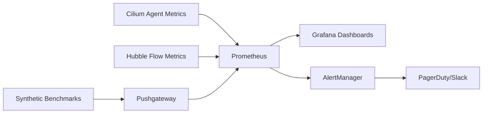

# Monitoring WireGuard Throughput in Cilium Performance

Author: [nawazdhandala](https://github.com/nawazdhandala)

Tags: Cilium, Kubernetes, WireGuard, Encryption, Monitoring, Prometheus

Description: Set up comprehensive monitoring for WireGuard encrypted throughput in Cilium clusters, including crypto metrics, interface statistics, and performance dashboards.

---

## Introduction

Monitoring WireGuard throughput in Cilium requires visibility into both the encryption layer and the underlying network performance. Unlike unencrypted traffic where you only monitor the NIC and BPF datapath, encrypted traffic adds the WireGuard interface as another observation point with its own set of metrics.

This guide covers setting up monitoring for WireGuard performance in Cilium, including interface statistics, CPU overhead from crypto operations, and throughput comparisons between encrypted and unencrypted paths.

Effective monitoring ensures you detect throughput degradation from WireGuard-specific issues like key rotation pauses, MTU misconfigurations, and CPU saturation from crypto processing.

## Prerequisites

- Kubernetes cluster with Cilium v1.14+ and WireGuard enabled
- Prometheus and Grafana
- Node exporter for system-level metrics
- `cilium` CLI

## Enabling WireGuard Metrics

Cilium exports WireGuard-related metrics automatically when encryption is enabled:

```bash
# Verify metrics are available
kubectl exec -n kube-system ds/cilium -- cilium metrics list | grep -i encrypt

# Key metrics:
# cilium_wireguard_peers - Number of WireGuard peers
# cilium_forward_bytes_total - Bytes forwarded (includes encrypted)
# cilium_drop_count_total{reason="Encryption"} - Encryption-related drops
```

## WireGuard Interface Monitoring

Create a DaemonSet that exports WireGuard interface stats:

```yaml
apiVersion: apps/v1
kind: DaemonSet
metadata:
  name: wg-monitor
  namespace: monitoring
spec:
  selector:
    matchLabels:
      app: wg-monitor
  template:
    metadata:
      labels:
        app: wg-monitor
      annotations:
        prometheus.io/scrape: "true"
        prometheus.io/port: "9101"
    spec:
      hostNetwork: true
      containers:
      - name: exporter
        image: busybox:1.36
        securityContext:
          privileged: true
        command:
        - /bin/sh
        - -c
        - |
          while true; do
            # Collect WireGuard stats
            RX=$(cat /sys/class/net/cilium_wg0/statistics/rx_bytes 2>/dev/null || echo 0)
            TX=$(cat /sys/class/net/cilium_wg0/statistics/tx_bytes 2>/dev/null || echo 0)
            RX_PKT=$(cat /sys/class/net/cilium_wg0/statistics/rx_packets 2>/dev/null || echo 0)
            TX_PKT=$(cat /sys/class/net/cilium_wg0/statistics/tx_packets 2>/dev/null || echo 0)
            ERRORS=$(cat /sys/class/net/cilium_wg0/statistics/rx_errors 2>/dev/null || echo 0)

            # Write Prometheus metrics
            cat > /tmp/metrics << PROM
            wireguard_rx_bytes_total $RX
            wireguard_tx_bytes_total $TX
            wireguard_rx_packets_total $RX_PKT
            wireguard_tx_packets_total $TX_PKT
            wireguard_errors_total $ERRORS
            PROM
            sleep 15
          done
        ports:
        - containerPort: 9101
```

## Alerting Rules

```yaml
apiVersion: monitoring.coreos.com/v1
kind: PrometheusRule
metadata:
  name: wireguard-alerts
  namespace: monitoring
spec:
  groups:
  - name: wireguard-performance
    rules:
    - alert: WireGuardThroughputDegraded
      expr: |
        rate(wireguard_tx_bytes_total[5m]) * 8
        < 0.6 * rate(node_network_transmit_bytes_total{device="eth0"}[5m]) * 8
      for: 10m
      labels:
        severity: warning
      annotations:
        summary: "WireGuard throughput below 60% of NIC throughput"
    - alert: WireGuardErrors
      expr: rate(wireguard_errors_total[5m]) > 0
      for: 5m
      labels:
        severity: warning
      annotations:
        summary: "WireGuard interface errors detected"
    - alert: WireGuardPeerDown
      expr: cilium_wireguard_peers < count(kube_node_info) - 1
      for: 5m
      labels:
        severity: critical
      annotations:
        summary: "Not all nodes have WireGuard peer connections"
```

## Grafana Dashboard

Create a dashboard comparing encrypted vs unencrypted performance:

```json
{
  "dashboard": {
    "title": "Cilium WireGuard Performance",
    "panels": [
      {
        "title": "WireGuard Throughput",
        "type": "graph",
        "targets": [
          {
            "expr": "rate(wireguard_tx_bytes_total[5m]) * 8",
            "legendFormat": "WireGuard TX bps"
          }
        ]
      },
      {
        "title": "Encryption Overhead Ratio",
        "type": "gauge",
        "targets": [
          {
            "expr": "rate(wireguard_tx_bytes_total[5m]) / rate(node_network_transmit_bytes_total{device='eth0'}[5m])"
          }
        ]
      },
      {
        "title": "WireGuard Peer Count",
        "type": "stat",
        "targets": [
          {
            "expr": "cilium_wireguard_peers"
          }
        ]
      }
    ]
  }
}
```

## Verification

```bash
# Verify metrics collection
curl -s http://prometheus:9090/api/v1/query?query=wireguard_tx_bytes_total

# Check WireGuard peer status
cilium encrypt status

# Verify dashboard data
echo "Open Grafana and check the WireGuard Performance dashboard"
```

## Troubleshooting

- **No WireGuard metrics**: Verify `cilium_wg0` interface exists on nodes with `ip link show cilium_wg0`.
- **Peer count incorrect**: Check Cilium agent logs for WireGuard peer negotiation errors.
- **Throughput ratio too low**: Profile CPU usage during transfer; check for CPU saturation from crypto.
- **Errors on WireGuard interface**: Check kernel logs with `dmesg | grep wireguard`.

## Building a Monitoring Pipeline

A complete monitoring pipeline for Cilium performance includes data collection, storage, visualization, and alerting:

### Data Collection Architecture



### Essential Dashboards

Create three dashboards for complete visibility:

1. **Overview Dashboard**: High-level cluster performance metrics
   - Aggregate throughput across all nodes
   - P99 latency percentile
   - Active identity and endpoint counts
   - BPF map utilization gauges

2. **Node Detail Dashboard**: Per-node performance metrics
   - Per-node throughput and latency
   - CPU utilization breakdown (user, system, softirq)
   - NIC statistics (drops, errors, queue depth)
   - Cilium agent resource usage

3. **Trend Dashboard**: Long-term performance trends
   - Weekly throughput trend with regression detection
   - Identity count growth rate
   - Policy computation time trend
   - Conntrack table utilization over time

### Alert Tuning

Avoid alert fatigue by tuning thresholds appropriately:

```yaml
# Start with loose thresholds and tighten based on data
# Week 1: Alert at 50% degradation (catch major issues)
# Week 2: Tighten to 30% based on observed variance
# Week 3: Final threshold at 15-20% degradation
```

Regular review of alert history helps identify flapping alerts and adjust thresholds. Aim for zero false positives while still catching real regressions within your SLA.

## Conclusion

Monitoring WireGuard throughput in Cilium requires tracking both the encryption interface statistics and the relationship between encrypted and total traffic. Key metrics include WireGuard interface throughput, error rates, peer counts, and the overhead ratio compared to unencrypted traffic. With proper dashboards and alerts, you can detect WireGuard-specific performance issues before they impact application traffic.
