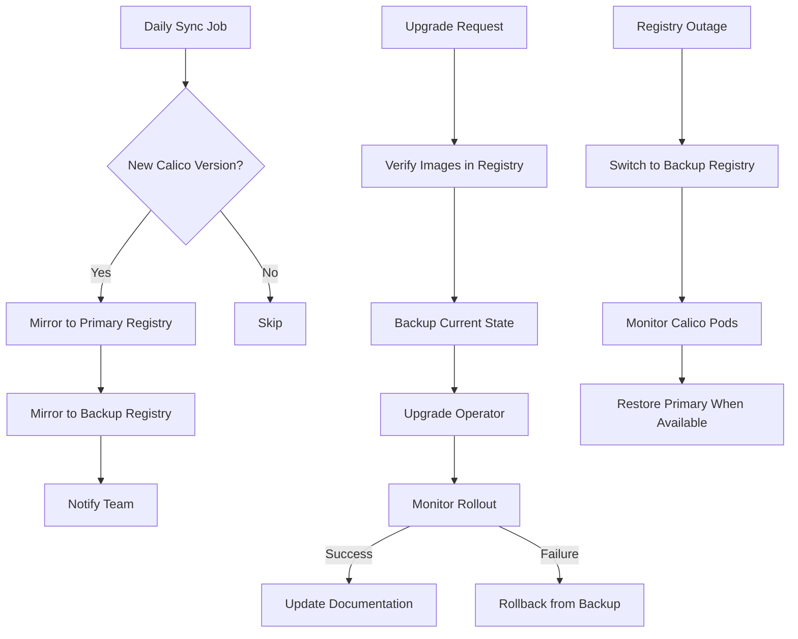

# Operationalizing Calico Alternate Registry Configuration

Author: [nawazdhandala](https://github.com/nawazdhandala)

Tags: Calico, Container Registry, Operations, Kubernetes, DevOps

Description: Learn how to operationalize Calico alternate registry configuration with automated image synchronization, upgrade workflows, disaster recovery, and team processes for production environments.

---

## Introduction

Running Calico with an alternate registry in production requires more than initial configuration. You need automated image synchronization, documented upgrade workflows, disaster recovery procedures for registry failures, and clear team processes for managing the image lifecycle.

Without operational processes, teams discover missing images during critical upgrades, lose time to manual mirroring steps, or find that a registry outage prevents Calico from recovering after a node failure. Operationalizing the alternate registry configuration ensures these scenarios are handled proactively.

This guide covers the essential operational processes for managing Calico with an alternate registry in production environments.

## Prerequisites

- Kubernetes cluster with Calico configured for an alternate registry
- Private container registry with admin access
- CI/CD platform for automation
- Object storage for registry backups
- kubectl and crane CLI tools

## Automated Image Synchronization Pipeline

Create a fully automated pipeline that keeps your registry in sync with Calico releases:

```yaml
# .github/workflows/calico-image-sync.yaml
name: Calico Image Sync
on:
  schedule:
    - cron: '0 2 * * *'  # Daily at 2 AM
  workflow_dispatch:
    inputs:
      version:
        description: 'Specific Calico version to sync'
        required: false

jobs:
  detect-new-version:
    runs-on: ubuntu-latest
    outputs:
      version: ${{ steps.detect.outputs.version }}
      needs_sync: ${{ steps.detect.outputs.needs_sync }}
    steps:
      - name: Install crane
        run: |
          curl -sL "https://github.com/google/go-containerregistry/releases/latest/download/go-containerregistry_Linux_x86_64.tar.gz" | tar -xzf - crane
          sudo mv crane /usr/local/bin/

      - name: Detect latest Calico version
        id: detect
        run: |
          if [ -n "${{ github.event.inputs.version }}" ]; then
            VERSION="${{ github.event.inputs.version }}"
          else
            VERSION=$(crane ls docker.io/calico/node | grep -E '^v[0-9]+\.[0-9]+\.[0-9]+$' | sort -V | tail -1)
          fi
          echo "version=${VERSION}" >> "$GITHUB_OUTPUT"

          # Check if already mirrored
          if crane manifest "${{ secrets.REGISTRY }}/calico/node:${VERSION}" > /dev/null 2>&1; then
            echo "needs_sync=false" >> "$GITHUB_OUTPUT"
          else
            echo "needs_sync=true" >> "$GITHUB_OUTPUT"
          fi

  sync-images:
    needs: detect-new-version
    if: needs.detect-new-version.outputs.needs_sync == 'true'
    runs-on: ubuntu-latest
    steps:
      - uses: actions/checkout@v4

      - name: Install crane
        run: |
          curl -sL "https://github.com/google/go-containerregistry/releases/latest/download/go-containerregistry_Linux_x86_64.tar.gz" | tar -xzf - crane
          sudo mv crane /usr/local/bin/

      - name: Login to private registry
        run: crane auth login ${{ secrets.REGISTRY }} -u ${{ secrets.REGISTRY_USER }} -p ${{ secrets.REGISTRY_PASS }}

      - name: Mirror images
        env:
          VERSION: ${{ needs.detect-new-version.outputs.version }}
        run: |
          IMAGES=("node" "cni" "kube-controllers" "typha" "pod2daemon-flexvol" "csi" "node-driver-registrar")
          for img in "${IMAGES[@]}"; do
            echo "Mirroring calico/${img}:${VERSION}"
            crane copy "docker.io/calico/${img}:${VERSION}" "${{ secrets.REGISTRY }}/calico/${img}:${VERSION}"
          done

      - name: Notify team
        run: |
          echo "New Calico version ${{ needs.detect-new-version.outputs.version }} synced to private registry"
```

## Calico Upgrade Workflow

Document and automate the upgrade process:

```bash
#!/bin/bash
# upgrade-calico.sh
# Orchestrated Calico upgrade with alternate registry

set -euo pipefail

NEW_VERSION="${1:?Usage: $0 <version>}"
REGISTRY="${REGISTRY:-registry.example.com}"

echo "=== Calico Upgrade to ${NEW_VERSION} ==="

# Step 1: Verify images are available
echo "Step 1: Verifying images in registry..."
IMAGES=("node" "cni" "kube-controllers" "typha")
for img in "${IMAGES[@]}"; do
  if crane manifest "${REGISTRY}/calico/${img}:${NEW_VERSION}" > /dev/null 2>&1; then
    echo "  OK: ${img}:${NEW_VERSION}"
  else
    echo "  FAIL: ${img}:${NEW_VERSION} not found in registry"
    exit 1
  fi
done

# Step 2: Backup current state
echo "Step 2: Backing up current Calico state..."
BACKUP_DIR="/var/backups/calico-upgrade-$(date +%Y%m%d-%H%M%S)"
mkdir -p "$BACKUP_DIR"
kubectl get installation default -o yaml > "${BACKUP_DIR}/installation.yaml"
calicoctl get globalnetworkpolicies -o yaml > "${BACKUP_DIR}/policies.yaml" 2>/dev/null || true

# Step 3: Update the operator
echo "Step 3: Upgrading Tigera operator..."
helm upgrade calico projectcalico/tigera-operator \
  --set installation.registry="${REGISTRY}" \
  --set installation.imagePath=calico \
  --version "${NEW_VERSION}" \
  --namespace tigera-operator \
  --wait --timeout=10m

# Step 4: Monitor rollout
echo "Step 4: Monitoring rollout..."
kubectl rollout status daemonset/calico-node -n calico-system --timeout=10m

echo "Upgrade complete. Backup saved to: ${BACKUP_DIR}"
```

## Registry Disaster Recovery

Prepare for registry failures with fallback procedures:

```bash
#!/bin/bash
# registry-failover.sh
# Switch Calico to a backup registry during primary registry outage

set -euo pipefail

BACKUP_REGISTRY="${BACKUP_REGISTRY:-backup-registry.example.com}"

echo "Switching Calico to backup registry: ${BACKUP_REGISTRY}"

# Update the Installation resource
kubectl patch installation default --type merge -p "{
  \"spec\": {
    \"registry\": \"${BACKUP_REGISTRY}\",
    \"imagePath\": \"calico\"
  }
}"

# Monitor the rollout
kubectl rollout status daemonset/calico-node -n calico-system --timeout=10m

echo "Failover complete. Calico now uses: ${BACKUP_REGISTRY}"
echo "Remember to switch back after primary registry is restored."
```



## Inventory Management

Maintain an inventory of mirrored images:

```bash
#!/bin/bash
# calico-image-inventory.sh
# Generate an inventory report of Calico images in the private registry

set -euo pipefail

REGISTRY="${REGISTRY:-registry.example.com}"
IMAGES=("node" "cni" "kube-controllers" "typha" "csi" "pod2daemon-flexvol" "node-driver-registrar")

echo "=== Calico Image Inventory - $(date) ==="
echo "Registry: ${REGISTRY}"
echo ""

for img in "${IMAGES[@]}"; do
  echo "Image: calico/${img}"
  versions=$(crane ls "${REGISTRY}/calico/${img}" 2>/dev/null | grep -E '^v[0-9]+' | sort -V | tail -5)
  if [ -n "$versions" ]; then
    echo "$versions" | while read -r v; do
      echo "  - ${v}"
    done
  else
    echo "  (no versions found)"
  fi
  echo ""
done
```

## Verification

```bash
# Verify all Calico images use the correct registry
kubectl get pods -n calico-system -o jsonpath='{range .items[*]}{.spec.containers[*].image}{"\n"}{end}' | sort -u

# Verify sync pipeline is running
# Check your CI/CD platform for recent sync job runs

# Verify backup registry has images
crane ls backup-registry.example.com/calico/node | tail -3

# Run the inventory report
bash calico-image-inventory.sh
```

## Troubleshooting

- **Sync pipeline fails with rate limiting**: Public registries have pull rate limits. Use authenticated pulls or add retry logic with exponential backoff to your sync pipeline.
- **Upgrade stalls after registry switch**: Check that all nodes can reach the new registry. Run a debug pod on each node to test connectivity.
- **Backup registry out of sync**: Ensure the sync pipeline mirrors to both primary and backup registries. Add the backup as a second destination in the mirroring script.
- **Old images accumulating**: Implement a retention policy in your registry to automatically delete images older than a defined threshold (e.g., keep only the last 5 minor versions).

## Conclusion

Operationalizing Calico alternate registry configuration means building automated processes for image synchronization, structured upgrade workflows, disaster recovery procedures, and inventory management. These processes ensure that your private registry always has the images Calico needs, upgrades are predictable and reversible, and registry failures do not impact cluster networking. Document these procedures in your team runbooks and test the disaster recovery workflow regularly.
