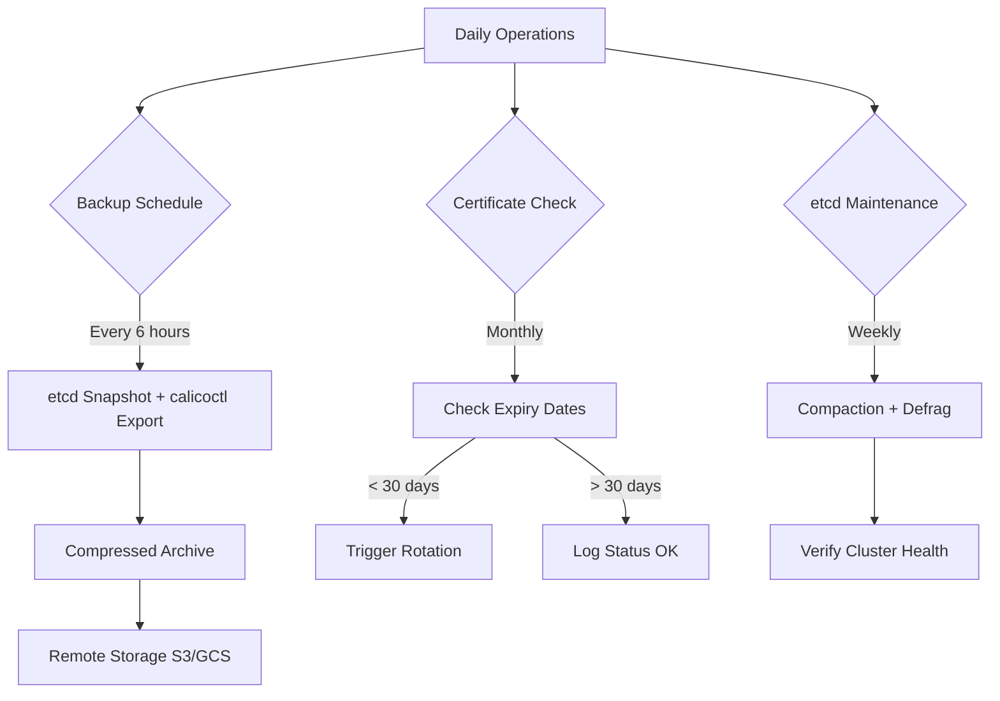

# Operationalizing Calicoctl etcd Configuration

Author: [nawazdhandala](https://github.com/nawazdhandala)

Tags: Calico, etcd, DevOps, Operations, Calicoctl

Description: Learn how to operationalize your calicoctl etcd configuration with backup strategies, certificate lifecycle management, disaster recovery plans, and standardized operational procedures.

---

## Introduction

Moving calicoctl etcd configuration from a development setup to a production-grade operational workflow requires structured processes around backup and restore, certificate lifecycle management, etcd maintenance, and team access controls. Without these processes, a single etcd failure or expired certificate can leave your team unable to manage network policies during a critical incident.

Operationalizing the etcd datastore path is more involved than the Kubernetes API datastore because you must manage the etcd infrastructure independently. This includes etcd backups, compaction schedules, certificate rotation, and disaster recovery procedures.

This guide covers the essential operational procedures for managing calicoctl with an etcd datastore in production environments.

## Prerequisites

- Calico cluster using the etcd datastore backend
- calicoctl v3.27 or later
- etcdctl v3 for backup and maintenance operations
- Access to etcd cluster with admin privileges
- A backup storage location (S3, GCS, or NFS)

## Implementing Automated Backups

Create automated etcd backups that capture all Calico data:

```bash
#!/bin/bash
# calico-etcd-backup.sh
# Automated backup of Calico data from etcd

set -euo pipefail

BACKUP_DIR="/var/backups/calico-etcd"
RETENTION_DAYS=30
ETCD_ENDPOINTS="${ETCD_ENDPOINTS:-https://etcd1:2379}"
CERT_DIR="/etc/calicoctl/certs"
TIMESTAMP=$(date +%Y%m%d-%H%M%S)

mkdir -p "$BACKUP_DIR"

# Create etcd snapshot
echo "Creating etcd snapshot..."
etcdctl --endpoints="$ETCD_ENDPOINTS" \
  --cert="${CERT_DIR}/cert.pem" \
  --key="${CERT_DIR}/key.pem" \
  --cacert="${CERT_DIR}/ca.pem" \
  snapshot save "${BACKUP_DIR}/etcd-snapshot-${TIMESTAMP}.db"

# Also export Calico resources via calicoctl for human-readable backup
echo "Exporting Calico resources..."
export DATASTORE_TYPE=etcdv3
CALICO_BACKUP="${BACKUP_DIR}/calico-resources-${TIMESTAMP}"
mkdir -p "$CALICO_BACKUP"

RESOURCES=(
  "nodes"
  "ippools"
  "globalnetworkpolicies"
  "networkpolicies"
  "globalnetworksets"
  "networksets"
  "bgpconfigurations"
  "bgppeers"
  "felixconfigurations"
  "hostendpoints"
  "profiles"
)

for resource in "${RESOURCES[@]}"; do
  calicoctl get "$resource" -o yaml --all-namespaces > \
    "${CALICO_BACKUP}/${resource}.yaml" 2>/dev/null || true
done

# Compress the backup
tar -czf "${CALICO_BACKUP}.tar.gz" -C "$BACKUP_DIR" \
  "calico-resources-${TIMESTAMP}" \
  "etcd-snapshot-${TIMESTAMP}.db"
rm -rf "$CALICO_BACKUP" "${BACKUP_DIR}/etcd-snapshot-${TIMESTAMP}.db"

# Clean up old backups
find "$BACKUP_DIR" -name "*.tar.gz" -mtime +"$RETENTION_DAYS" -delete

echo "Backup completed: ${CALICO_BACKUP}.tar.gz"
```

Schedule the backup with a cron job:

```bash
# Run backup every 6 hours
0 */6 * * * /usr/local/bin/calico-etcd-backup.sh >> /var/log/calico-backup.log 2>&1
```

## Disaster Recovery Procedure

Document and test the restore procedure:

```bash
#!/bin/bash
# calico-etcd-restore.sh
# Restore Calico data from backup

set -euo pipefail

BACKUP_FILE="${1:?Usage: $0 <backup-file.tar.gz>}"
RESTORE_DIR="/tmp/calico-restore-$(date +%s)"

echo "Extracting backup..."
mkdir -p "$RESTORE_DIR"
tar -xzf "$BACKUP_FILE" -C "$RESTORE_DIR"

# Option 1: Restore from etcd snapshot (full etcd restore)
SNAPSHOT=$(find "$RESTORE_DIR" -name "etcd-snapshot-*.db" | head -1)
if [ -n "$SNAPSHOT" ]; then
    echo "Found etcd snapshot: $SNAPSHOT"
    echo "WARNING: Full etcd restore will replace ALL etcd data."
    echo "To restore full etcd, stop etcd on all members and run:"
    echo "  etcdctl snapshot restore $SNAPSHOT --data-dir=/var/lib/etcd-restore"
fi

# Option 2: Restore individual Calico resources
RESOURCE_DIR=$(find "$RESTORE_DIR" -type d -name "calico-resources-*" | head -1)
if [ -n "$RESOURCE_DIR" ]; then
    echo "Restoring Calico resources from: $RESOURCE_DIR"
    export DATASTORE_TYPE=etcdv3

    # Apply in dependency order
    for resource_file in \
      "${RESOURCE_DIR}/ippools.yaml" \
      "${RESOURCE_DIR}/felixconfigurations.yaml" \
      "${RESOURCE_DIR}/bgpconfigurations.yaml" \
      "${RESOURCE_DIR}/bgppeers.yaml" \
      "${RESOURCE_DIR}/globalnetworksets.yaml" \
      "${RESOURCE_DIR}/globalnetworkpolicies.yaml" \
      "${RESOURCE_DIR}/networksets.yaml" \
      "${RESOURCE_DIR}/networkpolicies.yaml"; do
        if [ -f "$resource_file" ] && [ -s "$resource_file" ]; then
            echo "Applying $(basename "$resource_file")..."
            calicoctl apply -f "$resource_file" || echo "WARNING: Failed to apply $resource_file"
        fi
    done
fi

rm -rf "$RESTORE_DIR"
echo "Restore complete. Verify with: calicoctl get nodes -o wide"
```

## Certificate Lifecycle Management

Maintain a certificate rotation schedule:

```bash
#!/bin/bash
# cert-lifecycle-check.sh
# Monthly certificate lifecycle report

set -euo pipefail

CERT_DIR="/etc/calicoctl/certs"

echo "=== Calico Certificate Lifecycle Report ==="
echo "Date: $(date)"
echo ""

for cert_file in "${CERT_DIR}"/*.pem; do
    [ -f "$cert_file" ] || continue

    subject=$(openssl x509 -in "$cert_file" -noout -subject 2>/dev/null) || continue
    expiry=$(openssl x509 -in "$cert_file" -noout -enddate 2>/dev/null | cut -d= -f2)
    issuer=$(openssl x509 -in "$cert_file" -noout -issuer 2>/dev/null)

    echo "File: $(basename "$cert_file")"
    echo "  Subject: $subject"
    echo "  Issuer: $issuer"
    echo "  Expires: $expiry"

    if ! openssl x509 -in "$cert_file" -noout -checkend 2592000 > /dev/null 2>&1; then
        echo "  STATUS: ROTATION NEEDED (expires within 30 days)"
    else
        echo "  STATUS: OK"
    fi
    echo ""
done
```



## etcd Maintenance Operations

Schedule regular etcd maintenance to prevent performance degradation:

```bash
#!/bin/bash
# etcd-maintenance.sh
# Weekly etcd maintenance for Calico datastore

set -euo pipefail

ETCD_ENDPOINTS="${ETCD_ENDPOINTS:-https://etcd1:2379}"
CERT_DIR="/etc/calicoctl/certs"

ETCD_OPTS="--endpoints=$ETCD_ENDPOINTS \
  --cert=${CERT_DIR}/cert.pem \
  --key=${CERT_DIR}/key.pem \
  --cacert=${CERT_DIR}/ca.pem"

echo "=== etcd Maintenance - $(date) ==="

# Check current status
echo "Cluster status:"
etcdctl $ETCD_OPTS endpoint status -w table

# Get current revision for compaction
REVISION=$(etcdctl $ETCD_OPTS endpoint status -w json | \
  python3 -c "import sys,json; print(json.loads(sys.stdin.read())[0]['Status']['header']['revision'])")

echo "Current revision: $REVISION"

# Compact to current revision
echo "Compacting to revision $REVISION..."
etcdctl $ETCD_OPTS compact "$REVISION"

# Defragment each member
echo "Defragmenting cluster members..."
etcdctl $ETCD_OPTS defrag --cluster

# Verify health after maintenance
echo "Post-maintenance health check:"
etcdctl $ETCD_OPTS endpoint health --cluster

echo "Maintenance complete."
```

## Verification

```bash
# Verify backup works by doing a test restore
bash calico-etcd-backup.sh
LATEST_BACKUP=$(ls -t /var/backups/calico-etcd/*.tar.gz | head -1)
echo "Latest backup: $LATEST_BACKUP"
tar -tzf "$LATEST_BACKUP"

# Verify certificate lifecycle report
bash cert-lifecycle-check.sh

# Verify etcd health after maintenance
etcdctl --endpoints=$ETCD_ENDPOINTS \
  --cert=/etc/calicoctl/certs/cert.pem \
  --key=/etc/calicoctl/certs/key.pem \
  --cacert=/etc/calicoctl/certs/ca.pem \
  endpoint health --cluster
```

## Troubleshooting

- **Backup fails with "context deadline exceeded"**: The etcd cluster is under heavy load or a member is down. Try targeting a specific healthy member with a single endpoint.
- **Restore fails with "resource already exists"**: Use `calicoctl replace` instead of `calicoctl apply` for resources that already exist, or delete them first.
- **Compaction fails**: The etcd cluster may not have quorum. Verify all members are healthy before running maintenance.
- **Certificate rotation breaks calico-node**: After rotating calicoctl certificates, remember to also update certificates used by calico-node pods. They use separate credentials.

## Conclusion

Operationalizing calicoctl etcd configuration means establishing automated backups, certificate rotation schedules, disaster recovery procedures, and regular etcd maintenance. These operational processes protect against data loss, prevent certificate-related outages, and ensure consistent etcd performance. Document these procedures in your team runbooks and test them regularly to maintain confidence in your Calico management infrastructure.
