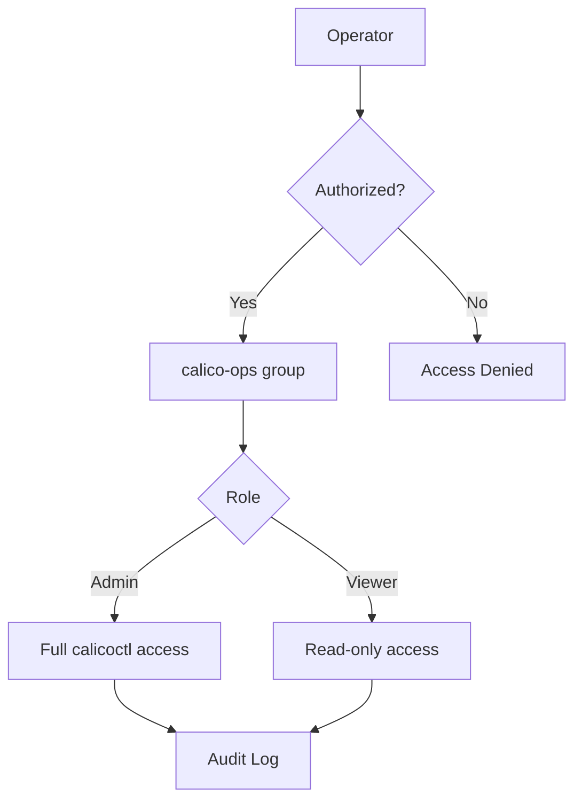

# How to Operationalize Calicoctl Installation

Author: [nawazdhandala](https://github.com/nawazdhandala)

Tags: Calico, calicoctl, Operations, Installation, Best Practices

Description: A guide to making calicoctl a well-managed operational tool in your infrastructure, covering upgrade procedures, access management, usage policies, and integration with operational workflows.

---

## Introduction

Operationalizing calicoctl means treating it as a managed piece of infrastructure rather than a tool that individuals install ad hoc. This includes standardized installation procedures, controlled upgrade paths, access management, usage auditing, and integration with your team's operational workflows.

This guide covers the practices that transform calicoctl from a manually managed tool into a properly operated infrastructure component. We address upgrade management, access control, operational integration, and documentation that ensures continuity as team members change.

When calicoctl is well-operationalized, any team member can use it confidently, upgrades happen without disruption, and usage is auditable for compliance requirements.

## Prerequisites

- calicoctl installed on managed systems
- A configuration management system (Ansible, Puppet, Chef)
- An artifact repository for binary management
- Documentation platform for runbooks
- Team agreement on operational standards

## Standardized Installation and Upgrade Procedure

Create a managed upgrade path that prevents version skew.

```bash
#!/bin/bash
# upgrade-calicoctl.sh
# Standardized calicoctl upgrade procedure
# Usage: ./upgrade-calicoctl.sh <new-version>

set -euo pipefail

NEW_VERSION="${1:?Usage: $0 <version> (e.g., v3.27.0)}"
INSTALL_DIR="/usr/local/bin"
BACKUP_DIR="/opt/calicoctl-backups"
ARCH=$(uname -m | sed 's/x86_64/amd64/;s/aarch64/arm64/')

echo "=== Calicoctl Upgrade Procedure ==="
echo "Target version: ${NEW_VERSION}"
echo ""

# Step 1: Record current version
CURRENT_VERSION=$(calicoctl version 2>/dev/null | grep "Client Version" | awk '{print $NF}' || echo "none")
echo "Current version: ${CURRENT_VERSION}"

# Step 2: Backup current binary
if [ -f "${INSTALL_DIR}/calicoctl" ]; then
  sudo mkdir -p ${BACKUP_DIR}
  sudo cp ${INSTALL_DIR}/calicoctl ${BACKUP_DIR}/calicoctl-${CURRENT_VERSION}
  echo "Backup saved to: ${BACKUP_DIR}/calicoctl-${CURRENT_VERSION}"
fi

# Step 3: Download new version
echo "Downloading ${NEW_VERSION}..."
curl -fsSL -o /tmp/calicoctl   "https://github.com/projectcalico/calico/releases/download/${NEW_VERSION}/calicoctl-linux-${ARCH}"

# Step 4: Install
sudo install -o root -g root -m 0755 /tmp/calicoctl ${INSTALL_DIR}/calicoctl
rm -f /tmp/calicoctl

# Step 5: Verify
echo ""
echo "Verification:"
calicoctl version
calicoctl get nodes -o name > /dev/null 2>&1 && echo "Datastore: CONNECTED" || echo "Datastore: FAILED"

# Step 6: Log the upgrade
echo "$(date) - Upgraded calicoctl from ${CURRENT_VERSION} to ${NEW_VERSION} on $(hostname)" |   sudo tee -a /var/log/calicoctl-upgrades.log
```

## Access Management

Control who can use calicoctl and what operations they can perform.

```bash
#!/bin/bash
# setup-calicoctl-access.sh
# Configure access controls for calicoctl

# Create a dedicated group for calicoctl users
sudo groupadd -f calico-ops

# Set binary permissions to group-executable
sudo chown root:calico-ops /usr/local/bin/calicoctl
sudo chmod 750 /usr/local/bin/calicoctl

# Add authorized users to the group
# sudo usermod -aG calico-ops <username>

echo "Access configuration:"
ls -la /usr/local/bin/calicoctl
echo ""
echo "Group members:"
getent group calico-ops
```

Create role-specific calicoctl configurations:

```yaml
# /etc/calico/calicoctl-readonly.cfg
# Read-only configuration using a restricted service account
apiVersion: projectcalico.org/v3
kind: CalicoAPIConfig
metadata:
spec:
  datastoreType: "kubernetes"
  kubeconfig: "/etc/calico/kubeconfig-readonly"
```



## Integrating with Operational Workflows

Make calicoctl part of standard operational procedures.

```bash
#!/bin/bash
# ops-wrapper.sh
# Operational wrapper for calicoctl with auditing

CALICOCTL_BIN="/usr/local/bin/calicoctl"
AUDIT_LOG="/var/log/calicoctl-audit.log"

# Log the operation
echo "$(date) user=$(whoami) host=$(hostname) cmd=calicoctl args='$*'" >> ${AUDIT_LOG}

# Execute calicoctl
exec ${CALICOCTL_BIN} "$@"
```

Install the wrapper:

```bash
# Replace direct calicoctl with the audited wrapper
sudo mv /usr/local/bin/calicoctl /usr/local/bin/calicoctl.bin
sudo install -m 755 ops-wrapper.sh /usr/local/bin/calicoctl
# Update the wrapper to point to calicoctl.bin
```

## Operational Runbooks Using Calicoctl

Create standard runbooks for common operations.

```bash
#!/bin/bash
# runbook-check-cluster-health.sh
# Standard operational runbook: Check Calico cluster health

echo "=== Calico Cluster Health Check ==="
echo "Operator: $(whoami)"
echo "Date: $(date)"
echo ""

echo "--- Node Status ---"
calicoctl node status

echo ""
echo "--- IP Pool Usage ---"
calicoctl ipam show

echo ""
echo "--- Global Policies ---"
calicoctl get globalnetworkpolicies -o wide

echo ""
echo "--- Recent Felix Errors ---"
calicoctl get felixconfiguration default -o yaml | grep -i log
```

## Verification

```bash
#!/bin/bash
# verify-operationalization.sh
echo "=== Operationalization Verification ==="

echo "Installation:"
echo "  Binary: $(which calicoctl)"
echo "  Version: $(calicoctl version 2>&1 | grep 'Client Version')"

echo ""
echo "Access control:"
echo "  Permissions: $(ls -la /usr/local/bin/calicoctl* | head -2)"
echo "  Group: $(stat -c '%G' /usr/local/bin/calicoctl 2>/dev/null || stat -f '%Sg' /usr/local/bin/calicoctl)"

echo ""
echo "Audit logging:"
if [ -f /var/log/calicoctl-audit.log ]; then
  echo "  Last 3 entries:"
  tail -3 /var/log/calicoctl-audit.log
else
  echo "  No audit log found"
fi

echo ""
echo "Upgrade history:"
if [ -f /var/log/calicoctl-upgrades.log ]; then
  tail -5 /var/log/calicoctl-upgrades.log
else
  echo "  No upgrade history"
fi
```

## Troubleshooting

- **Upgrade breaks existing scripts**: Pin calicoctl version in automation scripts. Test upgrades in staging before production.
- **Access control too restrictive**: Start with broad access and tighten based on actual usage patterns. Do not block incident response by requiring elevated access.
- **Audit log grows too large**: Implement log rotation for the audit log. Use logrotate to compress and archive old entries.
- **Team members not following procedures**: Make the operational wrapper the default calicoctl path. Procedures that require extra effort will be bypassed.

## Conclusion

Operationalizing calicoctl transforms it from an ad hoc tool into a managed infrastructure component. By standardizing installation and upgrades, implementing access controls, auditing usage, and creating operational runbooks, you ensure that calicoctl is reliable, secure, and consistently available. Treat calicoctl with the same operational rigor as any other critical infrastructure tool.
