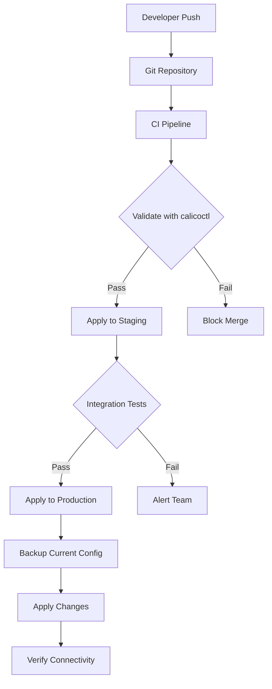

# Operationalizing Calicoctl Kubernetes API Datastore Configuration

Author: [nawazdhandala](https://github.com/nawazdhandala)

Tags: Calico, Kubernetes, DevOps, GitOps, calicoctl

Description: Learn how to operationalize your calicoctl Kubernetes API datastore configuration with GitOps workflows, CI/CD integration, backup strategies, and standardized team processes for production...

---

## Introduction

Moving calicoctl from a developer tool to a production-grade operational workflow requires more than just getting the configuration right. It means establishing repeatable processes for applying network policies, integrating with CI/CD pipelines, maintaining configuration backups, and ensuring that multiple team members can safely manage Calico resources.

When calicoctl uses the Kubernetes API datastore, you benefit from Kubernetes-native tooling and patterns. However, this also means you need to treat Calico resource management with the same rigor as any other Kubernetes resource -- version control, review processes, automated validation, and rollback capabilities.

This guide covers the practical steps to operationalize calicoctl with the Kubernetes API datastore, including GitOps integration, CI/CD pipelines, backup and restore procedures, and team workflow standardization.

## Prerequisites

- A running Kubernetes cluster with Calico using the Kubernetes API datastore
- calicoctl v3.27 or later
- A Git repository for storing Calico configurations
- CI/CD platform (GitHub Actions, GitLab CI, or similar)
- kubectl and basic Kubernetes knowledge

## Establishing a GitOps Workflow for Calico Resources

Store all Calico resources in a Git repository with a clear directory structure:

```bash
# Recommended repository structure
calico-config/
  ├── base/
  │   ├── ippools/
  │   │   └── default-ippool.yaml
  │   ├── felixconfig/
  │   │   └── default.yaml
  │   └── bgp/
  │       └── bgp-configuration.yaml
  ├── policies/
  │   ├── global/
  │   │   ├── deny-all-default.yaml
  │   │   └── allow-dns.yaml
  │   └── namespaced/
  │       ├── frontend/
  │       │   └── allow-ingress.yaml
  │       └── backend/
  │           └── allow-frontend.yaml
  └── environments/
      ├── staging/
      │   └── kustomization.yaml
      └── production/
          └── kustomization.yaml
```

Example global default-deny policy stored in version control:

```yaml
# calico-config/policies/global/deny-all-default.yaml
apiVersion: projectcalico.org/v3
kind: GlobalNetworkPolicy
metadata:
  name: default-deny
spec:
  selector: all()
  types:
    - Ingress
    - Egress
```

```yaml
# calico-config/policies/global/allow-dns.yaml
apiVersion: projectcalico.org/v3
kind: GlobalNetworkPolicy
metadata:
  name: allow-dns
spec:
  order: 100
  selector: all()
  types:
    - Egress
  egress:
    - action: Allow
      protocol: UDP
      destination:
        selector: k8s-app == "kube-dns"
        ports:
          - 53
    - action: Allow
      protocol: TCP
      destination:
        selector: k8s-app == "kube-dns"
        ports:
          - 53
```

## Building a CI/CD Pipeline for Calico Changes

Create a CI/CD pipeline that validates and applies Calico resources:

```yaml
# .github/workflows/calico-deploy.yaml
name: Calico Policy Deployment
on:
  push:
    branches: [main]
    paths: ['calico-config/**']
  pull_request:
    branches: [main]
    paths: ['calico-config/**']

jobs:
  validate:
    runs-on: ubuntu-latest
    steps:
      - uses: actions/checkout@v4

      - name: Install calicoctl
        run: |
          curl -L https://github.com/projectcalico/calico/releases/download/v3.27.0/calicoctl-linux-amd64 -o calicoctl
          chmod +x calicoctl
          sudo mv calicoctl /usr/local/bin/

      - name: Validate Calico manifests
        run: |
          # Validate all YAML files in the calico-config directory
          find calico-config -name "*.yaml" -not -name "kustomization.yaml" | while read file; do
            echo "Validating $file..."
            calicoctl validate -f "$file" || exit 1
          done

  deploy:
    needs: validate
    if: github.ref == 'refs/heads/main'
    runs-on: ubuntu-latest
    steps:
      - uses: actions/checkout@v4

      - name: Configure kubectl
        uses: azure/setup-kubectl@v3

      - name: Install calicoctl
        run: |
          curl -L https://github.com/projectcalico/calico/releases/download/v3.27.0/calicoctl-linux-amd64 -o calicoctl
          chmod +x calicoctl
          sudo mv calicoctl /usr/local/bin/

      - name: Apply Calico resources
        env:
          DATASTORE_TYPE: kubernetes
        run: |
          # Apply base configuration first
          calicoctl apply -f calico-config/base/ippools/
          calicoctl apply -f calico-config/base/felixconfig/
          # Apply global policies
          calicoctl apply -f calico-config/policies/global/
          # Apply namespaced policies
          calicoctl apply -f calico-config/policies/namespaced/
```

## Implementing Backup and Restore Procedures

Create automated backups of your Calico configuration:

```bash
#!/bin/bash
# calico-backup.sh
# Creates a timestamped backup of all Calico resources

set -euo pipefail

export DATASTORE_TYPE=kubernetes
BACKUP_DIR="/var/backups/calico/$(date +%Y%m%d-%H%M%S)"
mkdir -p "$BACKUP_DIR"

# List of Calico resource types to back up
RESOURCES=(
  "globalnetworkpolicies"
  "networkpolicies"
  "globalnetworksets"
  "networksets"
  "ippools"
  "ipreservations"
  "bgpconfigurations"
  "bgppeers"
  "felixconfigurations"
  "profiles"
  "hostendpoints"
)

for resource in "${RESOURCES[@]}"; do
  echo "Backing up $resource..."
  calicoctl get "$resource" -o yaml > "$BACKUP_DIR/$resource.yaml" 2>/dev/null || true
done

echo "Backup completed: $BACKUP_DIR"

# Compress and retain only last 30 backups
tar -czf "${BACKUP_DIR}.tar.gz" -C "$(dirname "$BACKUP_DIR")" "$(basename "$BACKUP_DIR")"
rm -rf "$BACKUP_DIR"
ls -t /var/backups/calico/*.tar.gz | tail -n +31 | xargs -r rm
```



## Standardizing Team Operations

Create a wrapper script that enforces operational standards:

```bash
#!/bin/bash
# calico-ops.sh
# Standardized operations wrapper for calicoctl

set -euo pipefail
export DATASTORE_TYPE=kubernetes

COMMAND="${1:-help}"
shift || true

case "$COMMAND" in
  apply)
    # Always validate before applying
    echo "Validating resource..."
    calicoctl validate -f "$@"
    echo "Creating backup before apply..."
    calicoctl get globalnetworkpolicies -o yaml > /tmp/calico-pre-apply-backup.yaml
    echo "Applying resource..."
    calicoctl apply -f "$@"
    echo "Applied successfully. Backup saved to /tmp/calico-pre-apply-backup.yaml"
    ;;
  diff)
    # Show what would change
    echo "Comparing local vs cluster state..."
    for file in "$@"; do
      echo "--- File: $file ---"
      calicoctl apply -f "$file" --dry-run -o yaml 2>/dev/null || echo "New resource"
    done
    ;;
  backup)
    echo "Running full backup..."
    bash "$(dirname "$0")/calico-backup.sh"
    ;;
  status)
    echo "=== Calico Nodes ==="
    calicoctl get nodes -o wide
    echo ""
    echo "=== IP Pools ==="
    calicoctl get ippools -o wide
    echo ""
    echo "=== Global Network Policies ==="
    calicoctl get globalnetworkpolicies
    ;;
  *)
    echo "Usage: calico-ops.sh {apply|diff|backup|status}"
    ;;
esac
```

## Verification

```bash
# Verify GitOps pipeline is working
git log --oneline -5 -- calico-config/

# Verify all expected resources exist in cluster
export DATASTORE_TYPE=kubernetes
calicoctl get globalnetworkpolicies -o wide
calicoctl get networkpolicies --all-namespaces -o wide
calicoctl get ippools -o yaml

# Verify backup is working
ls -la /var/backups/calico/

# Run the status command from the ops wrapper
./calico-ops.sh status
```

## Troubleshooting

- **CI pipeline fails on validate**: Check that the calicoctl version in CI matches the Calico version in the cluster. Version mismatches can cause validation failures for valid resources.
- **Apply conflicts**: If multiple team members apply changes simultaneously, use the GitOps workflow to serialize changes through pull requests. Avoid direct `calicoctl apply` in production.
- **Backup script fails**: Verify the service account has read permissions for all Calico resource types. Some resources like `clusterinformations` may require additional RBAC grants.
- **Stale state after apply**: The Kubernetes API datastore may take a few seconds to propagate changes. Wait and re-check with `calicoctl get` after applying changes.

## Conclusion

Operationalizing calicoctl with the Kubernetes API datastore transforms ad-hoc network policy management into a reliable, repeatable process. By storing configurations in Git, validating through CI/CD, maintaining automated backups, and providing standardized tooling for your team, you reduce the risk of misconfigurations and ensure that network policy changes are traceable and reversible. These operational practices are essential for any production Calico deployment.
