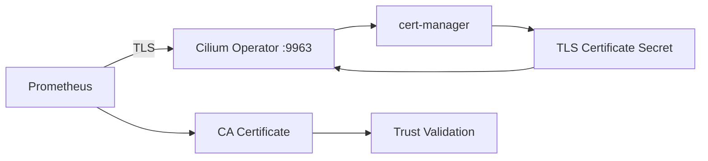

# Using Operator Prometheus TLS Configuration in Cilium Observability

Author: [nawazdhandala](https://github.com/nawazdhandala)

Tags: Cilium, Observability, Prometheus, TLS, Operator, Security

Description: Configure TLS encryption for Prometheus metric scraping from the Cilium Operator to protect sensitive metrics data in transit and meet security compliance requirements.

---

## Introduction

The Cilium Operator exposes Prometheus metrics that include sensitive operational data — policy enforcement statistics, endpoint counts, identity information, and cluster topology details. In environments with strict security requirements, these metrics must be encrypted in transit using TLS to prevent eavesdropping and tampering.

Configuring TLS for the Operator's Prometheus endpoint involves certificate management, Helm value configuration, and Prometheus scraper updates. This guide covers the complete setup process.

## Prerequisites

- Kubernetes cluster with Cilium installed
- Prometheus Operator or standalone Prometheus
- cert-manager installed (recommended for certificate management)
- `kubectl` and `helm` CLI tools
- Understanding of TLS certificate chains

## Generating TLS Certificates

Use cert-manager to create certificates for the Cilium Operator metrics endpoint:

```yaml
# cilium-operator-metrics-cert.yaml
apiVersion: cert-manager.io/v1
kind: Certificate
metadata:
  name: cilium-operator-metrics-tls
  namespace: kube-system
spec:
  secretName: cilium-operator-metrics-tls
  duration: 8760h # 1 year
  renewBefore: 720h # 30 days
  issuerRef:
    name: cluster-issuer
    kind: ClusterIssuer
  dnsNames:
    - cilium-operator.kube-system.svc
    - cilium-operator.kube-system.svc.cluster.local
  usages:
    - server auth
```

```bash
# Apply the certificate
kubectl apply -f cilium-operator-metrics-cert.yaml

# Verify the certificate was issued
kubectl get certificate -n kube-system cilium-operator-metrics-tls
kubectl get secret -n kube-system cilium-operator-metrics-tls
```

If not using cert-manager, generate certificates manually:

```bash
# Generate CA key and certificate
openssl genrsa -out ca.key 4096
openssl req -new -x509 -key ca.key -out ca.crt -days 365 -subj "/CN=Cilium Metrics CA"

# Generate operator metrics key and CSR
openssl genrsa -out operator-metrics.key 4096
openssl req -new -key operator-metrics.key -out operator-metrics.csr \
    -subj "/CN=cilium-operator.kube-system.svc"

# Sign the certificate
openssl x509 -req -in operator-metrics.csr -CA ca.crt -CAkey ca.key \
    -CAcreateserial -out operator-metrics.crt -days 365 \
    -extfile <(echo "subjectAltName=DNS:cilium-operator.kube-system.svc,DNS:cilium-operator.kube-system.svc.cluster.local")

# Create Kubernetes secret
kubectl create secret tls cilium-operator-metrics-tls \
    --cert=operator-metrics.crt \
    --key=operator-metrics.key \
    -n kube-system
```

## Configuring the Cilium Operator for TLS

Update the Cilium Helm values to enable TLS on the Operator metrics endpoint:

```yaml
# cilium-values-tls.yaml
operator:
  prometheus:
    enabled: true
    port: 9963
    serviceMonitor:
      enabled: true
  extraVolumes:
    - name: metrics-tls
      secret:
        secretName: cilium-operator-metrics-tls
  extraVolumeMounts:
    - name: metrics-tls
      mountPath: /etc/cilium/metrics-tls
      readOnly: true
```

```bash
# Upgrade Cilium with TLS configuration
helm upgrade cilium cilium/cilium \
    --namespace kube-system \
    --reuse-values \
    -f cilium-values-tls.yaml
```



## Configuring Prometheus for TLS Scraping

Update Prometheus to use TLS when scraping the Cilium Operator:

```yaml
# operator-servicemonitor-tls.yaml
apiVersion: monitoring.coreos.com/v1
kind: ServiceMonitor
metadata:
  name: cilium-operator
  namespace: kube-system
spec:
  selector:
    matchLabels:
      name: cilium-operator
  endpoints:
    - port: operator-prometheus
      interval: 30s
      scheme: https
      tlsConfig:
        ca:
          secret:
            name: cilium-operator-metrics-tls
            key: ca.crt
        serverName: cilium-operator.kube-system.svc
        insecureSkipVerify: false
```

For standalone Prometheus, update the scrape config:

```yaml
# prometheus.yml addition
scrape_configs:
  - job_name: cilium-operator
    scheme: https
    tls_config:
      ca_file: /etc/prometheus/cilium-ca.crt
      server_name: cilium-operator.kube-system.svc
    kubernetes_sd_configs:
      - role: endpoints
        namespaces:
          names:
            - kube-system
    relabel_configs:
      - source_labels: [__meta_kubernetes_service_label_name]
        action: keep
        regex: cilium-operator
```

## Verifying TLS Configuration

Test the TLS connection:

```bash
# Test TLS connection from within the cluster
kubectl run tls-test --image=curlimages/curl --rm -it --restart=Never -- \
    curl -v --cacert /tmp/ca.crt https://cilium-operator.kube-system.svc:9963/metrics

# Check certificate details
kubectl exec -n kube-system deploy/cilium-operator -- \
    openssl s_client -connect localhost:9963 -showcerts 2>/dev/null | \
    openssl x509 -noout -text | head -20

# Verify Prometheus is scraping successfully
curl -s http://localhost:9090/api/v1/targets | jq '.data.activeTargets[] | select(.labels.job == "cilium-operator") | {health: .health, lastError: .lastError}'
```

## Verification

Confirm the complete TLS setup is working:

```bash
# Check certificate is valid and not expired
kubectl get certificate -n kube-system cilium-operator-metrics-tls -o yaml | grep -A5 "status:"

# Check Prometheus target health
curl -s http://localhost:9090/api/v1/targets | jq '.data.activeTargets[] | select(.labels.job | contains("operator")) | .health'

# Verify metrics are flowing
curl -s "http://localhost:9090/api/v1/query?query=cilium_operator_process_cpu_seconds_total" | jq '.data.result | length'

# Verify TLS is actually being used (not falling back to HTTP)
kubectl exec -n kube-system deploy/cilium-operator -- netstat -tlnp | grep 9963
```

## Troubleshooting

**Problem: Prometheus scrape fails with TLS handshake error**
Verify the CA certificate in Prometheus matches the issuer that signed the operator certificate. Check certificate expiry dates.

**Problem: Certificate not found by the operator**
Verify the volume mount path matches where the operator looks for certificates. Check `kubectl describe pod` for volume mount errors.

**Problem: cert-manager fails to issue certificate**
Check the ClusterIssuer status: `kubectl get clusterissuer -o yaml`. Verify the issuer is ready and has the required CA credentials.

**Problem: Metrics endpoint returns empty response over TLS**
The operator may need a restart after TLS configuration changes. Delete the operator pod to trigger a restart: `kubectl delete pod -n kube-system -l name=cilium-operator`.

## Conclusion

Configuring TLS for Cilium Operator Prometheus metrics protects sensitive operational data in transit. Using cert-manager for automatic certificate lifecycle management reduces operational overhead. The configuration involves three components: certificate generation, operator TLS configuration through Helm values, and Prometheus scraper TLS configuration through ServiceMonitor or scrape config. Always verify the complete chain from Prometheus through TLS to the operator metrics endpoint after configuration changes.
