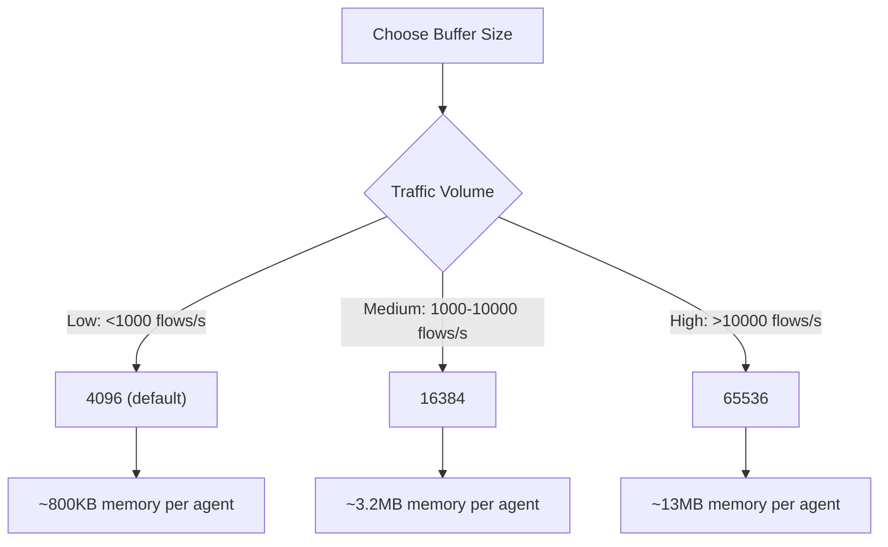

# How to Use Performance Tuning in Cilium Hubble

Author: [nawazdhandala](https://github.com/nawazdhandala)

Tags: Cilium, Hubble, Performance, Tuning, Observability

Description: Learn how to tune Cilium Hubble for optimal performance, including buffer sizing, monitor aggregation, metric cardinality management, and resource allocation strategies.

---

## Introduction

Hubble adds observability overhead to Cilium's eBPF datapath. Every network event captured by the eBPF programs must be processed, stored in the ring buffer, and potentially exported or converted to metrics. In high-traffic clusters, this overhead can become significant if Hubble is not properly tuned.

Performance tuning for Hubble involves balancing three factors: the granularity of observability data you need, the CPU and memory resources available on each node, and the volume of network traffic in your cluster. The right configuration depends on your specific use case.

This guide covers the key performance tuning parameters for Hubble, with practical guidance on how to measure impact and choose optimal values.

## Prerequisites

- Kubernetes cluster with Cilium and Hubble enabled
- kubectl and cilium CLI access
- Prometheus for measuring resource usage
- Understanding of eBPF and ring buffer concepts

## Tuning the Event Buffer

The event buffer determines how many flows Hubble keeps in memory per agent:

```yaml
# hubble-performance.yaml
hubble:
  enabled: true

  # Event buffer capacity (default: 4096)
  # Each event uses approximately 100-200 bytes
  # 4096 events ~= 400KB-800KB per agent
  # 65536 events ~= 6.5MB-13MB per agent
  eventBufferCapacity: "16384"

  # Event queue size for the observer
  # Controls backpressure from the ring buffer to the BPF perf event reader
  eventQueueSize: "0"  # 0 = auto-size based on buffer capacity
```

```bash
helm upgrade cilium cilium/cilium -n kube-system \
  --reuse-values \
  --set hubble.eventBufferCapacity="16384"

# Measure the impact on memory usage
kubectl -n kube-system top pod -l k8s-app=cilium --sort-by=memory
```

Choose the buffer size based on your needs:



## Configuring Monitor Aggregation

Monitor aggregation reduces the number of events Hubble processes by combining similar flows:

```yaml
# Monitor aggregation settings (set via Cilium config, not Hubble directly)
# These are set as Cilium Helm values
monitorAggregation: medium  # Options: none, low, medium, maximum

# Fine-grained control
monitorAggregationFlags: "all"  # Which TCP flags to track
monitorAggregationInterval: "5s"  # Aggregation window
```

```bash
# Check current aggregation setting
kubectl -n kube-system exec ds/cilium -- cilium config | grep MonitorAggregation

# Set to medium for a good balance
helm upgrade cilium cilium/cilium -n kube-system \
  --reuse-values \
  --set monitorAggregation=medium \
  --set monitorAggregationInterval=5s
```

Impact of each level:

```bash
# none: Every packet generates an event (highest overhead, most detail)
# low: Aggregate events with same source, destination, verdict
# medium: Additionally aggregate across TCP flags (recommended)
# maximum: Aggressive aggregation, only report new connections and drops
```

## Managing Metric Cardinality

High-cardinality Hubble metrics can overwhelm Prometheus:

```yaml
# Control metric labels to reduce cardinality
hubble:
  metrics:
    enabled:
      # Basic flow metrics (low cardinality)
      - flow

      # DNS with controlled labels
      - "dns:query;ignoreAAAA"

      # Drop metrics with reason (moderate cardinality)
      - drop

      # TCP with minimal labels
      - tcp

      # HTTP with controlled label context
      # AVOID: labelsContext=source_ip,destination_ip (creates massive cardinality)
      # PREFER: Use namespace/workload labels instead
      - "httpV2:labelsContext=source_namespace,source_workload,destination_namespace,destination_workload"
```

```bash
# Check current metric cardinality
kubectl -n kube-system exec ds/cilium -- \
  wget -qO- http://localhost:9965/metrics 2>/dev/null | \
  grep "^hubble_" | wc -l

# Identify high-cardinality metrics
kubectl -n kube-system exec ds/cilium -- \
  wget -qO- http://localhost:9965/metrics 2>/dev/null | \
  grep "^hubble_" | cut -d'{' -f1 | sort | uniq -c | sort -rn | head -10
```

## Resource Allocation for Hubble Components

Set appropriate resource limits to prevent Hubble from competing with workloads:

```yaml
# hubble-resources.yaml
hubble:
  relay:
    resources:
      requests:
        cpu: 100m
        memory: 128Mi
      limits:
        cpu: 1000m
        memory: 1Gi

  ui:
    resources:
      requests:
        cpu: 50m
        memory: 64Mi
      limits:
        cpu: 500m
        memory: 256Mi

# Cilium agent resources (Hubble runs inside the agent)
resources:
  requests:
    cpu: 200m
    memory: 256Mi
  limits:
    cpu: 2000m
    memory: 2Gi
```

```bash
helm upgrade cilium cilium/cilium -n kube-system \
  --reuse-values \
  --values hubble-resources.yaml

# Monitor resource usage after the change
watch kubectl -n kube-system top pod -l k8s-app=cilium
```

## Verification

Measure the performance impact of your tuning:

```bash
# 1. Check event processing rate
kubectl -n kube-system exec ds/cilium -- \
  wget -qO- http://localhost:9962/metrics 2>/dev/null | \
  grep "cilium_event_ts"

# 2. Verify no events are being lost
kubectl -n kube-system exec ds/cilium -- cilium status --verbose | grep -i "lost\|drop"

# 3. Check memory usage
kubectl -n kube-system top pod -l k8s-app=cilium --sort-by=memory

# 4. Measure metric scrape duration
curl -s 'http://localhost:9090/api/v1/query?query=scrape_duration_seconds{job=~".*hubble.*"}' | python3 -m json.tool

# 5. Verify flow visibility is maintained
hubble observe --last 20 -o compact
```

## Troubleshooting

- **High CPU on Cilium agent after enabling Hubble**: Set `monitorAggregation` to `medium` or `maximum`. This is the single most impactful tuning parameter.

- **Prometheus OOM after enabling Hubble metrics**: Reduce metric cardinality by removing IP-level labels from `labelsContext` and disabling `port-distribution` metrics.

- **Hubble relay using too much memory**: Reduce `sortBufferLenMax` in the relay configuration. Default is fine for most clusters.

- **Flows being dropped**: Increase `eventBufferCapacity`. Check with `cilium status --verbose` for "events lost" counters.

- **Metric scrapes timing out**: Too many time series. Reduce the enabled metric list or use `metric_relabel_configs` in Prometheus to drop unnecessary labels.

## Conclusion

Performance tuning Hubble is about finding the right balance between observability depth and resource consumption. Start with monitor aggregation set to `medium`, choose an event buffer size proportional to your traffic, and carefully control metric cardinality. Measure resource usage after each change and adjust incrementally. A well-tuned Hubble deployment adds minimal overhead while providing the network visibility your operations team needs.
