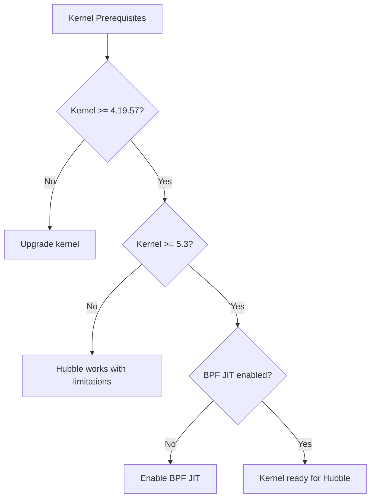

# How to Use Pre-Requisites in Cilium Hubble

Author: [nawazdhandala](https://github.com/nawazdhandala)

Tags: Cilium, Hubble, Prerequisites, Installation, Kubernetes

Description: A detailed guide to understanding and fulfilling all prerequisites for deploying Cilium Hubble, including kernel requirements, cluster configuration, and dependency setup.

---

## Introduction

Deploying Cilium Hubble successfully requires a properly configured foundation. Unlike simple Kubernetes add-ons, Cilium operates at the kernel level using eBPF, which means it has specific requirements for the Linux kernel version, Kubernetes configuration, and cluster networking setup. Missing any prerequisite can lead to subtle failures that are difficult to diagnose later.

Before installing Hubble, you need to verify that your cluster meets the kernel, Kubernetes version, and configuration requirements, and that the necessary tools and dependencies are in place. Taking the time to validate prerequisites upfront saves hours of troubleshooting.

This guide covers every prerequisite for a production-ready Hubble deployment, with verification commands for each requirement.

## Prerequisites

- Access to a Kubernetes cluster (or ability to create one)
- SSH access to cluster nodes (for kernel verification)
- kubectl configured for the target cluster
- Helm 3 installed locally

## Kernel Requirements

Cilium and Hubble require specific Linux kernel features:

```bash
# Check kernel version on cluster nodes
kubectl get nodes -o json | python3 -c "
import json, sys
nodes = json.load(sys.stdin)
for node in nodes['items']:
    name = node['metadata']['name']
    kernel = node['status']['nodeInfo']['kernelVersion']
    os_image = node['status']['nodeInfo']['osImage']
    print(f'{name}: kernel={kernel}, os={os_image}')
"

# Minimum kernel versions:
# - 4.19.57+ for basic Cilium functionality
# - 5.3+ for Hubble with full BPF features
# - 5.10+ recommended for best performance and feature support

# Verify BPF support on a node (via node debug pod)
kubectl debug node/$(kubectl get nodes -o name | head -1 | cut -d/ -f2) \
  -it --image=ubuntu -- bash -c '
  echo "BPF JIT: $(cat /proc/sys/net/core/bpf_jit_enable)"
  echo "BPF programs: $(ls /sys/fs/bpf/ 2>/dev/null | wc -l)"
  echo "Kernel config BPF: $(zcat /proc/config.gz 2>/dev/null | grep CONFIG_BPF= || echo "cannot check")"
'
```



## Kubernetes Cluster Requirements

```bash
# Check Kubernetes version
kubectl version --short 2>/dev/null || kubectl version

# Minimum: v1.21
# Recommended: v1.24+

# Verify the cluster does not already have a CNI that conflicts with Cilium
kubectl get pods -A -o wide | grep -E "calico|flannel|weave|canal"
# If another CNI is running, it must be removed before installing Cilium

# Check if kube-proxy is running (Cilium can replace it)
kubectl -n kube-system get ds kube-proxy 2>/dev/null
# If present, you can either keep it or replace it with Cilium's kube-proxy replacement

# Verify node CIDR allocation
kubectl get nodes -o jsonpath='{.items[*].spec.podCIDR}'
# Cilium needs pod CIDRs allocated to nodes
```

## Helm and CLI Tool Setup

```bash
# Install Helm 3
curl https://raw.githubusercontent.com/helm/helm/main/scripts/get-helm-3 | bash
helm version

# Add the Cilium Helm repository
helm repo add cilium https://helm.cilium.io/
helm repo update

# Install the Cilium CLI
CILIUM_CLI_VERSION=$(curl -s https://raw.githubusercontent.com/cilium/cilium-cli/main/stable.txt)
CLI_ARCH=amd64
curl -L --fail --remote-name-all \
  https://github.com/cilium/cilium-cli/releases/download/${CILIUM_CLI_VERSION}/cilium-linux-${CLI_ARCH}.tar.gz
sudo tar xzvf cilium-linux-${CLI_ARCH}.tar.gz -C /usr/local/bin
rm cilium-linux-${CLI_ARCH}.tar.gz
cilium version

# Install the Hubble CLI
HUBBLE_VERSION=$(curl -s https://raw.githubusercontent.com/cilium/hubble/main/stable.txt)
curl -L --fail --remote-name-all \
  https://github.com/cilium/hubble/releases/download/${HUBBLE_VERSION}/hubble-linux-${CLI_ARCH}.tar.gz
sudo tar xzvf hubble-linux-${CLI_ARCH}.tar.gz -C /usr/local/bin
rm hubble-linux-${CLI_ARCH}.tar.gz
hubble version
```

## Optional Dependencies

For a production Hubble deployment, these additional components are recommended:

```bash
# Prometheus Operator (for metrics collection)
helm repo add prometheus-community https://prometheus-community.github.io/helm-charts
helm install kube-prometheus-stack prometheus-community/kube-prometheus-stack \
  --namespace monitoring --create-namespace \
  --set prometheus.prometheusSpec.serviceMonitorSelectorNilUsesHelmValues=false

# cert-manager (for TLS certificate management)
kubectl apply -f https://github.com/cert-manager/cert-manager/releases/latest/download/cert-manager.yaml
kubectl -n cert-manager rollout status deployment/cert-manager
kubectl -n cert-manager rollout status deployment/cert-manager-webhook

# Verify cert-manager is ready
kubectl get pods -n cert-manager
```

## Verification

Run a complete prerequisites check:

```bash
echo "=== Cilium Hubble Prerequisites Check ==="

# Kubernetes version
echo ""
echo "1. Kubernetes Version:"
K8S_VERSION=$(kubectl version -o json 2>/dev/null | python3 -c "import json,sys; print(json.load(sys.stdin)['serverVersion']['gitVersion'])")
echo "   $K8S_VERSION"

# Node count
echo ""
echo "2. Cluster Nodes:"
kubectl get nodes --no-headers | wc -l

# Kernel versions
echo ""
echo "3. Kernel Versions:"
kubectl get nodes -o json | python3 -c "
import json, sys
for n in json.load(sys.stdin)['items']:
    print(f\"   {n['metadata']['name']}: {n['status']['nodeInfo']['kernelVersion']}\")
"

# Existing CNI
echo ""
echo "4. Existing CNI (should be empty for fresh install):"
kubectl get pods -A --no-headers 2>/dev/null | grep -E "calico|flannel|weave" | awk '{print "   "$2}' || echo "   None detected"

# Helm
echo ""
echo "5. Helm Version:"
helm version --short

# Cilium CLI
echo ""
echo "6. Cilium CLI:"
cilium version 2>/dev/null | head -1 || echo "   Not installed"

# Hubble CLI
echo ""
echo "7. Hubble CLI:"
hubble version 2>/dev/null || echo "   Not installed"

# Prometheus
echo ""
echo "8. Prometheus:"
kubectl get pods -n monitoring -l app.kubernetes.io/name=prometheus --no-headers 2>/dev/null | head -1 || echo "   Not installed"

# cert-manager
echo ""
echo "9. cert-manager:"
kubectl get pods -n cert-manager --no-headers 2>/dev/null | head -1 || echo "   Not installed"
```

## Troubleshooting

- **Kernel too old**: Use a managed Kubernetes service with recent node images (GKE, EKS, AKS all support kernels >= 5.10).

- **Existing CNI conflicts**: Remove the existing CNI before installing Cilium. For Calico: `kubectl delete -f calico.yaml`. For Flannel: `kubectl delete -f flannel.yaml`.

- **No pod CIDRs allocated**: If using kubeadm, ensure `--pod-network-cidr` was set during init. For managed clusters, this is usually handled automatically.

- **Helm repo not accessible**: Check network connectivity and proxy settings. Try `helm repo add cilium https://helm.cilium.io/ --force-update`.

- **cilium CLI install fails**: Download the binary directly from the GitHub releases page and place it in your PATH.

## Conclusion

Validating prerequisites before installing Cilium Hubble prevents the majority of installation and runtime issues. The key requirements are a recent Linux kernel with BPF support, a Kubernetes version of 1.24 or later, no conflicting CNI, and the necessary CLI tools. Optional but recommended dependencies like Prometheus and cert-manager should also be set up beforehand. Use the comprehensive prerequisites check script provided in this guide as a pre-installation gate.
