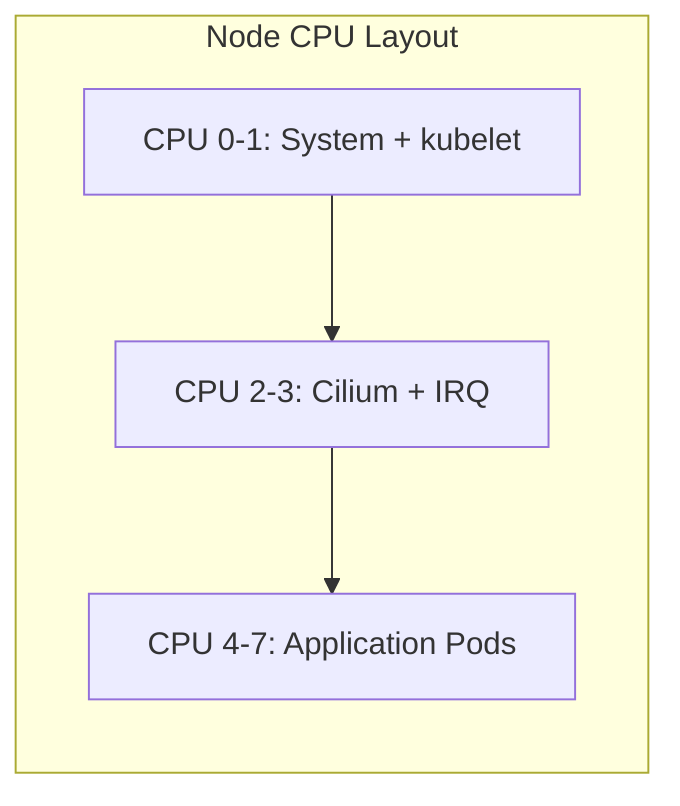

# Preventing Single-Process Performance Issues in Cilium

Author: [nawazdhandala](https://github.com/nawazdhandala)

Tags: Cilium, Kubernetes, Networking, Performance, Single-Process, Best Practices

Description: Best practices and proactive configurations to prevent single-process workloads from experiencing CPU contention with Cilium's eBPF datapath.

---

## Introduction

Single-process workloads are common in Kubernetes -- many legacy applications, databases, and specialized services use a single main process for network I/O. Without proactive planning, these workloads inevitably hit CPU contention issues when Cilium's eBPF packet processing competes for the same core.

Prevention is straightforward once you understand the interaction between Kubernetes CPU management, Linux interrupt handling, and Cilium's datapath. This guide covers the configurations and practices that should be in place before deploying single-process workloads.

The key insight is that CPU isolation must be designed into your cluster architecture, not bolted on after performance problems appear.

## Prerequisites

- Kubernetes cluster with Cilium v1.14+
- Cluster administrator access
- Understanding of your workload's CPU requirements

## Cluster-Level CPU Architecture

Design your node CPU layout with isolation in mind:

```yaml
# kubelet configuration for nodes running single-process workloads
apiVersion: kubelet.config.k8s.io/v1beta1
kind: KubeletConfiguration
cpuManagerPolicy: static
cpuManagerReconcilePeriod: 10s
topologyManagerPolicy: single-numa-node
reservedSystemCPUs: "0-3"
# Reserve CPUs 0-3 for system, Cilium, IRQ processing
# CPUs 4+ available for application pods
```



## Standard Pod Template for Single-Process Apps

Create a pod template that guarantees CPU isolation:

```yaml
apiVersion: v1
kind: Pod
metadata:
  name: single-process-app
  labels:
    workload-type: single-process
spec:
  containers:
  - name: app
    image: my-single-process-app:latest
    resources:
      # Guaranteed QoS with integer CPUs = exclusive core assignment
      requests:
        cpu: "2"
        memory: "2Gi"
      limits:
        cpu: "2"
        memory: "2Gi"
  # Schedule on nodes with static CPU manager
  nodeSelector:
    cpu-manager: "static"
  # Ensure topology alignment
  topologySpreadConstraints:
  - maxSkew: 1
    topologyKey: kubernetes.io/hostname
    whenUnsatisfiable: DoNotSchedule
    labelSelector:
      matchLabels:
        workload-type: single-process
```

## IRQ Isolation DaemonSet

Deploy IRQ management from day one:

```yaml
apiVersion: apps/v1
kind: DaemonSet
metadata:
  name: irq-isolator
  namespace: kube-system
spec:
  selector:
    matchLabels:
      app: irq-isolator
  template:
    metadata:
      labels:
        app: irq-isolator
    spec:
      hostNetwork: true
      hostPID: true
      containers:
      - name: isolator
        image: busybox:1.36
        securityContext:
          privileged: true
        command:
        - sh
        - -c
        - |
          while true; do
            # Pin all NIC IRQs to CPUs 2-3
            for IRQ in $(cat /proc/interrupts | grep -E "eth|ens" | awk -F: '{print $1}' | tr -d ' '); do
              echo 0c > /proc/irq/$IRQ/smp_affinity 2>/dev/null || true
            done
            sleep 300
          done
```

## Cilium Pre-Configuration

Configure Cilium optimally from initial deployment:

```bash
helm install cilium cilium/cilium --namespace kube-system \
  --set kubeProxyReplacement=true \
  --set socketLB.enabled=true \
  --set bpf.hostLegacyRouting=false \
  --set bpf.masquerade=true \
  --set tunnel=disabled \
  --set routingMode=native \
  --set autoDirectNodeRoutes=true \
  --set prometheus.enabled=true
```

## Monitoring for CPU Contention

Set up proactive alerts:

```yaml
apiVersion: monitoring.coreos.com/v1
kind: PrometheusRule
metadata:
  name: cpu-contention-alerts
  namespace: monitoring
spec:
  groups:
  - name: single-process-cpu
    rules:
    - alert: PodCPUThrottling
      expr: |
        rate(container_cpu_cfs_throttled_periods_total[5m])
        / rate(container_cpu_cfs_periods_total[5m]) > 0.1
      for: 5m
      labels:
        severity: warning
      annotations:
        summary: "Pod {{ $labels.pod }} is being CPU throttled >10% of periods"
    - alert: SingleCoreSaturation
      expr: |
        max by (instance, cpu) (rate(node_cpu_seconds_total{mode!="idle"}[5m])) > 0.95
      for: 5m
      labels:
        severity: warning
      annotations:
        summary: "CPU {{ $labels.cpu }} on {{ $labels.instance }} is >95% utilized"
```

## Verification

```bash
# Verify CPU manager is active
kubectl get nodes -o json | jq '.items[].status.allocatable.cpu'

# Check that pods get exclusive CPUs
kubectl exec single-process-app -- cat /sys/fs/cgroup/cpuset/cpuset.cpus

# Verify IRQ isolation
ssh node-1 "cat /proc/interrupts | head -5"

# Confirm Cilium optimal mode
cilium status --verbose | grep -E "Host Routing|KubeProxyReplacement|Socket LB"
```

## Troubleshooting

- **CPU Manager not working**: Ensure the node was drained and kubelet restarted after changing CPU policy.
- **Pods pending due to CPU requests**: Ensure enough unreserved CPUs are available on nodes.
- **IRQ isolation DaemonSet failing**: Check security context and host access permissions.
- **Unexpected CPU sharing**: Verify pod has Guaranteed QoS class with `kubectl describe pod`.

## Building a Prevention Framework

A comprehensive prevention framework combines multiple layers of protection to ensure issues are caught before they impact production:

### Layer 1: Configuration Management

Store all Cilium and cluster configurations in version control. Use GitOps tools like Flux or ArgoCD to enforce desired state:

```bash
# Store Cilium values in Git
git add cilium-values.yaml
git commit -m "Cilium performance configuration baseline"

# Use Flux HelmRelease for automatic reconciliation
cat > cilium-helmrelease.yaml << 'YAML'
apiVersion: helm.toolkit.fluxcd.io/v2
kind: HelmRelease
metadata:
  name: cilium
  namespace: kube-system
spec:
  interval: 5m
  chart:
    spec:
      chart: cilium
      version: "1.14.x"
      sourceRef:
        kind: HelmRepository
        name: cilium
  valuesFrom:
  - kind: ConfigMap
    name: cilium-values
YAML
```

### Layer 2: Automated Testing

Run performance regression tests on every change:

```bash
#!/bin/bash
# perf-gate.sh - Run as part of CI/CD pipeline

echo "Running performance regression gate..."

# Quick smoke test
BPS=$(kubectl exec perf-client -- iperf3 -c perf-server.monitoring -t 10 -P 1 -J | \
  jq '.end.sum_sent.bits_per_second')
MIN_BPS=8000000000

if (( $(echo "$BPS < $MIN_BPS" | bc -l) )); then
  echo "FAIL: Performance below minimum threshold"
  echo "Measured: $BPS, Required: $MIN_BPS"
  exit 1
fi

echo "PASS: Performance within acceptable range"
```

### Layer 3: Observability

Maintain dashboards and alerts that provide real-time visibility into performance metrics. The monitoring should be checked daily and alerts should be acted upon within the SLA defined by your team.

Regular performance reviews (weekly or biweekly) where the team examines trends and proactively addresses any degradation before it becomes critical are highly recommended.

## Conclusion

Preventing single-process performance issues in Cilium requires architectural planning: configure CPU Manager at cluster setup, deploy IRQ isolation from day one, and ensure Cilium uses its most efficient datapath. By building CPU isolation into your cluster design, single-process workloads get dedicated compute resources without competing with packet processing. The proactive monitoring ensures any drift from this ideal state is detected before it impacts performance.
