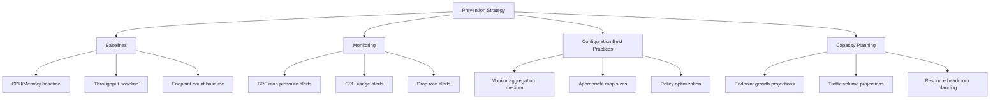

# How to Prevent Performance Issues in Cilium

Author: [nawazdhandala](https://github.com/nawazdhandala)

Tags: Cilium, Performance, Prevention, Monitoring, Kubernetes

Description: Proactive strategies for preventing Cilium performance issues, including capacity planning, monitoring setup, configuration best practices, and automated alerting.

---

## Introduction

Preventing Cilium performance issues is significantly cheaper than diagnosing and fixing them in production. Most performance problems are predictable: BPF map exhaustion follows endpoint growth, CPU overhead scales with traffic volume and monitoring granularity, and policy complexity grows with the number of microservices.

By establishing baselines, monitoring key metrics, and following configuration best practices from the start, you can prevent the majority of performance issues before they impact your workloads.

This guide covers proactive measures for maintaining optimal Cilium performance as your cluster grows.

## Prerequisites

- Kubernetes cluster with Cilium installed
- Prometheus and Grafana for monitoring
- kubectl and Helm 3 access
- Understanding of your workload growth patterns

## Establishing Performance Baselines

Measure baseline performance before your cluster is under load:

```bash
# Record baseline CPU and memory usage
kubectl -n kube-system top pod -l k8s-app=cilium > /tmp/cilium-baseline-$(date +%Y%m%d).txt

# Baseline throughput test (same-node)
kubectl run iperf3-server --image=networkstatic/iperf3 --port=5201 -- -s
kubectl expose pod iperf3-server --port=5201
kubectl run iperf3-baseline --image=networkstatic/iperf3 --rm -it --restart=Never -- \
  -c iperf3-server.default -t 30 -P 4 2>&1 | tee /tmp/iperf3-baseline.txt

# Baseline endpoint count and BPF map usage
kubectl -n kube-system exec ds/cilium -- cilium status --verbose > /tmp/cilium-status-baseline.txt

# Clean up
kubectl delete pod iperf3-server 2>/dev/null
kubectl delete svc iperf3-server 2>/dev/null
```

## Setting Up Proactive Monitoring

Create Prometheus alerts that trigger before performance degrades:

```yaml
# cilium-performance-prevention-alerts.yaml
apiVersion: monitoring.coreos.com/v1
kind: PrometheusRule
metadata:
  name: cilium-performance-prevention
  namespace: monitoring
  labels:
    release: prometheus
spec:
  groups:
    - name: cilium-performance
      rules:
        # BPF map approaching capacity
        - alert: CiliumBPFMapHighPressure
          expr: cilium_bpf_map_pressure > 0.8
          for: 5m
          labels:
            severity: warning
          annotations:
            summary: "BPF map {{ $labels.map_name }} at {{ $value | humanizePercentage }} capacity"

        # CPU usage trending high
        - alert: CiliumAgentHighCPU
          expr: |
            rate(container_cpu_usage_seconds_total{namespace="kube-system",pod=~"cilium-.*",container="cilium-agent"}[5m]) > 1.5
          for: 10m
          labels:
            severity: warning
          annotations:
            summary: "Cilium agent on {{ $labels.node }} using > 1.5 CPU cores"

        # Endpoint count growing fast
        - alert: CiliumEndpointCountHigh
          expr: cilium_endpoint_count > 500
          for: 5m
          labels:
            severity: info
          annotations:
            summary: "{{ $value }} endpoints on {{ $labels.instance }} - review BPF map sizing"

        # Drop rate increasing
        - alert: CiliumDropRateHigh
          expr: sum(rate(cilium_drop_count_total[5m])) > 100
          for: 5m
          labels:
            severity: warning
          annotations:
            summary: "Cilium dropping {{ $value }} packets/second cluster-wide"

        # Endpoint regeneration taking too long
        - alert: CiliumSlowEndpointRegeneration
          expr: |
            rate(cilium_endpoint_regeneration_time_stats_sum[5m])
            / rate(cilium_endpoint_regeneration_time_stats_count[5m]) > 30
          for: 5m
          labels:
            severity: warning
          annotations:
            summary: "Average endpoint regeneration time > 30s on {{ $labels.instance }}"
```

```bash
kubectl apply -f cilium-performance-prevention-alerts.yaml
```



## Configuration Best Practices

Apply these settings from the initial deployment:

```yaml
# cilium-performance-best-practices.yaml
# Monitor aggregation (reduces CPU overhead)
monitorAggregation: medium
monitorAggregationInterval: 5s

# Appropriate BPF map sizes for a medium cluster (100-500 nodes)
bpf:
  ctTcpMax: 524288
  ctAnyMax: 262144
  natMax: 524288
  policyMapMax: 16384

# Resource limits with headroom
resources:
  requests:
    cpu: 300m
    memory: 384Mi
  limits:
    cpu: 2000m
    memory: 2Gi

# Hubble with controlled cardinality
hubble:
  enabled: true
  eventBufferCapacity: "8192"
  metrics:
    enabled:
      - dns
      - drop
      - tcp
      - flow
      - "httpV2:labelsContext=source_namespace,destination_namespace"

# Enable health checking
healthChecking: true
healthPort: 9879
```

```bash
helm upgrade cilium cilium/cilium -n kube-system \
  --reuse-values \
  --values cilium-performance-best-practices.yaml
```

## Capacity Planning for Growth

Plan BPF map sizes based on expected growth:

```bash
# Calculate required CT table size
# Rule of thumb: 2 entries per active connection
# Each pod typically maintains 10-50 active connections
# Formula: pods_per_node * avg_connections_per_pod * 2 * safety_factor

# Example for 200 pods per node, 30 connections each:
# 200 * 30 * 2 * 2 = 24,000 (well within default 524,288)

# Calculate memory requirements
# Each CT entry: ~128 bytes
# 524,288 entries * 128 bytes = ~67MB per map
# With TCP + Any maps: ~134MB
# Plus NAT map: ~67MB
# Total BPF map memory: ~200MB per agent

echo "Capacity planning calculator:"
PODS_PER_NODE=200
CONNECTIONS_PER_POD=30
SAFETY_FACTOR=2

REQUIRED_CT=$((PODS_PER_NODE * CONNECTIONS_PER_POD * 2 * SAFETY_FACTOR))
MEMORY_MB=$((REQUIRED_CT * 128 / 1024 / 1024))
echo "Pods per node: $PODS_PER_NODE"
echo "Avg connections per pod: $CONNECTIONS_PER_POD"
echo "Required CT table size: $REQUIRED_CT"
echo "Estimated memory for BPF maps: ${MEMORY_MB}MB"
```

## Verification

Confirm prevention measures are in place:

```bash
# 1. Alerting rules are loaded
curl -s 'http://localhost:9090/api/v1/rules' | python3 -c "
import json, sys
data = json.load(sys.stdin)
cilium_rules = [r['name'] for g in data['data']['groups'] for r in g['rules'] if 'cilium' in r.get('name','').lower()]
print(f'Cilium alert rules: {len(cilium_rules)}')
for r in cilium_rules:
    print(f'  {r}')
"

# 2. Current metrics are healthy
echo "BPF Map Pressure:"
curl -s 'http://localhost:9090/api/v1/query?query=cilium_bpf_map_pressure' | python3 -c "
import json, sys
data = json.load(sys.stdin)
for r in data.get('data',{}).get('result',[]):
    print(f'  {r[\"metric\"].get(\"map_name\",\"?\")}: {float(r[\"value\"][1]):.2%}')
"

# 3. Resource limits are set appropriately
kubectl -n kube-system get ds cilium -o jsonpath='{.spec.template.spec.containers[0].resources}' | python3 -m json.tool

# 4. Monitor aggregation is enabled
kubectl -n kube-system exec ds/cilium -- cilium config | grep MonitorAggregation
```

## Troubleshooting

- **Alerts firing immediately after setup**: Adjust thresholds to match your cluster's normal operating range. The defaults in this guide assume a medium-sized cluster.

- **Cannot predict endpoint growth**: Start with conservative map sizes (defaults) and set alerts at 50% capacity. This gives you time to increase before hitting limits.

- **Performance degrades during upgrades**: Endpoint regeneration during Cilium upgrades is CPU-intensive. Schedule upgrades during low-traffic periods.

- **New microservices increase policy complexity**: Review policies quarterly. Consolidate overlapping rules and use label-based selectors instead of pod-specific rules.

## Conclusion

Preventing Cilium performance issues is a combination of proper initial configuration, proactive monitoring, and capacity planning. Set monitor aggregation from day one, size BPF maps with growth headroom, establish alerts for early warning signs, and regularly review resource usage against your baselines. These practices keep your cluster running efficiently as it scales, avoiding the costly process of diagnosing and fixing performance problems under pressure.
