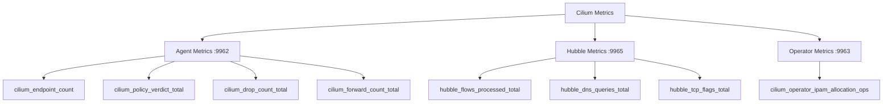

# How to Use Prometheus for Cilium Observability

Author: [nawazdhandala](https://github.com/nawazdhandala)

Tags: Cilium, Prometheus, Observability, Kubernetes, Monitoring

Description: Learn how to integrate Prometheus with Cilium to collect and visualize network metrics, enabling deep observability into your Kubernetes cluster's networking layer.

---

## Introduction

Cilium provides eBPF-based networking, security, and observability for Kubernetes clusters. One of its most powerful features is the ability to expose detailed metrics about network flows, policy enforcement, and datapath performance. Prometheus, the de facto standard for monitoring in Kubernetes environments, is the ideal tool to scrape and store these metrics.

By integrating Prometheus with Cilium, you gain visibility into packet drops, policy verdicts, connection tracking table sizes, endpoint health, and much more. This data is invaluable for debugging connectivity issues, capacity planning, and ensuring that your network policies are working as intended.

In this guide, you will learn how to enable Cilium metrics, configure Prometheus to scrape them, and set up Grafana dashboards to visualize the data. We will use real Helm values and CLI commands that work with Cilium 1.15 and later.

## Prerequisites

- A running Kubernetes cluster (v1.24 or later)
- Helm 3 installed
- kubectl configured to access your cluster
- Basic familiarity with Prometheus and Grafana
- Cilium installed (or ready to install) via Helm

## Enabling Cilium Metrics with Helm

Cilium exposes metrics through its agent and operator components. You need to enable the Prometheus metrics endpoint in your Helm values.

Create or update your Cilium Helm values file:

```yaml
# cilium-values.yaml
prometheus:
  enabled: true
  serviceMonitor:
    enabled: true
    labels:
      release: prometheus  # Must match your Prometheus operator's label selector

operator:
  prometheus:
    enabled: true
    serviceMonitor:
      enabled: true
      labels:
        release: prometheus

hubble:
  enabled: true
  metrics:
    enabled:
      - dns
      - drop
      - tcp
      - flow
      - icmp
      - httpV2:exemplars=true;labelsContext=source_ip,source_namespace,source_workload,destination_ip,destination_namespace,destination_workload
    serviceMonitor:
      enabled: true
      labels:
        release: prometheus
```

Install or upgrade Cilium with these values:

```bash
helm repo add cilium https://helm.cilium.io/
helm repo update

# For a fresh install
helm install cilium cilium/cilium --version 1.15.0 \
  --namespace kube-system \
  --values cilium-values.yaml

# For an upgrade
helm upgrade cilium cilium/cilium --version 1.15.0 \
  --namespace kube-system \
  --values cilium-values.yaml
```

Verify that the metrics endpoints are available:

```bash
# Check cilium-agent metrics
kubectl -n kube-system get svc cilium-agent -o wide

# Port-forward to test locally
kubectl -n kube-system port-forward svc/cilium-agent 9962:9962 &
curl -s http://localhost:9962/metrics | head -20
```

## Configuring Prometheus to Scrape Cilium Metrics

If you are using the Prometheus Operator (kube-prometheus-stack), the ServiceMonitor resources created by Cilium's Helm chart will automatically configure scraping. Verify the ServiceMonitors exist:

```bash
kubectl get servicemonitors -n kube-system | grep cilium
```

You should see output similar to:

```
cilium-agent       9962   2m
cilium-operator    9963   2m
hubble             9965   2m
```

If you are running Prometheus without the operator, add scrape configs manually:

```yaml
# prometheus-additional-scrape-configs.yaml
- job_name: 'cilium-agent'
  kubernetes_sd_configs:
    - role: pod
      namespaces:
        names:
          - kube-system
  relabel_configs:
    - source_labels: [__meta_kubernetes_pod_label_k8s_app]
      regex: cilium
      action: keep
    - source_labels: [__meta_kubernetes_pod_annotation_prometheus_io_port]
      regex: "9962"
      action: keep
    - source_labels: [__address__]
      regex: (.+):.*
      replacement: $1:9962
      target_label: __address__

- job_name: 'hubble'
  kubernetes_sd_configs:
    - role: pod
      namespaces:
        names:
          - kube-system
  relabel_configs:
    - source_labels: [__meta_kubernetes_pod_label_k8s_app]
      regex: cilium
      action: keep
    - source_labels: [__address__]
      regex: (.+):.*
      replacement: $1:9965
      target_label: __address__
```

## Key Cilium Metrics to Monitor

Once Prometheus is scraping, these are the most important metrics to track:



Useful PromQL queries to get started:

```bash
# Rate of dropped packets by reason
rate(cilium_drop_count_total[5m])

# Policy verdict breakdown
sum by (verdict) (rate(cilium_policy_verdict_total[5m]))

# Active endpoints per node
cilium_endpoint_count

# DNS query rate by destination
sum by (query) (rate(hubble_dns_queries_total[5m]))

# HTTP request rate by response code (requires httpV2 metric)
sum by (status) (rate(hubble_http_requests_total[5m]))
```

## Setting Up Grafana Dashboards

Cilium provides official Grafana dashboards. Import them into your Grafana instance:

```bash
# Download official Cilium dashboards
curl -sL https://raw.githubusercontent.com/cilium/cilium/main/install/kubernetes/cilium/files/cilium-agent/dashboards/cilium-dashboard.json \
  -o cilium-dashboard.json

# If using Grafana Operator, create a ConfigMap
kubectl create configmap cilium-grafana-dashboard \
  --from-file=cilium-dashboard.json \
  -n monitoring

kubectl label configmap cilium-grafana-dashboard \
  grafana_dashboard=1 \
  -n monitoring
```

Alternatively, use the Grafana dashboard IDs directly in the Grafana UI:

- Cilium Agent: Dashboard ID `16611`
- Cilium Operator: Dashboard ID `16612`
- Hubble: Dashboard ID `16613`

## Verification

Confirm that everything is working end to end:

```bash
# 1. Check Cilium agent is exposing metrics
cilium status --brief

# 2. Verify Prometheus targets are healthy
kubectl port-forward -n monitoring svc/prometheus-operated 9090:9090 &
curl -s http://localhost:9090/api/v1/targets | python3 -m json.tool | grep cilium

# 3. Run a test query
curl -s 'http://localhost:9090/api/v1/query?query=cilium_endpoint_count' | python3 -m json.tool

# 4. Check Hubble metrics specifically
kubectl -n kube-system exec ds/cilium -- cilium metrics list | grep hubble
```

## Troubleshooting

- **No metrics appearing in Prometheus**: Verify the ServiceMonitor labels match your Prometheus operator's `serviceMonitorSelector`. Check with `kubectl get prometheus -n monitoring -o yaml | grep -A5 serviceMonitorSelector`.

- **Hubble metrics missing**: Ensure Hubble is enabled and the relay is running: `kubectl -n kube-system get pods -l k8s-app=hubble-relay`.

- **Partial metrics**: Some metrics like `httpV2` require L7 visibility. Ensure you have a CiliumNetworkPolicy with `visibility` annotations or L7 policy rules applied.

- **High cardinality warnings**: Be careful with labels like `source_ip` and `destination_ip` in Hubble metrics. These can cause high cardinality. Use `labelsContext` selectively.

- **Stale targets**: If Cilium pods restart, Prometheus may show stale targets temporarily. This resolves within the scrape interval (default 15s for ServiceMonitor).

## Conclusion

Integrating Prometheus with Cilium gives you comprehensive observability into your Kubernetes networking stack. By enabling metrics on the Cilium agent, Hubble, and the operator, you can monitor packet drops, policy verdicts, DNS queries, HTTP traffic, and more. Combined with Grafana dashboards, this setup provides actionable insights for maintaining a healthy and secure cluster. Regularly review your PromQL alerts and dashboard panels to catch networking anomalies before they impact your workloads.
