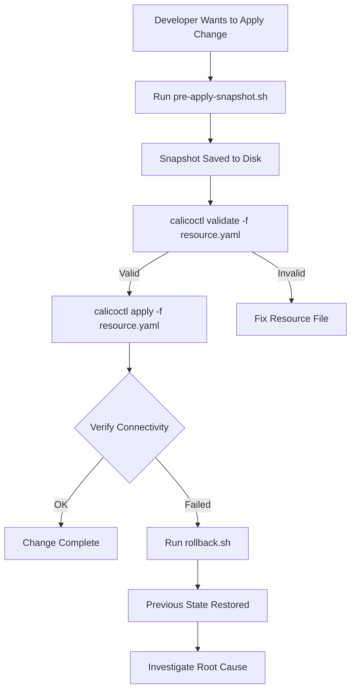

# How to Roll Back Safely After Using calicoctl apply

Author: [nawazdhandala](https://github.com/nawazdhandala)

Tags: Calico, Kubernetes, Rollback, Calicoctl, Network Policy

Description: Learn how to safely roll back Calico resource changes made with calicoctl apply, including pre-apply backups, resource versioning, and step-by-step rollback procedures.

---

## Introduction

The `calicoctl apply` command creates or updates Calico resources in the datastore. Unlike Kubernetes deployments, Calico resources do not have built-in revision history or automatic rollback capabilities. When a `calicoctl apply` introduces a misconfigured network policy or incorrect IP pool setting, the impact is immediate -- pods may lose connectivity, services may become unreachable, or workloads may be exposed to unintended traffic.

Rolling back safely requires preparation before the apply and a clear procedure after. This means capturing the current state, validating the change, and having a tested restore process ready to execute within seconds.

This guide covers practical rollback strategies for `calicoctl apply` operations, including pre-apply snapshots, diff-based validation, and automated rollback scripts.

## Prerequisites

- A running Kubernetes cluster with Calico installed
- calicoctl v3.27 or later
- kubectl access to the cluster
- Basic understanding of Calico resources (NetworkPolicy, GlobalNetworkPolicy, IPPool)

## Creating Pre-Apply Snapshots

Always capture the current state before applying changes:

```bash
#!/bin/bash
# pre-apply-snapshot.sh
# Captures the current state of Calico resources before applying changes

set -euo pipefail

export DATASTORE_TYPE=kubernetes
SNAPSHOT_DIR="/var/backups/calico-snapshots/$(date +%Y%m%d-%H%M%S)"
mkdir -p "$SNAPSHOT_DIR"

echo "Creating pre-apply snapshot in: $SNAPSHOT_DIR"

# Snapshot all resource types
RESOURCES=(
  "globalnetworkpolicies"
  "networkpolicies"
  "globalnetworksets"
  "networksets"
  "ippools"
  "bgpconfigurations"
  "bgppeers"
  "felixconfigurations"
  "hostendpoints"
)

for resource in "${RESOURCES[@]}"; do
  calicoctl get "$resource" --all-namespaces -o yaml > \
    "${SNAPSHOT_DIR}/${resource}.yaml" 2>/dev/null || true
done

echo "$SNAPSHOT_DIR" > /tmp/last-calico-snapshot
echo "Snapshot complete: $SNAPSHOT_DIR"
```

## Safe Apply Workflow

Wrap `calicoctl apply` in a workflow that includes validation and rollback capability:

```bash
#!/bin/bash
# safe-apply.sh
# Apply Calico resources with automatic snapshot and validation

set -euo pipefail

RESOURCE_FILE="${1:?Usage: $0 <resource-file.yaml>}"
export DATASTORE_TYPE=kubernetes

# Step 1: Snapshot current state
SNAPSHOT_DIR="/var/backups/calico-snapshots/$(date +%Y%m%d-%H%M%S)"
mkdir -p "$SNAPSHOT_DIR"

# Determine what resource type we're applying
RESOURCE_KIND=$(python3 -c "import yaml; print(yaml.safe_load(open('$RESOURCE_FILE'))['kind'])")
RESOURCE_NAME=$(python3 -c "import yaml; print(yaml.safe_load(open('$RESOURCE_FILE'))['metadata']['name'])")

echo "Applying ${RESOURCE_KIND}/${RESOURCE_NAME}"

# Snapshot the specific resource if it exists
calicoctl get "${RESOURCE_KIND}" "${RESOURCE_NAME}" -o yaml > \
  "${SNAPSHOT_DIR}/before-${RESOURCE_KIND}-${RESOURCE_NAME}.yaml" 2>/dev/null || echo "Resource does not exist yet"

# Step 2: Validate the resource
echo "Validating resource..."
calicoctl validate -f "$RESOURCE_FILE"

# Step 3: Apply the resource
echo "Applying resource..."
calicoctl apply -f "$RESOURCE_FILE"

# Step 4: Record the snapshot path
echo "$SNAPSHOT_DIR" > /tmp/last-calico-snapshot

echo "Applied successfully."
echo "To rollback: calicoctl apply -f ${SNAPSHOT_DIR}/before-${RESOURCE_KIND}-${RESOURCE_NAME}.yaml"
```

## Rolling Back a Specific Resource

```bash
#!/bin/bash
# rollback.sh
# Roll back the last calicoctl apply operation

set -euo pipefail

export DATASTORE_TYPE=kubernetes
SNAPSHOT_DIR=$(cat /tmp/last-calico-snapshot 2>/dev/null)

if [ -z "$SNAPSHOT_DIR" ] || [ ! -d "$SNAPSHOT_DIR" ]; then
  echo "ERROR: No snapshot found. Cannot rollback."
  exit 1
fi

echo "Rolling back from snapshot: $SNAPSHOT_DIR"

# List available snapshots
ls -la "$SNAPSHOT_DIR"/before-*.yaml 2>/dev/null

# Apply the previous state
for snapshot_file in "$SNAPSHOT_DIR"/before-*.yaml; do
  [ -f "$snapshot_file" ] || continue
  if [ -s "$snapshot_file" ]; then
    echo "Restoring: $snapshot_file"
    calicoctl apply -f "$snapshot_file"
  else
    echo "Skipping empty snapshot: $snapshot_file"
  fi
done

echo "Rollback complete."
```



## Rolling Back When the Resource Was New

If the applied resource was newly created (not an update), rollback means deleting it:

```bash
# If the resource did not exist before the apply, delete it to rollback
calicoctl delete globalnetworkpolicy <policy-name>

# For namespaced resources
calicoctl delete networkpolicy <policy-name> -n <namespace>
```

## Full Cluster Rollback

For broader changes affecting multiple resources:

```bash
#!/bin/bash
# full-rollback.sh
# Restore all Calico resources from a snapshot directory

set -euo pipefail

SNAPSHOT_DIR="${1:?Usage: $0 <snapshot-directory>}"
export DATASTORE_TYPE=kubernetes

echo "Performing full rollback from: $SNAPSHOT_DIR"

# Apply in dependency order
ORDER=(
  "ippools"
  "felixconfigurations"
  "bgpconfigurations"
  "bgppeers"
  "globalnetworksets"
  "networksets"
  "globalnetworkpolicies"
  "networkpolicies"
  "hostendpoints"
)

for resource in "${ORDER[@]}"; do
  file="${SNAPSHOT_DIR}/${resource}.yaml"
  if [ -f "$file" ] && [ -s "$file" ]; then
    echo "Restoring ${resource}..."
    calicoctl apply -f "$file"
  fi
done

echo "Full rollback complete."
```

## Verification

```bash
# After rollback, verify the resource state matches the snapshot
export DATASTORE_TYPE=kubernetes

# Compare current state with snapshot
calicoctl get globalnetworkpolicies -o yaml > /tmp/current-state.yaml
diff "$SNAPSHOT_DIR/globalnetworkpolicies.yaml" /tmp/current-state.yaml

# Verify pod connectivity
kubectl run test-pod --rm -it --image=busybox -- wget -q -O- --timeout=5 http://my-service.default.svc.cluster.local

# Check for any policy enforcement issues
calicoctl get globalnetworkpolicies -o wide
```

## Troubleshooting

- **Snapshot file is empty**: The resource did not exist before the apply. Rollback by deleting the resource with `calicoctl delete`.
- **"resource version conflict" on rollback**: Another process modified the resource. Fetch the current version, merge the rollback changes, and apply again.
- **Network connectivity not restored after rollback**: Check the policy order field. Calico evaluates policies by order number; a conflicting policy with a lower order number may override the restored policy.
- **Cannot find snapshot directory**: If `/tmp/last-calico-snapshot` is missing, check `/var/backups/calico-snapshots/` for the most recent directory.

## Conclusion

Safe rollback after `calicoctl apply` depends entirely on preparation. By creating pre-apply snapshots, validating resources before applying, and maintaining tested rollback scripts, you can recover from any misconfigured network policy or resource change within seconds. Make the safe-apply workflow part of your team's standard operating procedure to minimize the blast radius of Calico configuration changes.
