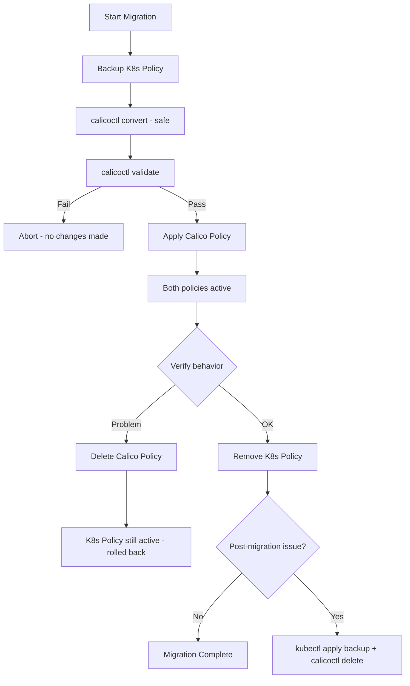

# How to Roll Back Safely After Using calicoctl convert

Author: [nawazdhandala](https://github.com/nawazdhandala)

Tags: Calico, Kubernetes, Rollback, Migration, calicoctl

Description: Understand why calicoctl convert is inherently safe and learn rollback strategies for the broader migration workflow from Kubernetes to Calico NetworkPolicy.

---

## Introduction

The `calicoctl convert` command is a read-only operation that transforms Kubernetes NetworkPolicy YAML into Calico NetworkPolicy format. It reads an input file and outputs the converted resource without modifying any cluster state. The convert command itself requires no rollback.

However, the broader migration workflow that uses convert -- exporting K8s policies, converting them, applying the Calico versions, and removing the originals -- does require rollback planning. If converted policies behave differently than expected after application, you need a clear path back to the original Kubernetes NetworkPolicies.

This guide covers rollback strategies for the complete conversion and migration workflow.

## Prerequisites

- calicoctl v3.27 or later
- kubectl access to the cluster
- Original Kubernetes NetworkPolicy files (in Git or backup)
- Understanding of the migration workflow

## The Convert Command Is Safe

```bash
# calicoctl convert only outputs to stdout or a file
# It makes NO changes to the cluster
calicoctl convert -f k8s-policy.yaml -o yaml > calico-policy.yaml

# The cluster is unmodified after running convert
# No rollback is needed for the convert step itself
```

## Rollback Strategy for the Migration Workflow

The migration workflow typically follows these steps, each with its own rollback:

```bash
#!/bin/bash
# migration-with-rollback.sh
# Complete migration workflow with rollback at each stage

set -euo pipefail

export DATASTORE_TYPE=kubernetes
K8S_FILE="${1:?Usage: $0 <k8s-policy.yaml>}"
BACKUP_DIR="/var/backups/calico-migration/$(date +%Y%m%d-%H%M%S)"
mkdir -p "$BACKUP_DIR"

NS=$(python3 -c "import yaml; print(yaml.safe_load(open('$K8S_FILE'))['metadata'].get('namespace','default'))")
NAME=$(python3 -c "import yaml; print(yaml.safe_load(open('$K8S_FILE'))['metadata']['name'])")

echo "=== Migration: ${NS}/${NAME} ==="

# Stage 1: Backup original K8s policy
echo "Stage 1: Backing up original..."
kubectl get networkpolicy "$NAME" -n "$NS" -o yaml > "${BACKUP_DIR}/k8s-original.yaml"

# Stage 2: Convert (safe, no cluster changes)
echo "Stage 2: Converting..."
calicoctl convert -f "$K8S_FILE" -o yaml > "${BACKUP_DIR}/calico-converted.yaml"

# Stage 3: Validate converted policy
echo "Stage 3: Validating..."
if ! calicoctl validate -f "${BACKUP_DIR}/calico-converted.yaml"; then
  echo "ABORT: Validation failed. No changes made."
  exit 1
fi

# Stage 4: Apply Calico policy (both K8s and Calico policies active)
echo "Stage 4: Applying Calico policy..."
calicoctl apply -f "${BACKUP_DIR}/calico-converted.yaml"

# Stage 5: Verify connectivity
echo "Stage 5: Verifying connectivity (10 second window)..."
sleep 10

echo "Press Enter to confirm migration, or Ctrl+C to rollback"
read -r -t 60 || {
  echo "Timeout - rolling back..."
  calicoctl delete networkpolicy "$NAME" -n "$NS" 2>/dev/null || true
  echo "Rollback complete. Original K8s policy still active."
  exit 1
}

# Stage 6: Remove original K8s policy (optional)
echo "Stage 6: Removing original K8s NetworkPolicy..."
kubectl delete networkpolicy "$NAME" -n "$NS"

echo "Migration complete."
echo "Rollback files: $BACKUP_DIR"
echo "To rollback: kubectl apply -f ${BACKUP_DIR}/k8s-original.yaml && calicoctl delete networkpolicy $NAME -n $NS"
```

## Full Rollback Script

```bash
#!/bin/bash
# rollback-migration.sh
# Rolls back a Calico migration to original K8s policies

set -euo pipefail

export DATASTORE_TYPE=kubernetes
BACKUP_DIR="${1:?Usage: $0 <backup-directory>}"

if [ ! -d "$BACKUP_DIR" ]; then
  echo "ERROR: Backup directory not found: $BACKUP_DIR"
  exit 1
fi

echo "Rolling back migration from: $BACKUP_DIR"

# Restore original K8s NetworkPolicy
if [ -f "${BACKUP_DIR}/k8s-original.yaml" ]; then
  echo "Restoring K8s NetworkPolicy..."
  kubectl apply -f "${BACKUP_DIR}/k8s-original.yaml"
fi

# Remove Calico NetworkPolicy
if [ -f "${BACKUP_DIR}/calico-converted.yaml" ]; then
  NS=$(python3 -c "import yaml; print(yaml.safe_load(open('${BACKUP_DIR}/calico-converted.yaml'))['metadata'].get('namespace','default'))")
  NAME=$(python3 -c "import yaml; print(yaml.safe_load(open('${BACKUP_DIR}/calico-converted.yaml'))['metadata']['name'])")
  echo "Removing Calico NetworkPolicy: ${NS}/${NAME}"
  calicoctl delete networkpolicy "$NAME" -n "$NS" 2>/dev/null || echo "  Already removed"
fi

echo "Rollback complete. Original K8s NetworkPolicy restored."
```

## Batch Migration Rollback

```bash
#!/bin/bash
# rollback-batch-migration.sh
# Rolls back all policies migrated in a batch

set -euo pipefail

export DATASTORE_TYPE=kubernetes
MIGRATION_DIR="${1:?Usage: $0 <migration-backup-dir>}"

echo "Rolling back batch migration from: $MIGRATION_DIR"

find "$MIGRATION_DIR" -name "k8s-original.yaml" | while read backup; do
  dir=$(dirname "$backup")
  echo "Rolling back: $dir"

  # Restore K8s policy
  kubectl apply -f "$backup" 2>/dev/null || echo "  Could not restore K8s policy"

  # Remove Calico policy
  if [ -f "${dir}/calico-converted.yaml" ]; then
    NS=$(python3 -c "import yaml; print(yaml.safe_load(open('${dir}/calico-converted.yaml'))['metadata'].get('namespace','default'))" 2>/dev/null)
    NAME=$(python3 -c "import yaml; print(yaml.safe_load(open('${dir}/calico-converted.yaml'))['metadata']['name'])" 2>/dev/null)
    calicoctl delete networkpolicy "$NAME" -n "$NS" 2>/dev/null || true
  fi
done

echo "Batch rollback complete."
```



## Verification

```bash
# After rollback, verify K8s policy is active
kubectl get networkpolicies -n production

# Verify Calico policy is removed
calicoctl get networkpolicies -n production

# Test connectivity
kubectl exec deploy/frontend -- curl -s --max-time 5 http://backend:8080/health
```

## Troubleshooting

- **Both K8s and Calico policies exist after partial migration**: Having both active is safe -- they are additive. Remove the Calico version if rolling back.
- **K8s backup file has extra metadata**: Kubernetes adds status fields and annotations. These are harmless and will be ignored on apply.
- **Cannot find backup directory**: Check `/var/backups/calico-migration/` for timestamped directories. Use the most recent one.
- **Rollback does not restore original behavior**: Check if other Calico GlobalNetworkPolicies are affecting the namespace. K8s NetworkPolicies are namespace-scoped but Calico global policies are not.

## Conclusion

While `calicoctl convert` itself is safe and requires no rollback, the migration workflow built around it needs careful rollback planning. By keeping the original K8s policies active until the Calico versions are verified, maintaining backup files at every stage, and having tested rollback scripts ready, you can migrate confidently knowing that any issues can be reversed quickly and completely.
