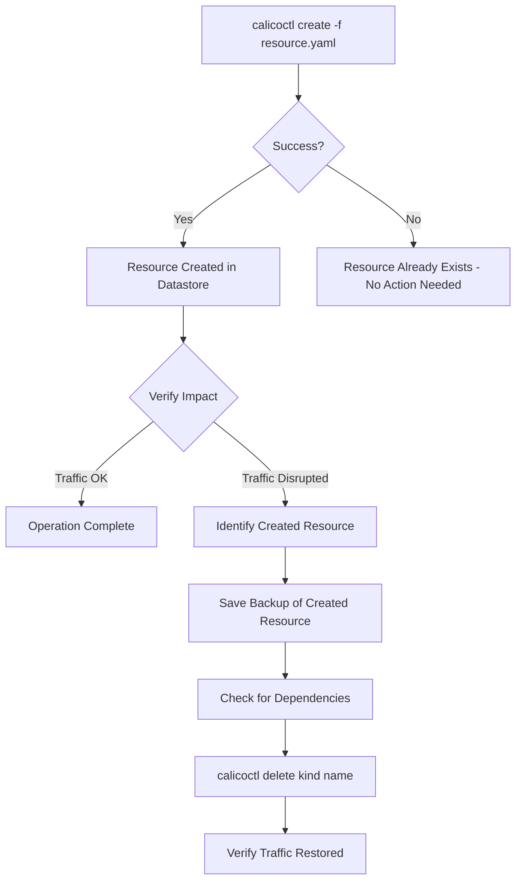

# How to Roll Back Safely After Using calicoctl create

Author: [nawazdhandala](https://github.com/nawazdhandala)

Tags: Calico, Kubernetes, Rollback, calicoctl, Network Policy

Description: Learn how to safely roll back resources created with calicoctl create, including identifying created resources, safe deletion procedures, and automated rollback workflows.

---

## Introduction

The `calicoctl create` command adds new Calico resources to the datastore. Unlike `calicoctl apply`, which creates or updates, `calicoctl create` fails if the resource already exists. This makes rollback conceptually simpler -- rolling back a create means deleting the newly created resource. However, the practical challenges lie in identifying exactly what was created, understanding dependencies, and ensuring deletion does not cause unintended side effects.

A hastily created GlobalNetworkPolicy with a broad selector can immediately block traffic across the entire cluster. Rolling back requires quick identification and deletion of the offending resource, but only after confirming that no other resources depend on it.

This guide covers rollback strategies specific to `calicoctl create` operations, including tracking created resources, safe deletion procedures, and automated rollback scripts.

## Prerequisites

- A running Kubernetes cluster with Calico installed
- calicoctl v3.27 or later
- kubectl access to the cluster
- Basic understanding of Calico resource types

## Tracking What Was Created

Before you can roll back, you need to know exactly what was created. Implement a logging wrapper:

```bash
#!/bin/bash
# tracked-create.sh
# Creates a Calico resource and logs the operation for rollback

set -euo pipefail

RESOURCE_FILE="${1:?Usage: $0 <resource-file.yaml>}"
export DATASTORE_TYPE=kubernetes
LOG_DIR="/var/log/calico-operations"
LOG_FILE="${LOG_DIR}/create-$(date +%Y%m%d-%H%M%S).log"

mkdir -p "$LOG_DIR"

# Extract resource details
RESOURCE_KIND=$(python3 -c "import yaml; print(yaml.safe_load(open('$RESOURCE_FILE'))['kind'])")
RESOURCE_NAME=$(python3 -c "import yaml; print(yaml.safe_load(open('$RESOURCE_FILE'))['metadata']['name'])")
RESOURCE_NS=$(python3 -c "
import yaml
doc = yaml.safe_load(open('$RESOURCE_FILE'))
print(doc['metadata'].get('namespace', 'cluster-scoped'))
")

# Log the operation
echo "$(date -u +%Y-%m-%dT%H:%M:%SZ) CREATE ${RESOURCE_KIND}/${RESOURCE_NAME} ns=${RESOURCE_NS} file=${RESOURCE_FILE}" >> "$LOG_FILE"

# Save a copy of the created resource
cp "$RESOURCE_FILE" "${LOG_DIR}/created-${RESOURCE_KIND}-${RESOURCE_NAME}.yaml"

# Perform the create
echo "Creating ${RESOURCE_KIND}/${RESOURCE_NAME}..."
calicoctl create -f "$RESOURCE_FILE"

echo "Created successfully. Logged to: $LOG_FILE"
echo "To rollback: calicoctl delete ${RESOURCE_KIND} ${RESOURCE_NAME}"
```

## Safe Deletion for Rollback

Deleting a Calico resource requires understanding its impact:

```bash
#!/bin/bash
# rollback-create.sh
# Safely rolls back a calicoctl create operation

set -euo pipefail

RESOURCE_KIND="${1:?Usage: $0 <kind> <name> [namespace]}"
RESOURCE_NAME="${2:?Usage: $0 <kind> <name> [namespace]}"
NAMESPACE="${3:-}"
export DATASTORE_TYPE=kubernetes

echo "=== Rollback: Delete ${RESOURCE_KIND}/${RESOURCE_NAME} ==="

# Step 1: Verify the resource exists
echo "Step 1: Verifying resource exists..."
if [ -n "$NAMESPACE" ]; then
  CURRENT=$(calicoctl get "$RESOURCE_KIND" "$RESOURCE_NAME" -n "$NAMESPACE" -o yaml 2>/dev/null)
else
  CURRENT=$(calicoctl get "$RESOURCE_KIND" "$RESOURCE_NAME" -o yaml 2>/dev/null)
fi

if [ -z "$CURRENT" ]; then
  echo "Resource does not exist. Nothing to rollback."
  exit 0
fi

# Step 2: Save the resource before deletion
BACKUP_FILE="/tmp/rollback-backup-${RESOURCE_KIND}-${RESOURCE_NAME}-$(date +%s).yaml"
echo "$CURRENT" > "$BACKUP_FILE"
echo "Step 2: Backup saved to: $BACKUP_FILE"

# Step 3: Check for dependent resources
echo "Step 3: Checking for dependencies..."
if [ "$RESOURCE_KIND" = "GlobalNetworkSet" ] || [ "$RESOURCE_KIND" = "NetworkSet" ]; then
  echo "  Checking if any policies reference this network set..."
  calicoctl get globalnetworkpolicies -o yaml | grep -l "$RESOURCE_NAME" || echo "  No policy references found"
fi

# Step 4: Delete the resource
echo "Step 4: Deleting resource..."
if [ -n "$NAMESPACE" ]; then
  calicoctl delete "$RESOURCE_KIND" "$RESOURCE_NAME" -n "$NAMESPACE"
else
  calicoctl delete "$RESOURCE_KIND" "$RESOURCE_NAME"
fi

echo "Rollback complete. Resource deleted."
echo "To undo this rollback: calicoctl create -f $BACKUP_FILE"
```

## Handling Multi-Resource Creates

When `calicoctl create` is used with a file containing multiple resources:

```bash
#!/bin/bash
# rollback-multi-create.sh
# Roll back a multi-resource create operation

set -euo pipefail

RESOURCE_FILE="${1:?Usage: $0 <resource-file.yaml>}"
export DATASTORE_TYPE=kubernetes

echo "Rolling back all resources in: $RESOURCE_FILE"

# Parse multi-document YAML and delete each resource in reverse order
python3 -c "
import yaml, sys
docs = list(yaml.safe_load_all(open('$RESOURCE_FILE')))
# Reverse order for safe deletion (dependencies first)
for doc in reversed(docs):
    if doc is None:
        continue
    kind = doc['kind']
    name = doc['metadata']['name']
    ns = doc['metadata'].get('namespace', '')
    ns_flag = f'-n {ns}' if ns else ''
    print(f'{kind} {name} {ns_flag}')
" | while read -r kind name ns_flag; do
  echo "Deleting ${kind}/${name} ${ns_flag}..."
  calicoctl delete "$kind" "$name" $ns_flag 2>/dev/null || echo "  Warning: Could not delete ${kind}/${name}"
done

echo "Multi-resource rollback complete."
```



## Automated Rollback with Timeout

Create a wrapper that auto-rolls back if verification fails:

```bash
#!/bin/bash
# create-with-auto-rollback.sh
# Creates a resource and auto-rollbacks if verification fails within timeout

set -euo pipefail

RESOURCE_FILE="${1:?Usage: $0 <resource-file.yaml> [verify-command]}"
VERIFY_CMD="${2:-kubectl get pods -n default -o wide}"
TIMEOUT_SECONDS=60
export DATASTORE_TYPE=kubernetes

# Extract resource info
KIND=$(python3 -c "import yaml; print(yaml.safe_load(open('$RESOURCE_FILE'))['kind'])")
NAME=$(python3 -c "import yaml; print(yaml.safe_load(open('$RESOURCE_FILE'))['metadata']['name'])")

# Create the resource
echo "Creating ${KIND}/${NAME}..."
calicoctl create -f "$RESOURCE_FILE"

# Wait and verify
echo "Verifying for ${TIMEOUT_SECONDS} seconds..."
sleep 10

if eval "$VERIFY_CMD" > /dev/null 2>&1; then
  echo "Verification passed. Resource created successfully."
else
  echo "Verification FAILED. Rolling back..."
  calicoctl delete "$KIND" "$NAME"
  echo "Rollback complete. Resource deleted."
  exit 1
fi
```

## Verification

```bash
export DATASTORE_TYPE=kubernetes

# Verify the resource was deleted (should return error or empty)
calicoctl get globalnetworkpolicy <deleted-policy-name> 2>&1

# Verify no orphaned resources remain
calicoctl get globalnetworkpolicies -o wide
calicoctl get networkpolicies --all-namespaces -o wide

# Verify traffic is flowing correctly after rollback
kubectl exec -it deploy/frontend -- curl -s --max-time 5 http://backend-service:8080/health
```

## Troubleshooting

- **"resource does not exist" on delete**: The resource may have already been deleted or the name is misspelled. Use `calicoctl get <kind>` to list all resources of that type.
- **Deletion does not restore connectivity**: Other policies may still be blocking traffic. List all policies and check their selectors and order values.
- **Cannot delete resource due to finalizers**: Check if the resource has finalizers with `calicoctl get <kind> <name> -o yaml | grep finalizers`. Remove finalizers if needed before deletion.
- **Multi-document YAML rollback skips resources**: Ensure the YAML file uses proper document separators (`---`). The parser may miss resources without separators.

## Conclusion

Rolling back `calicoctl create` operations is straightforward in principle -- delete the created resource -- but requires careful execution. By tracking created resources, saving backups before deletion, checking for dependencies, and using automated rollback wrappers, you can recover from misconfigured creates quickly and safely. Integrate these practices into your team workflows to ensure that every `calicoctl create` has a clear rollback path.
