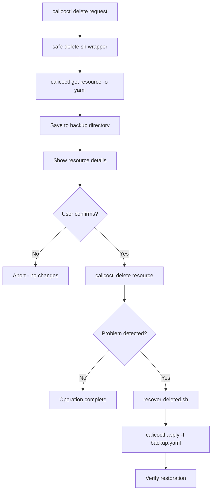

# How to Roll Back Safely After Using calicoctl delete

Author: [nawazdhandala](https://github.com/nawazdhandala)

Tags: Calico, Kubernetes, Rollback, Calicoctl, Disaster Recovery

Description: Learn how to safely roll back after a calicoctl delete operation by implementing pre-delete backups, recovery procedures, and automated safety wrappers.

---

## Introduction

The `calicoctl delete` command permanently removes Calico resources from the datastore. Unlike other calicoctl commands, delete is immediately destructive with no built-in undo mechanism. Accidentally deleting a GlobalNetworkPolicy, IPPool, or BGPConfiguration can instantly disrupt cluster networking, drop all traffic, or cause IP address allocation failures.

Rolling back from a delete requires having captured the resource definition before deletion. Without a backup, the deleted resource must be manually reconstructed, which is time-consuming and error-prone during an incident.

This guide covers pre-delete safety measures, automated backup-before-delete workflows, and step-by-step recovery procedures for different Calico resource types.

## Prerequisites

- A running Kubernetes cluster with Calico installed
- calicoctl v3.27 or later
- kubectl access to the cluster
- Understanding of Calico resource dependencies

## Pre-Delete Safety Wrapper

Never run `calicoctl delete` directly. Use a wrapper that captures the resource first:

```bash
#!/bin/bash
# safe-delete.sh
# Backs up a Calico resource before deleting it

set -euo pipefail

export DATASTORE_TYPE=kubernetes
RESOURCE_KIND="${1:?Usage: $0 <kind> <name> [-n namespace]}"
RESOURCE_NAME="${2:?Usage: $0 <kind> <name> [-n namespace]}"
shift 2

BACKUP_DIR="/var/backups/calico-deletes"
mkdir -p "$BACKUP_DIR"
TIMESTAMP=$(date +%Y%m%d-%H%M%S)
BACKUP_FILE="${BACKUP_DIR}/${RESOURCE_KIND}-${RESOURCE_NAME}-${TIMESTAMP}.yaml"

# Step 1: Capture the current resource definition
echo "Backing up ${RESOURCE_KIND}/${RESOURCE_NAME}..."
calicoctl get "$RESOURCE_KIND" "$RESOURCE_NAME" "$@" -o yaml > "$BACKUP_FILE"

if [ ! -s "$BACKUP_FILE" ]; then
  echo "ERROR: Resource not found or empty. Aborting delete."
  rm -f "$BACKUP_FILE"
  exit 1
fi

echo "Backup saved to: $BACKUP_FILE"

# Step 2: Show what will be deleted
echo ""
echo "=== Resource to be deleted ==="
cat "$BACKUP_FILE"
echo ""

# Step 3: Confirm deletion
read -r -p "Delete ${RESOURCE_KIND}/${RESOURCE_NAME}? [y/N] " confirm
if [ "$confirm" != "y" ] && [ "$confirm" != "Y" ]; then
  echo "Aborted."
  exit 0
fi

# Step 4: Delete the resource
calicoctl delete "$RESOURCE_KIND" "$RESOURCE_NAME" "$@"

echo "Deleted. To restore: calicoctl apply -f $BACKUP_FILE"
```

## Recovering Deleted Resources

Restore a previously deleted resource from backup:

```bash
#!/bin/bash
# recover-deleted.sh
# Restores a deleted Calico resource from backup

set -euo pipefail

export DATASTORE_TYPE=kubernetes
BACKUP_DIR="/var/backups/calico-deletes"

if [ -n "${1:-}" ]; then
  # Restore specific backup file
  BACKUP_FILE="$1"
else
  # List available backups
  echo "Available backups:"
  ls -lt "$BACKUP_DIR"/*.yaml 2>/dev/null | head -20
  echo ""
  read -r -p "Enter backup file path: " BACKUP_FILE
fi

if [ ! -f "$BACKUP_FILE" ]; then
  echo "ERROR: Backup file not found: $BACKUP_FILE"
  exit 1
fi

echo "Restoring from: $BACKUP_FILE"
echo ""
echo "=== Resource to restore ==="
head -20 "$BACKUP_FILE"
echo "..."
echo ""

# Apply the backup (re-creates the resource)
calicoctl apply -f "$BACKUP_FILE"

echo "Resource restored successfully."
```

## Handling IPPool Deletion Recovery

IPPool deletion is particularly dangerous because it affects IP address allocation:

```bash
#!/bin/bash
# recover-ippool.sh
# Special recovery procedure for deleted IPPools

set -euo pipefail

export DATASTORE_TYPE=kubernetes
BACKUP_FILE="${1:?Usage: $0 <ippool-backup.yaml>}"

echo "WARNING: IPPool recovery may cause IP address conflicts."
echo "Existing pods may have IPs from the deleted pool."
echo ""

# Show current pools
echo "Current IP Pools:"
calicoctl get ippools -o wide

echo ""
echo "Pool to restore:"
cat "$BACKUP_FILE"
echo ""

read -r -p "Proceed with IPPool restoration? [y/N] " confirm
if [ "$confirm" != "y" ]; then
  echo "Aborted."
  exit 0
fi

# Restore the IPPool
calicoctl apply -f "$BACKUP_FILE"

# Verify
echo ""
echo "Restored IP Pools:"
calicoctl get ippools -o wide
```



## Bulk Delete Recovery

When multiple resources were accidentally deleted:

```bash
#!/bin/bash
# recover-bulk.sh
# Restores multiple deleted resources from the backup directory

set -euo pipefail

export DATASTORE_TYPE=kubernetes
BACKUP_DIR="/var/backups/calico-deletes"
SINCE="${1:-60}"  # Recover resources deleted in the last N minutes

echo "Recovering resources deleted in the last ${SINCE} minutes..."

# Find recent backups
BACKUPS=$(find "$BACKUP_DIR" -name "*.yaml" -mmin "-${SINCE}" | sort)

if [ -z "$BACKUPS" ]; then
  echo "No backups found in the last ${SINCE} minutes."
  exit 0
fi

echo "Found backups:"
echo "$BACKUPS" | while read -r f; do
  echo "  $(basename "$f")"
done
echo ""

read -r -p "Restore all? [y/N] " confirm
if [ "$confirm" != "y" ]; then
  exit 0
fi

echo "$BACKUPS" | while read -r backup_file; do
  echo "Restoring: $(basename "$backup_file")..."
  calicoctl apply -f "$backup_file" 2>/dev/null || echo "  Warning: Could not restore $(basename "$backup_file")"
done

echo "Bulk recovery complete."
```

## Verification

```bash
export DATASTORE_TYPE=kubernetes

# Verify the resource was restored
calicoctl get globalnetworkpolicy <restored-policy-name> -o yaml

# Compare with the backup file
diff <(calicoctl get globalnetworkpolicy <name> -o yaml) backup.yaml

# Verify network connectivity is restored
kubectl exec -it deploy/test-app -- curl -s --max-time 5 http://backend:8080/health

# Check that all Calico nodes are healthy
calicoctl node status
```

## Troubleshooting

- **"resource already exists" on restore**: The resource was recreated by another process. Use `calicoctl replace` instead of `calicoctl apply` to overwrite with the backup version.
- **Restored IPPool shows different blockSize**: The IPPool was modified before deletion. Review the backup file and adjust if the original blockSize was different from what is needed.
- **Policy restored but traffic still blocked**: Verify the policy order and selectors. Other policies may have been created during the outage that conflict with the restored policy.
- **Backup directory is empty**: The delete was performed without the safe-delete wrapper. Check if etcd snapshots or Velero backups contain the deleted resource.

## Conclusion

The `calicoctl delete` command is the most dangerous calicoctl operation because it is immediately destructive with no undo. The only reliable rollback strategy is prevention through pre-delete backups. By using the safe-delete wrapper, maintaining a structured backup directory, and testing your recovery procedures regularly, you ensure that any accidental deletion can be reversed quickly and completely. Make the safe-delete script the only way your team performs Calico resource deletions.
