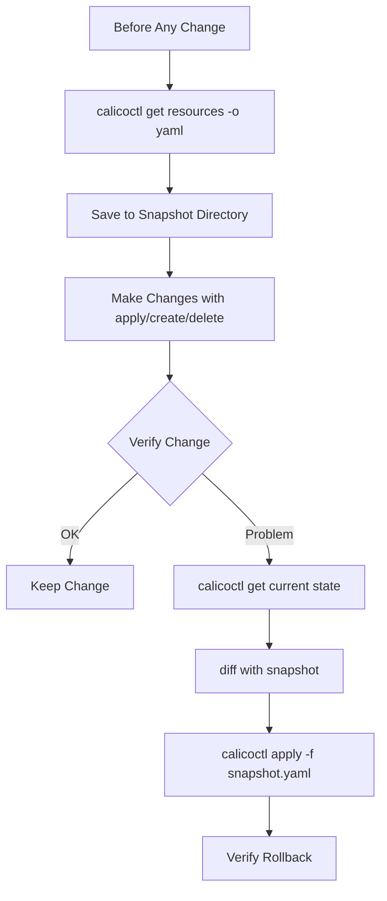

# How to Roll Back Safely After Using calicoctl get

Author: [nawazdhandala](https://github.com/nawazdhandala)

Tags: Calico, Kubernetes, calicoctl, Best Practices, Network Policy

Description: Understand when and why calicoctl get might require a rollback scenario, and learn how to use get output safely as the foundation for backup, restore, and change management workflows.

---

## Introduction

The `calicoctl get` command is a read-only operation that retrieves Calico resources from the datastore. It does not modify any state, so in the traditional sense, there is nothing to "roll back." However, `calicoctl get` plays a critical role in the rollback workflow for other commands -- it is the tool you use to capture the current state before making changes and to verify state after a rollback.

The real risks associated with `calicoctl get` are indirect: acting on stale or incorrect output, piping get output directly into destructive operations, or confusing the output format when using it for restore operations.

This guide covers how to use `calicoctl get` safely and effectively as part of your change management and rollback workflows.

## Prerequisites

- A running Kubernetes cluster with Calico installed
- calicoctl v3.27 or later
- kubectl access to the cluster
- Basic understanding of Calico resource types

## Using calicoctl get for Pre-Change Snapshots

The primary rollback-related use of `calicoctl get` is capturing the current state before making changes:

```bash
#!/bin/bash
# snapshot-current-state.sh
# Uses calicoctl get to create a comprehensive snapshot

set -euo pipefail

export DATASTORE_TYPE=kubernetes
SNAPSHOT_DIR="/var/backups/calico/$(date +%Y%m%d-%H%M%S)"
mkdir -p "$SNAPSHOT_DIR"

# Capture each resource type in YAML format for restore compatibility
RESOURCES=(
  "globalnetworkpolicies"
  "networkpolicies"
  "globalnetworksets"
  "networksets"
  "ippools"
  "bgpconfigurations"
  "bgppeers"
  "felixconfigurations"
  "hostendpoints"
  "profiles"
)

for resource in "${RESOURCES[@]}"; do
  echo "Capturing ${resource}..."
  # Use -o yaml for restore-compatible output
  calicoctl get "$resource" --all-namespaces -o yaml > \
    "${SNAPSHOT_DIR}/${resource}.yaml" 2>/dev/null || true
done

echo "Snapshot saved to: $SNAPSHOT_DIR"
echo "$SNAPSHOT_DIR" > /tmp/last-calico-snapshot
```

## Safe Output Handling

Avoid common mistakes when using `calicoctl get` output:

```bash
export DATASTORE_TYPE=kubernetes

# CORRECT: Save to file first, then review before acting on it
calicoctl get globalnetworkpolicy my-policy -o yaml > /tmp/policy-backup.yaml
cat /tmp/policy-backup.yaml  # Review the content

# WRONG: Piping get directly into apply/delete without review
# calicoctl get globalnetworkpolicies -o yaml | calicoctl delete -f -   # DANGEROUS!

# CORRECT: Use specific resource names instead of bulk operations
calicoctl get globalnetworkpolicy my-policy -o yaml > backup.yaml

# CORRECT: Verify the output is valid YAML before using it
python3 -c "import yaml; yaml.safe_load(open('/tmp/policy-backup.yaml'))" && echo "Valid YAML"
```

## Comparing State Before and After Changes

Use `calicoctl get` to create before/after comparisons:

```bash
#!/bin/bash
# compare-states.sh
# Compare Calico state before and after a change

set -euo pipefail

export DATASTORE_TYPE=kubernetes
RESOURCE_TYPE="${1:?Usage: $0 <resource-type> [name]}"
RESOURCE_NAME="${2:-}"

BEFORE_FILE="/tmp/calico-before-${RESOURCE_TYPE}.yaml"
AFTER_FILE="/tmp/calico-after-${RESOURCE_TYPE}.yaml"

if [ -n "$RESOURCE_NAME" ]; then
  # Capture before state
  calicoctl get "$RESOURCE_TYPE" "$RESOURCE_NAME" -o yaml > "$BEFORE_FILE"
  echo "Before state captured. Make your changes, then press Enter to compare."
  read -r

  # Capture after state
  calicoctl get "$RESOURCE_TYPE" "$RESOURCE_NAME" -o yaml > "$AFTER_FILE"
else
  calicoctl get "$RESOURCE_TYPE" --all-namespaces -o yaml > "$BEFORE_FILE"
  echo "Before state captured. Make your changes, then press Enter to compare."
  read -r
  calicoctl get "$RESOURCE_TYPE" --all-namespaces -o yaml > "$AFTER_FILE"
fi

echo "=== Changes ==="
diff "$BEFORE_FILE" "$AFTER_FILE" || echo "(differences shown above)"
```

## Building a Restore Workflow from Get Output

```bash
#!/bin/bash
# restore-from-snapshot.sh
# Restores Calico resources from a calicoctl get snapshot

set -euo pipefail

SNAPSHOT_DIR="${1:?Usage: $0 <snapshot-directory>}"
export DATASTORE_TYPE=kubernetes

if [ ! -d "$SNAPSHOT_DIR" ]; then
  echo "ERROR: Snapshot directory not found: $SNAPSHOT_DIR"
  exit 1
fi

echo "Restoring from snapshot: $SNAPSHOT_DIR"

# Apply resources in dependency order
RESTORE_ORDER=(
  "ippools"
  "felixconfigurations"
  "bgpconfigurations"
  "bgppeers"
  "globalnetworksets"
  "networksets"
  "globalnetworkpolicies"
  "networkpolicies"
)

for resource in "${RESTORE_ORDER[@]}"; do
  file="${SNAPSHOT_DIR}/${resource}.yaml"
  if [ -f "$file" ] && [ -s "$file" ]; then
    echo "Restoring ${resource}..."
    calicoctl apply -f "$file" 2>/dev/null || echo "  Warning: Some ${resource} may have conflicts"
  fi
done

echo "Restore complete."
```



## Output Format Considerations

Understanding output formats is critical for safe rollback:

```bash
export DATASTORE_TYPE=kubernetes

# YAML format: best for backup and restore
calicoctl get globalnetworkpolicies -o yaml > backup.yaml

# JSON format: useful for programmatic processing
calicoctl get globalnetworkpolicies -o json > backup.json

# Wide format: human-readable but NOT usable for restore
calicoctl get globalnetworkpolicies -o wide
# This output cannot be used with calicoctl apply!

# Table format (default): also NOT usable for restore
calicoctl get globalnetworkpolicies
```

## Verification

```bash
export DATASTORE_TYPE=kubernetes

# Verify snapshot completeness
SNAPSHOT_DIR=$(cat /tmp/last-calico-snapshot)
echo "Snapshot contents:"
for f in "$SNAPSHOT_DIR"/*.yaml; do
  count=$(python3 -c "import yaml; docs=list(yaml.safe_load_all(open('$f'))); print(len([d for d in docs if d and 'items' in d and d['items']]))" 2>/dev/null || echo "0")
  echo "  $(basename "$f"): present"
done

# Verify a specific resource matches the snapshot
calicoctl get globalnetworkpolicies -o yaml > /tmp/current.yaml
diff "$SNAPSHOT_DIR/globalnetworkpolicies.yaml" /tmp/current.yaml && echo "State matches snapshot"
```

## Troubleshooting

- **Empty output from calicoctl get**: Verify `DATASTORE_TYPE` is set correctly. Check RBAC permissions with `kubectl auth can-i list globalnetworkpolicies.projectcalico.org`.
- **YAML output contains resourceVersion**: This is normal for Kubernetes API datastore. The resourceVersion is ignored on apply, so backups remain valid.
- **Snapshot does not match after restore**: Some fields like `creationTimestamp` and `uid` change on re-creation. Focus on comparing the `spec` section for functional equivalence.
- **Cannot restore from JSON output**: Ensure you use `calicoctl apply -f` with the JSON file. Both YAML and JSON formats are accepted.

## Conclusion

While `calicoctl get` is a read-only command, it is the cornerstone of every Calico rollback workflow. By using it to create pre-change snapshots, compare before/after states, and drive restore procedures, you build a reliable change management process. Always save output in YAML format, validate it before acting on it, and maintain a clear snapshot directory structure so rollbacks are fast and predictable.
