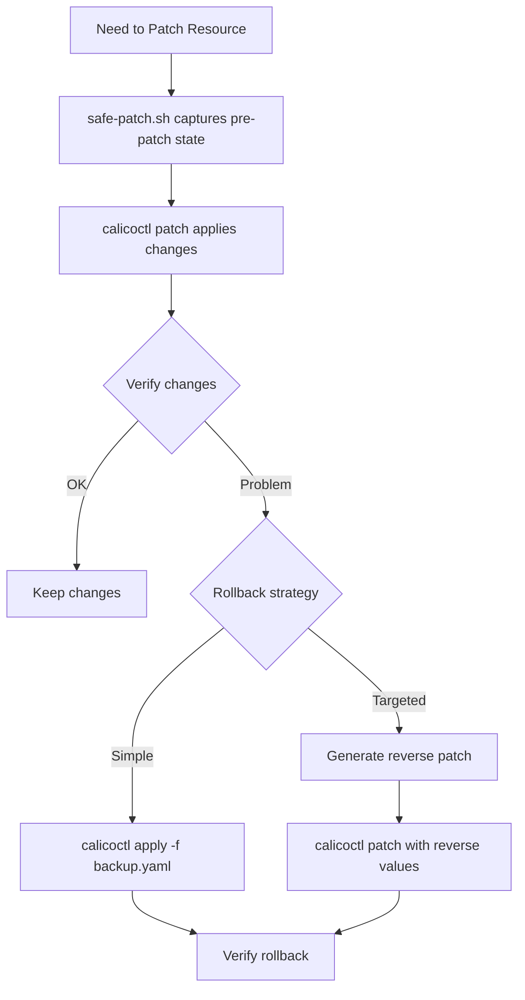

# How to Roll Back Safely After Using calicoctl patch

Author: [nawazdhandala](https://github.com/nawazdhandala)

Tags: Calico, Kubernetes, Rollback, calicoctl, Network Policy

Description: Learn how to safely roll back Calico resource changes made with calicoctl patch by capturing pre-patch state, creating reverse patches, and implementing automated rollback procedures.

---

## Introduction

The `calicoctl patch` command modifies specific fields of an existing Calico resource. Rolling back a patch means restoring the original values of those specific fields. This is different from rolling back an `apply` (which replaces the entire resource) because you only need to revert the changed fields, not the whole resource.

The challenge with patch rollbacks is that `calicoctl patch` does not record what the previous values were. You must capture the pre-patch state yourself to create a reverse patch or restore the original resource.

This guide covers practical rollback strategies for calicoctl patch operations, including pre-patch snapshots, reverse patch generation, and automated rollback workflows.

## Prerequisites

- A running Kubernetes cluster with Calico installed
- calicoctl v3.27 or later
- kubectl access to the cluster
- python3 for JSON processing

## Capturing Pre-Patch State

Always capture the resource before patching:

```bash
#!/bin/bash
# safe-patch.sh
# Patches a Calico resource with automatic pre-patch backup

set -euo pipefail

export DATASTORE_TYPE=kubernetes
RESOURCE_KIND="${1:?Usage: $0 <kind> <name> -p '<patch-json>'}"
RESOURCE_NAME="${2:?}"
shift 2

BACKUP_DIR="/var/backups/calico-patches"
mkdir -p "$BACKUP_DIR"
TIMESTAMP=$(date +%Y%m%d-%H%M%S)
BACKUP_FILE="${BACKUP_DIR}/${RESOURCE_KIND}-${RESOURCE_NAME}-${TIMESTAMP}.yaml"

# Capture pre-patch state
calicoctl get "$RESOURCE_KIND" "$RESOURCE_NAME" -o yaml > "$BACKUP_FILE"
echo "Pre-patch backup: $BACKUP_FILE"

# Apply the patch
calicoctl patch "$RESOURCE_KIND" "$RESOURCE_NAME" "$@"

echo "Patch applied. To rollback: calicoctl apply -f $BACKUP_FILE"
echo "$BACKUP_FILE" > /tmp/last-calico-patch-backup
```

## Generating a Reverse Patch

Create a reverse patch that restores only the modified fields:

```bash
#!/bin/bash
# generate-reverse-patch.sh
# Generates a reverse patch by comparing pre and post patch states

set -euo pipefail

export DATASTORE_TYPE=kubernetes
RESOURCE_KIND="${1:?Usage: $0 <kind> <name>}"
RESOURCE_NAME="${2:?}"
BACKUP_FILE=$(cat /tmp/last-calico-patch-backup 2>/dev/null)

if [ -z "$BACKUP_FILE" ] || [ ! -f "$BACKUP_FILE" ]; then
  echo "ERROR: No pre-patch backup found"
  exit 1
fi

# Get current state
calicoctl get "$RESOURCE_KIND" "$RESOURCE_NAME" -o json > /tmp/current-state.json

# Generate reverse patch
python3 -c "
import yaml, json

# Load pre-patch state
with open('$BACKUP_FILE') as f:
    before = yaml.safe_load(f)

# Load current state
with open('/tmp/current-state.json') as f:
    after = json.load(f)

def find_differences(before, after, path=''):
    diffs = {}
    if isinstance(before, dict) and isinstance(after, dict):
        for key in set(list(before.keys()) + list(after.keys())):
            bp = f'{path}.{key}' if path else key
            if key in before and key in after:
                sub_diff = find_differences(before[key], after[key], bp)
                if sub_diff:
                    diffs[key] = sub_diff if isinstance(sub_diff, dict) and key not in ('spec',) else before[key]
            elif key in before:
                diffs[key] = before[key]
    elif before != after:
        return before
    return diffs if diffs else None

diff = find_differences(before.get('spec', {}), after.get('spec', {}))
if diff:
    reverse_patch = {'spec': diff}
    print(json.dumps(reverse_patch, indent=2))
    print('', file=__import__('sys').stderr)
    print('Reverse patch generated. Apply with:', file=__import__('sys').stderr)
    print(f\"  calicoctl patch $RESOURCE_KIND $RESOURCE_NAME -p '{json.dumps(reverse_patch)}'\", file=__import__('sys').stderr)
else:
    print('No differences found.', file=__import__('sys').stderr)
" 2>&1
```

## Quick Rollback Using Full Resource Restore

The simplest and most reliable rollback is to restore the entire pre-patch resource:

```bash
#!/bin/bash
# rollback-patch.sh
# Rolls back the last patch operation using the pre-patch backup

set -euo pipefail

export DATASTORE_TYPE=kubernetes
BACKUP_FILE=$(cat /tmp/last-calico-patch-backup 2>/dev/null)

if [ -z "$BACKUP_FILE" ] || [ ! -f "$BACKUP_FILE" ]; then
  echo "ERROR: No pre-patch backup found."
  echo "Looking in backup directory..."
  ls -lt /var/backups/calico-patches/*.yaml 2>/dev/null | head -10
  exit 1
fi

echo "Rolling back to: $BACKUP_FILE"
calicoctl apply -f "$BACKUP_FILE"
echo "Rollback complete."
```



## Rollback with Timeout Guard

Automatically rollback if verification fails within a time window:

```bash
#!/bin/bash
# patch-with-guard.sh
# Patches with automatic rollback on verification failure

set -euo pipefail

export DATASTORE_TYPE=kubernetes
RESOURCE_KIND="${1:?Usage: $0 <kind> <name> <patch-json> <verify-command>}"
RESOURCE_NAME="$2"
PATCH_JSON="$3"
VERIFY_CMD="${4:-echo ok}"

BACKUP_FILE="/tmp/calico-guard-backup-$(date +%s).yaml"

# Backup
calicoctl get "$RESOURCE_KIND" "$RESOURCE_NAME" -o yaml > "$BACKUP_FILE"

# Patch
echo "Applying patch..."
calicoctl patch "$RESOURCE_KIND" "$RESOURCE_NAME" -p "$PATCH_JSON"

# Wait for enforcement
sleep 5

# Verify
echo "Verifying..."
if eval "$VERIFY_CMD"; then
  echo "Verification passed. Patch kept."
  rm -f "$BACKUP_FILE"
else
  echo "Verification FAILED. Rolling back..."
  calicoctl apply -f "$BACKUP_FILE"
  echo "Rolled back to previous state."
  rm -f "$BACKUP_FILE"
  exit 1
fi
```

## Verification

```bash
export DATASTORE_TYPE=kubernetes

# Verify rollback restored the original values
calicoctl get globalnetworkpolicy my-policy -o yaml

# Compare with backup
diff <(calicoctl get globalnetworkpolicy my-policy -o yaml) /var/backups/calico-patches/GlobalNetworkPolicy-my-policy-*.yaml

# Verify network behavior matches pre-patch state
kubectl exec deploy/test-app -- curl -s --max-time 5 http://backend:8080/health
```

## Troubleshooting

- **Backup file has resourceVersion that causes conflict**: Remove the `resourceVersion` field from the backup before applying: `sed -i '/resourceVersion/d' backup.yaml`.
- **Reverse patch does not restore array fields**: JSON merge patch replaces arrays entirely. The reverse patch must contain the complete original array, not just the changed elements.
- **Rollback succeeds but behavior unchanged**: Felix may be caching the previous policy. Wait 30 seconds and retest, or restart the calico-node pod on the affected node.
- **Multiple patches applied, need to rollback to specific point**: Keep all backup files organized by timestamp. Restore the backup from the desired point in time.

## Conclusion

Rolling back calicoctl patch operations requires capturing the pre-patch state before every patch. Whether you use full resource restoration or targeted reverse patches, the key is having a reliable backup. The safe-patch wrapper and timeout guard scripts provide automated protection against misconfigured patches, ensuring you can always recover quickly from unintended changes.
