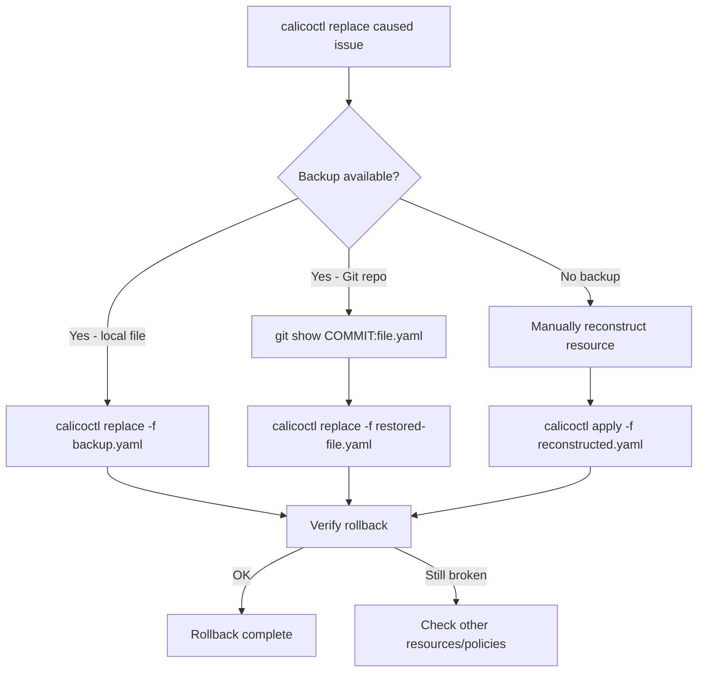

# How to Roll Back Safely After Using calicoctl replace

Author: [nawazdhandala](https://github.com/nawazdhandala)

Tags: Calico, Kubernetes, Rollback, Calicoctl, Network Policy

Description: Learn how to safely roll back Calico resources after a calicoctl replace operation with pre-replace backups, automated rollback scripts, and GitOps-based recovery.

---

## Introduction

The `calicoctl replace` command overwrites an entire Calico resource with a new definition. This makes rollback straightforward in concept -- simply replace the resource again with the previous definition. However, the challenge is having that previous definition readily available and applying it quickly enough to minimize impact.

Since `replace` removes any fields not present in the new definition, a bad replacement can strip critical policy rules, disable Felix features, or break BGP peering in a single operation. Fast, reliable rollback is essential.

This guide covers rollback strategies for calicoctl replace operations, from simple backup-and-restore to GitOps-based recovery.

## Prerequisites

- A running Kubernetes cluster with Calico installed
- calicoctl v3.27 or later
- kubectl access to the cluster
- Git repository for resource version control (recommended)

## Pre-Replace Backup Workflow

Always capture the current state before replacing:

```bash
#!/bin/bash
# safe-replace.sh
# Replaces a Calico resource with automatic backup

set -euo pipefail

export DATASTORE_TYPE=kubernetes
RESOURCE_FILE="${1:?Usage: $0 <resource-file.yaml>}"

KIND=$(python3 -c "import yaml; print(yaml.safe_load(open('$RESOURCE_FILE'))['kind'])")
NAME=$(python3 -c "import yaml; print(yaml.safe_load(open('$RESOURCE_FILE'))['metadata']['name'])")

BACKUP_DIR="/var/backups/calico-replace"
mkdir -p "$BACKUP_DIR"
TIMESTAMP=$(date +%Y%m%d-%H%M%S)
BACKUP_FILE="${BACKUP_DIR}/${KIND}-${NAME}-${TIMESTAMP}.yaml"

# Backup current state
calicoctl get "$KIND" "$NAME" -o yaml > "$BACKUP_FILE"
echo "Backup: $BACKUP_FILE"

# Validate new resource
calicoctl validate -f "$RESOURCE_FILE"

# Replace
calicoctl replace -f "$RESOURCE_FILE"
echo "$BACKUP_FILE" > /tmp/last-replace-backup

echo "Replaced. Rollback: calicoctl replace -f $BACKUP_FILE"
```

## Instant Rollback Script

```bash
#!/bin/bash
# rollback-replace.sh
# Instantly rolls back the last replace operation

set -euo pipefail

export DATASTORE_TYPE=kubernetes
BACKUP_FILE="${1:-$(cat /tmp/last-replace-backup 2>/dev/null)}"

if [ -z "$BACKUP_FILE" ] || [ ! -f "$BACKUP_FILE" ]; then
  echo "No backup file found. Available backups:"
  ls -lt /var/backups/calico-replace/*.yaml 2>/dev/null | head -10
  exit 1
fi

echo "Rolling back from: $BACKUP_FILE"

# Remove metadata fields that will conflict
python3 -c "
import yaml
with open('$BACKUP_FILE') as f:
    doc = yaml.safe_load(f)
# Remove auto-generated metadata
for field in ['resourceVersion', 'uid', 'creationTimestamp', 'generation']:
    doc['metadata'].pop(field, None)
with open('/tmp/rollback-clean.yaml', 'w') as f:
    yaml.dump(doc, f, default_flow_style=False)
"

calicoctl replace -f /tmp/rollback-clean.yaml
echo "Rollback complete."
```

## GitOps-Based Recovery

When resources are stored in Git, rollback means reverting to a previous commit:

```bash
#!/bin/bash
# git-rollback.sh
# Rolls back Calico resources to a previous Git commit

set -euo pipefail

export DATASTORE_TYPE=kubernetes
REPO_DIR="${1:?Usage: $0 <repo-dir> [commit-hash]}"
COMMIT="${2:-HEAD~1}"

echo "Rolling back Calico resources to Git commit: $COMMIT"

# Check out the previous version of resource files
cd "$REPO_DIR"
git stash 2>/dev/null || true

CHANGED_FILES=$(git diff --name-only "$COMMIT" HEAD -- '*.yaml')

for file in $CHANGED_FILES; do
  # Get the file content at the specified commit
  git show "${COMMIT}:${file}" > "/tmp/rollback-${file##*/}" 2>/dev/null || continue

  KIND=$(python3 -c "import yaml; print(yaml.safe_load(open('/tmp/rollback-${file##*/}'))['kind'])" 2>/dev/null) || continue
  NAME=$(python3 -c "import yaml; print(yaml.safe_load(open('/tmp/rollback-${file##*/}'))['metadata']['name'])" 2>/dev/null) || continue

  echo "Restoring ${KIND}/${NAME} from commit ${COMMIT}..."
  calicoctl replace -f "/tmp/rollback-${file##*/}" 2>/dev/null || \
    calicoctl apply -f "/tmp/rollback-${file##*/}"
done

git stash pop 2>/dev/null || true
echo "Git-based rollback complete."
```



## Replace with Automatic Rollback Timer

```bash
#!/bin/bash
# replace-with-timer.sh
# Replaces and auto-rollbacks if not confirmed within timeout

set -euo pipefail

export DATASTORE_TYPE=kubernetes
RESOURCE_FILE="${1:?Usage: $0 <resource-file.yaml> [timeout-seconds]}"
TIMEOUT="${2:-120}"

KIND=$(python3 -c "import yaml; print(yaml.safe_load(open('$RESOURCE_FILE'))['kind'])")
NAME=$(python3 -c "import yaml; print(yaml.safe_load(open('$RESOURCE_FILE'))['metadata']['name'])")

# Backup
BACKUP="/tmp/auto-rollback-backup-$(date +%s).yaml"
calicoctl get "$KIND" "$NAME" -o yaml > "$BACKUP"

# Replace
calicoctl replace -f "$RESOURCE_FILE"
echo "Replaced ${KIND}/${NAME}. You have ${TIMEOUT} seconds to confirm."
echo "Press Enter to keep the change, or wait for auto-rollback."

if read -r -t "$TIMEOUT"; then
  echo "Change confirmed. Keeping new state."
  rm -f "$BACKUP"
else
  echo ""
  echo "Timeout reached. Rolling back..."
  calicoctl replace -f "$BACKUP"
  echo "Auto-rollback complete."
fi
```

## Verification

```bash
export DATASTORE_TYPE=kubernetes

# Verify rollback restored the original state
calicoctl get globalnetworkpolicy my-policy -o yaml

# Compare with backup
diff <(calicoctl get globalnetworkpolicy my-policy -o yaml) /var/backups/calico-replace/GlobalNetworkPolicy-my-policy-*.yaml

# Verify network connectivity
kubectl exec deploy/frontend -- curl -s --max-time 5 http://backend:8080/health
```

## Troubleshooting

- **"resource version conflict" on rollback**: The resource was modified after the backup. Remove `resourceVersion` from the backup file and retry.
- **Rollback succeeds but old behavior persists**: Felix may need up to 30 seconds to process the update. Wait and retest.
- **Git rollback shows file not found**: The resource file may have been renamed or moved between commits. Check the Git history for the file.
- **Auto-rollback timer fires during slow verification**: Increase the timeout or use a separate verification script instead of the timer approach.

## Conclusion

Rolling back calicoctl replace operations is reliable when you have pre-replace backups. Whether using local file backups, Git-based recovery, or automatic rollback timers, the key is capturing the complete resource state before every replace. Since replace overwrites the entire resource, having the full previous definition is essential for clean recovery. Make the safe-replace wrapper your team's standard tool for all calicoctl replace operations.
