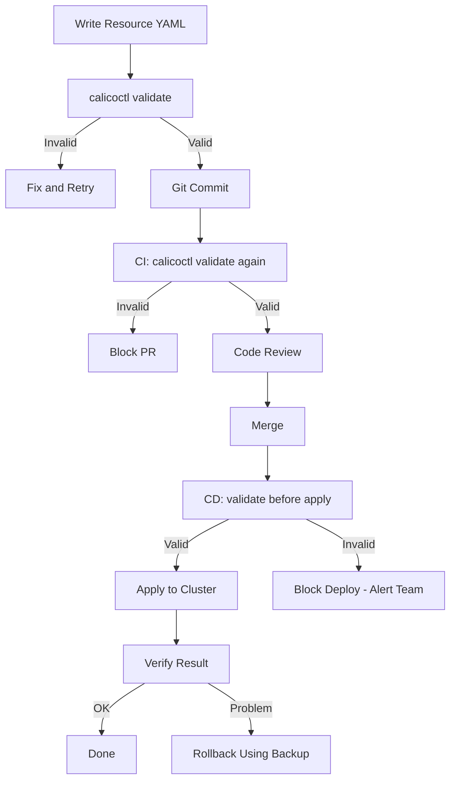

# How to Roll Back Safely After Using calicoctl validate

Author: [nawazdhandala](https://github.com/nawazdhandala)

Tags: Calico, Kubernetes, Validation, Calicoctl, Best Practices

Description: Understand why calicoctl validate is inherently safe, requires no rollback, and how to use it as the foundation for safe change management workflows.

---

## Introduction

The `calicoctl validate` command is a read-only operation that checks resource definitions for correctness without writing anything to the datastore. It makes no changes to the cluster, no changes to the resource state, and no changes to network behavior. There is nothing to roll back.

However, understanding this distinction is itself valuable. Teams sometimes confuse validate with apply or are unsure whether validation has side effects. This guide clarifies what calicoctl validate does and does not do, and shows how to use it as the cornerstone of a safe change management workflow where rollback is rarely needed.

## Prerequisites

- calicoctl v3.27 or later
- Basic understanding of Calico resource lifecycle
- Calico YAML resource files

## What calicoctl validate Does

The validate command performs these checks without modifying the cluster:

```bash
# calicoctl validate only reads the file -- it never contacts the datastore
calicoctl validate -f policy.yaml

# This is equivalent to a dry-run syntax check
# It verifies:
# 1. Valid YAML syntax
# 2. Correct apiVersion (projectcalico.org/v3)
# 3. Valid kind (GlobalNetworkPolicy, IPPool, etc.)
# 4. Required fields present
# 5. Field types correct (strings, numbers, booleans)
# 6. Selector syntax valid
# 7. Action values valid (Allow, Deny, Log, Pass)
# 8. Protocol values valid (TCP, UDP, ICMP, etc.)
```

## What calicoctl validate Does NOT Do

```bash
# validate does NOT:
# - Connect to the Kubernetes API or etcd datastore
# - Check if the resource already exists
# - Check for naming conflicts
# - Check if referenced resources (like NetworkSets) exist
# - Modify any cluster state
# - Require DATASTORE_TYPE to be set
# - Require valid credentials or kubeconfig

# This means validate works completely offline
calicoctl validate -f policy.yaml  # Works without cluster access
```

## Using Validate as Part of a Safe Workflow

Since validate has no side effects, it should be the first step in every Calico change workflow:

```bash
#!/bin/bash
# safe-change-workflow.sh
# Complete workflow with validate as the safety gate

set -euo pipefail

export DATASTORE_TYPE=kubernetes
RESOURCE_FILE="${1:?Usage: $0 <resource-file.yaml>}"

# Step 1: Validate (no cluster access needed, no side effects)
echo "Step 1: Validating resource..."
if ! calicoctl validate -f "$RESOURCE_FILE"; then
  echo "BLOCKED: Validation failed. No changes made."
  exit 1
fi
echo "Validation passed."

# Step 2: Backup current state (read-only)
KIND=$(python3 -c "import yaml; print(yaml.safe_load(open('$RESOURCE_FILE'))['kind'])")
NAME=$(python3 -c "import yaml; print(yaml.safe_load(open('$RESOURCE_FILE'))['metadata']['name'])")
BACKUP="/tmp/backup-${KIND}-${NAME}-$(date +%s).yaml"

if calicoctl get "$KIND" "$NAME" -o yaml > "$BACKUP" 2>/dev/null; then
  echo "Step 2: Backup saved to $BACKUP"
else
  echo "Step 2: Resource does not exist yet (new resource)"
  rm -f "$BACKUP"
fi

# Step 3: Apply the change
echo "Step 3: Applying resource..."
calicoctl apply -f "$RESOURCE_FILE"

# Step 4: Verify
echo "Step 4: Verifying..."
calicoctl get "$KIND" "$NAME" -o yaml > /dev/null && echo "Verification passed."

echo "Change complete. Rollback backup: ${BACKUP:-none (new resource)}"
```

## Validate in Multi-Stage Pipelines



The validate step appears three times in this workflow, providing defense in depth:

1. Locally before commit (pre-commit hook)
2. In CI before merge (PR check)
3. In CD before apply (deployment gate)

## Building Confidence with Validate

Use validate to test policy definitions without risk:

```bash
# Experiment with policy syntax safely
cat > /tmp/experimental-policy.yaml <<EOF
apiVersion: projectcalico.org/v3
kind: GlobalNetworkPolicy
metadata:
  name: experimental
spec:
  order: 1000
  selector: environment == "test"
  types:
    - Ingress
  ingress:
    - action: Allow
      protocol: TCP
      source:
        nets:
          - 10.0.0.0/8
      destination:
        ports:
          - 8080
          - 8443
EOF

# Validate without any cluster impact
calicoctl validate -f /tmp/experimental-policy.yaml
echo "Safe to apply if validation passed"
```

## Verification

```bash
# Verify that validate is truly read-only
# Check cluster state before
calicoctl get globalnetworkpolicies -o wide > /tmp/before.txt 2>/dev/null

# Run validate on a new policy
calicoctl validate -f /tmp/experimental-policy.yaml

# Check cluster state after
calicoctl get globalnetworkpolicies -o wide > /tmp/after.txt 2>/dev/null

# Compare - should be identical
diff /tmp/before.txt /tmp/after.txt && echo "Confirmed: validate made no changes"
```

## Troubleshooting

- **"validate is not a recognized command"**: Your calicoctl version may be too old. Update to v3.27 or later.
- **Validation passes but apply fails**: Validate checks syntax only. Apply also checks cluster-level constraints (resource existence, conflicts). These are different checks.
- **Team members skip validation**: Enforce it through pre-commit hooks and CI pipeline required checks. Make validation mandatory, not optional.
- **Validation gives different results on different machines**: Ensure all team members and CI runners use the same calicoctl version.

## Conclusion

The `calicoctl validate` command requires no rollback because it makes no changes. Its true value lies in preventing the need for rollbacks of other commands. By placing validate as the mandatory first step in every change workflow, you catch errors before they reach the cluster. Use validate liberally -- in pre-commit hooks, CI pipelines, deployment scripts, and local development. It is the simplest and most effective way to prevent Calico misconfigurations.
