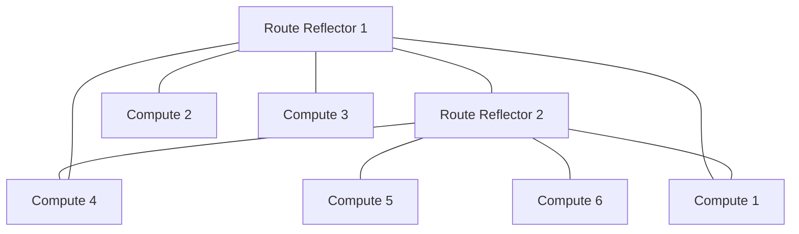

# How to Scale OpenStack Connectivity with Calico

Author: [nawazdhandala](https://github.com/nawazdhandala)

Tags: OpenStack, Calico, Scaling, Networking, Performance

Description: Practical strategies for scaling OpenStack networking with Calico to handle thousands of VMs, covering Felix tuning, route reflector configuration, and connection tracking optimization.

---

## Introduction

Scaling OpenStack connectivity with Calico requires understanding how Calico's Layer 3 architecture behaves as the number of VMs, networks, and security groups grows. Unlike OVS-based solutions that rely on distributed virtual switches, Calico programs routes and iptables rules directly on each compute node. This approach scales well but requires specific tuning as you grow.

This guide addresses the key scaling challenges: route table management, Felix performance tuning, BGP route reflector configuration, and connection tracking limits. We provide concrete configuration changes for environments scaling from hundreds to thousands of VMs.

The most common scaling bottleneck in Calico-based OpenStack deployments is not raw network performance but rather the time it takes for Felix to program security rules and for BGP to converge routes across all compute nodes.

## Prerequisites

- An OpenStack deployment with Calico networking
- At least 10 compute nodes (scaling guidance applies at this threshold)
- `calicoctl` configured with datastore access
- Administrative access to all compute nodes
- Monitoring infrastructure (Prometheus recommended)

## Configuring BGP Route Reflectors

In a full-mesh BGP topology, every node peers with every other node. This does not scale beyond approximately 50 nodes. Route reflectors reduce the number of BGP sessions required.

```yaml
# route-reflector-node.yaml
# Configure dedicated nodes as BGP route reflectors
apiVersion: projectcalico.org/v3
kind: Node
metadata:
  name: compute-rr-01
  labels:
    # Label nodes that serve as route reflectors
    route-reflector: "true"
spec:
  bgp:
    # Unique router ID (typically the node's IP)
    routerID: 192.168.1.10
    # Enable route reflector functionality
    routeReflectorClusterID: 244.0.0.1
```

Configure non-reflector nodes to peer only with route reflectors:

```yaml
# bgp-peer-to-rr.yaml
# All compute nodes peer with route reflectors instead of full mesh
apiVersion: projectcalico.org/v3
kind: BGPPeer
metadata:
  name: peer-to-route-reflectors
spec:
  # Select route reflector nodes
  peerSelector: route-reflector == 'true'
  # Apply to all non-reflector nodes
  nodeSelector: "!route-reflector == 'true'"
```

```bash
# Disable the default full-mesh BGP
calicoctl apply -f - << 'EOF'
apiVersion: projectcalico.org/v3
kind: BGPConfiguration
metadata:
  name: default
spec:
  # Disable node-to-node mesh (using route reflectors instead)
  nodeToNodeMeshEnabled: false
  # Set the cluster AS number
  asNumber: 64512
EOF
```



## Tuning Felix for Scale

Felix manages iptables rules and routes on each compute node. At scale, Felix tuning is critical for convergence time.

```yaml
# felix-configuration.yaml
# Tuned Felix configuration for large-scale deployments
apiVersion: projectcalico.org/v3
kind: FelixConfiguration
metadata:
  name: default
spec:
  # Increase iptables refresh interval for large rule sets
  iptablesRefreshInterval: 90s
  # Increase route refresh interval
  routeRefreshInterval: 90s
  # Use iptables nft backend for better performance on newer kernels
  iptablesBackend: Auto
  # Increase datastore connection timeout for busy clusters
  datastoreConnectionTimeout: 30s
  # Enable BPF dataplane for better performance (requires kernel 5.3+)
  bpfEnabled: false
  # Reduce log verbosity in production
  logSeverityScreen: Warning
  # Connection tracking tuning
  bpfConntrackTimeouts:
    tcpEstablished: 7200
```

## Optimizing Connection Tracking

Large-scale OpenStack deployments can exhaust connection tracking tables. Configure system-level and Calico-level settings.

```bash
#!/bin/bash
# scale-conntrack.sh
# Apply connection tracking optimizations on each compute node

# Increase maximum connection tracking entries
sudo sysctl -w net.netfilter.nf_conntrack_max=1048576

# Increase hash table size (should be ~1/4 of max)
echo 262144 | sudo tee /proc/sys/net/netfilter/nf_conntrack_buckets

# Reduce timeout for TIME_WAIT connections
sudo sysctl -w net.netfilter.nf_conntrack_tcp_timeout_time_wait=30

# Persist settings across reboots
cat << 'EOF' | sudo tee /etc/sysctl.d/99-calico-scale.conf
# Calico scaling optimizations for OpenStack
net.netfilter.nf_conntrack_max = 1048576
net.netfilter.nf_conntrack_tcp_timeout_time_wait = 30
net.core.somaxconn = 65535
net.ipv4.tcp_max_syn_backlog = 65535
EOF

sudo sysctl --system
```

## Monitoring at Scale

Deploy monitoring to track Calico scaling metrics.

```yaml
# calico-monitoring.yaml
# Prometheus ServiceMonitor for Calico Felix metrics
apiVersion: monitoring.coreos.com/v1
kind: ServiceMonitor
metadata:
  name: calico-felix
  namespace: monitoring
spec:
  selector:
    matchLabels:
      k8s-app: calico-node
  endpoints:
    - port: metrics
      interval: 30s
      path: /metrics
```

Key metrics to monitor at scale:

```bash
# Check Felix rule programming latency
curl -s http://localhost:9091/metrics | grep felix_iptables_save_time

# Check route programming time
curl -s http://localhost:9091/metrics | grep felix_route_table_update

# Check BGP session count and status
calicoctl node status | grep -c "Established"

# Check conntrack table usage
cat /proc/sys/net/netfilter/nf_conntrack_count
cat /proc/sys/net/netfilter/nf_conntrack_max
```

## Verification

Verify that scaling optimizations are effective:

```bash
#!/bin/bash
# verify-scale.sh
# Verify scaling configuration is applied correctly

echo "=== BGP Configuration ==="
calicoctl get bgpconfiguration default -o yaml

echo ""
echo "=== Route Reflectors ==="
calicoctl get nodes -l route-reflector=true -o wide

echo ""
echo "=== Felix Configuration ==="
calicoctl get felixconfiguration default -o yaml

echo ""
echo "=== BGP Sessions Per Node ==="
for node in $(calicoctl get nodes -o name); do
  sessions=$(calicoctl node status 2>/dev/null | grep -c "Established")
  echo "${node}: ${sessions} established sessions"
done

echo ""
echo "=== Conntrack Usage ==="
for node in $(cat /etc/hosts | grep compute | awk '{print $2}'); do
  usage=$(ssh ${node} 'cat /proc/sys/net/netfilter/nf_conntrack_count')
  max=$(ssh ${node} 'cat /proc/sys/net/netfilter/nf_conntrack_max')
  echo "${node}: ${usage}/${max} connections tracked"
done
```

## Troubleshooting

- **BGP routes not converging**: Verify route reflectors are healthy and have established sessions. Check `calicoctl node status` on route reflector nodes. Ensure the BGP configuration disables node-to-node mesh.
- **Felix slow to program rules**: Check Felix metrics for `felix_iptables_save_time`. If rule programming is slow, consider enabling the eBPF dataplane for better performance.
- **Conntrack table full**: Increase `nf_conntrack_max` and ensure the kernel module is loaded. Check for connection leaks from misconfigured applications.
- **Route table growing too large**: Use IP pool node selectors to limit route distribution scope. Consider using IPAM blocks to aggregate routes.

## Conclusion

Scaling OpenStack connectivity with Calico requires moving from a full-mesh BGP topology to route reflectors, tuning Felix for large rule sets, and optimizing connection tracking. These changes allow Calico to handle thousands of VMs while maintaining fast convergence and reliable security group enforcement. Monitor the scaling metrics continuously and adjust thresholds as your deployment grows.
