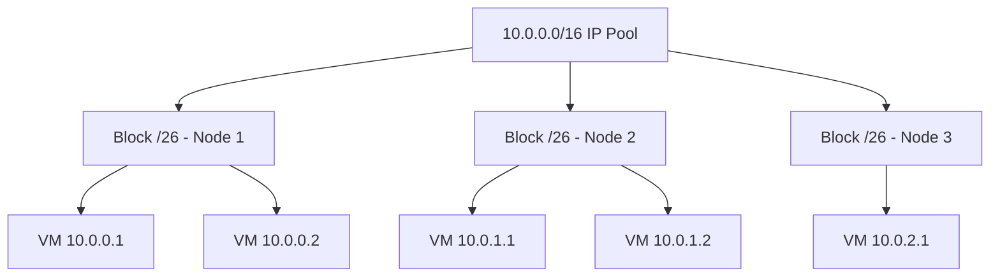

# How to Scale OpenStack Host Routes with Calico

Author: [nawazdhandala](https://github.com/nawazdhandala)

Tags: OpenStack, Calico, Host Routes, Scaling, Networking

Description: A guide to scaling OpenStack host route management with Calico for large deployments, covering route aggregation, BGP optimization, and route table management strategies.

---

## Introduction

As OpenStack deployments grow, the number of host routes managed by Calico increases proportionally with the number of VMs and networks. Each VM creates at least one route entry on its host compute node, and cross-node traffic requires routes to be distributed via BGP. At scale, managing these routes efficiently becomes critical for convergence time and network stability.

This guide addresses the challenges of scaling host routes in a Calico-based OpenStack deployment. We cover route aggregation techniques, BGP route reflector tuning, route table optimization on compute nodes, and monitoring strategies to detect route-related issues before they impact workloads.

Understanding how Calico distributes routes is key: each compute node runs a BIRD BGP daemon that advertises local VM routes and learns remote VM routes from peers or route reflectors.

## Prerequisites

- An OpenStack deployment with Calico networking at scale (100+ VMs)
- `calicoctl` configured with datastore access
- SSH access to compute nodes
- Understanding of BGP routing fundamentals
- Monitoring infrastructure for route table metrics

## Configuring Route Aggregation

Route aggregation reduces the number of individual routes by summarizing contiguous IP blocks into larger CIDR ranges.

```yaml
# ippool-aggregation.yaml
# Configure IP pools with block sizes that enable aggregation
apiVersion: projectcalico.org/v3
kind: IPPool
metadata:
  name: openstack-vms
spec:
  cidr: 10.0.0.0/16
  # Block size determines route aggregation granularity
  # Larger blocks = fewer routes but less efficient IP usage
  blockSize: 26
  natOutgoing: true
  nodeSelector: all()
```

```bash
# Verify current route count on compute nodes
for node in $(openstack compute service list -f value -c Host | sort -u); do
  routes=$(ssh ${node} 'ip route show | wc -l')
  echo "${node}: ${routes} routes"
done

# Check IPAM block allocations
calicoctl ipam show --show-blocks
```



## Optimizing BGP Route Distribution

Tune BIRD configuration for efficient route distribution at scale.

```yaml
# bgp-config-scaled.yaml
# BGP configuration optimized for large route tables
apiVersion: projectcalico.org/v3
kind: BGPConfiguration
metadata:
  name: default
spec:
  # Disable full mesh when using route reflectors
  nodeToNodeMeshEnabled: false
  asNumber: 64512
  # Control which routes are advertised
  prefixAdvertisements:
    - cidr: 10.0.0.0/16
      communities:
        - "64512:100"
  # Keep alive and hold timers for stability
  nodeMeshMaxRestartTime: 120s
```

Configure route reflectors to handle large route tables:

```yaml
# route-reflector-tuned.yaml
# Route reflector node with tuned BGP settings
apiVersion: projectcalico.org/v3
kind: Node
metadata:
  name: rr-node-01
  labels:
    route-reflector: "true"
spec:
  bgp:
    routerID: 192.168.1.10
    routeReflectorClusterID: 244.0.0.1
---
apiVersion: projectcalico.org/v3
kind: BGPPeer
metadata:
  name: rr-mesh
spec:
  # Route reflectors peer with each other
  nodeSelector: route-reflector == 'true'
  peerSelector: route-reflector == 'true'
```

## Monitoring Route Table Health

Set up monitoring to detect route table issues before they cause connectivity problems.

```bash
#!/bin/bash
# monitor-routes.sh
# Monitor route table health across compute nodes

echo "Route Table Health Report - $(date)"
echo "======================================"

for node in $(openstack compute service list -f value -c Host | sort -u); do
  total=$(ssh ${node} 'ip route show | wc -l')
  calico=$(ssh ${node} 'ip route show | grep -c "cali\|bird\|proto bird"')
  bgp_peers=$(ssh ${node} 'sudo calicoctl node status 2>/dev/null | grep -c Established')

  echo "${node}: ${total} total routes, ${calico} Calico routes, ${bgp_peers} BGP peers"

  # Alert if route count is unexpectedly high
  if [ "${total}" -gt 10000 ]; then
    echo "  WARNING: Route count exceeds 10000 on ${node}"
  fi
done
```

## Managing Route Table Size on Compute Nodes

Implement kernel-level optimizations for large route tables.

```bash
#!/bin/bash
# optimize-route-tables.sh
# Apply kernel optimizations for large route tables on compute nodes

# Increase route cache size
sudo sysctl -w net.ipv4.route.max_size=8388608

# Increase neighbor table size for ARP entries
sudo sysctl -w net.ipv4.neigh.default.gc_thresh1=4096
sudo sysctl -w net.ipv4.neigh.default.gc_thresh2=8192
sudo sysctl -w net.ipv4.neigh.default.gc_thresh3=16384

# Persist settings
cat << 'EOF' | sudo tee /etc/sysctl.d/99-calico-routes.conf
# Route table scaling optimizations
net.ipv4.route.max_size = 8388608
net.ipv4.neigh.default.gc_thresh1 = 4096
net.ipv4.neigh.default.gc_thresh2 = 8192
net.ipv4.neigh.default.gc_thresh3 = 16384
EOF

sudo sysctl --system
```

## Verification

Verify that route scaling optimizations are working correctly.

```bash
#!/bin/bash
# verify-route-scaling.sh

echo "=== Route Aggregation ==="
calicoctl get ippools -o yaml | grep blockSize

echo ""
echo "=== BGP Configuration ==="
calicoctl get bgpconfiguration default -o yaml

echo ""
echo "=== Route Reflector Status ==="
calicoctl get nodes -l route-reflector=true -o wide

echo ""
echo "=== Per-Node Route Summary ==="
for node in $(openstack compute service list -f value -c Host | sort -u); do
  routes=$(ssh ${node} 'ip route show proto bird | wc -l')
  echo "${node}: ${routes} BGP-learned routes"
done
```

## Troubleshooting

- **Route count growing unbounded**: Check for IP address leaks from terminated VMs. Verify that Calico garbage collection is cleaning up stale endpoints with `calicoctl get workloadendpoints`.
- **BGP convergence slow after node restart**: Increase the BIRD graceful restart timer. Check that route reflectors have sufficient memory for the full route table.
- **Kernel route cache exhaustion**: Increase `net.ipv4.route.max_size`. Monitor with `cat /proc/net/rt_cache | wc -l` on affected nodes.
- **ARP table overflow**: Increase neighbor table thresholds. This manifests as intermittent connectivity when the ARP table churns entries.

## Conclusion

Scaling OpenStack host routes with Calico requires attention to route aggregation, BGP topology, and kernel-level tuning. By configuring appropriate IPAM block sizes, deploying route reflectors, and optimizing kernel route table parameters, you can maintain fast convergence and stable routing for large-scale OpenStack deployments. Monitor route table health continuously to catch issues before they affect VM connectivity.
