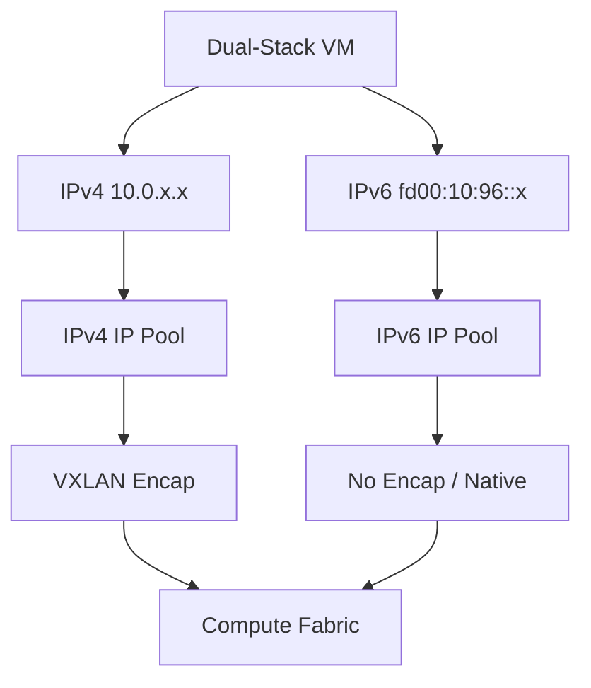

# How to Scale OpenStack IPv6 with Calico

Author: [nawazdhandala](https://github.com/nawazdhandala)

Tags: OpenStack, Calico, IPv6, Scaling, Networking

Description: A practical guide to scaling IPv6 networking in OpenStack with Calico, covering dual-stack configuration, IPv6 route management, neighbor discovery optimization, and large-scale deployment strategies.

---

## Introduction

IPv6 adoption in OpenStack environments is growing as organizations prepare for IPv4 address exhaustion and implement dual-stack networking. Calico supports IPv6 natively, but scaling IPv6 requires specific attention to neighbor discovery, route table management, and dual-stack policy configuration that differs from IPv4-only deployments.

This guide covers configuring and scaling IPv6 in OpenStack with Calico, from initial dual-stack setup through optimization for large deployments. We address IPv6-specific challenges including neighbor discovery protocol (NDP) scaling, extended route tables, and security group considerations for IPv6 traffic.

The key architectural difference with IPv6 in Calico is that neighbor discovery replaces ARP, and the larger address space means more route entries per VM if using full /128 routes rather than aggregated blocks.

## Prerequisites

- An OpenStack deployment with Calico networking
- IPv6 connectivity between compute nodes
- Understanding of IPv6 addressing and subnetting
- `calicoctl` configured with datastore access
- Kernel version 4.x or later with full IPv6 support

## Configuring Dual-Stack IP Pools

Set up IPv6 IP pools alongside existing IPv4 pools for dual-stack operation.

```yaml
# ipv6-ippool.yaml
# IPv6 IP pool for OpenStack VMs
apiVersion: projectcalico.org/v3
kind: IPPool
metadata:
  name: openstack-ipv6
spec:
  # Use a ULA or GUA range for your VMs
  cidr: fd00:10:96::/48
  # Block size for IPv6 (default is /122, 64 addresses per block)
  blockSize: 122
  # IPv6 does not use NAT typically
  natOutgoing: false
  # Use no encapsulation for IPv6 when possible
  encapsulation: None
  nodeSelector: all()
---
# Ensure IPv4 pool also exists for dual-stack
apiVersion: projectcalico.org/v3
kind: IPPool
metadata:
  name: openstack-ipv4
spec:
  cidr: 10.0.0.0/16
  blockSize: 26
  natOutgoing: true
  encapsulation: VXLAN
  nodeSelector: all()
```

```bash
# Apply the dual-stack IP pools
calicoctl apply -f ipv6-ippool.yaml

# Verify both pools are active
calicoctl get ippools -o wide
```

## Optimizing IPv6 Neighbor Discovery at Scale

IPv6 uses Neighbor Discovery Protocol (NDP) instead of ARP. At scale, NDP can generate significant traffic. Optimize kernel parameters on compute nodes.

```bash
#!/bin/bash
# optimize-ipv6-ndp.sh
# Optimize IPv6 neighbor discovery on compute nodes

# Increase IPv6 neighbor table sizes
sudo sysctl -w net.ipv6.neigh.default.gc_thresh1=4096
sudo sysctl -w net.ipv6.neigh.default.gc_thresh2=8192
sudo sysctl -w net.ipv6.neigh.default.gc_thresh3=16384

# Increase route table cache for IPv6
sudo sysctl -w net.ipv6.route.max_size=16384

# Reduce NDP retransmit timer for faster resolution
sudo sysctl -w net.ipv6.neigh.default.retrans_time_ms=1000

# Persist settings
cat << 'EOF' | sudo tee /etc/sysctl.d/99-calico-ipv6.conf
# IPv6 scaling optimizations for Calico
net.ipv6.neigh.default.gc_thresh1 = 4096
net.ipv6.neigh.default.gc_thresh2 = 8192
net.ipv6.neigh.default.gc_thresh3 = 16384
net.ipv6.route.max_size = 16384
net.ipv6.neigh.default.retrans_time_ms = 1000
EOF

sudo sysctl --system
```



## Configuring IPv6 Security Policies

Create network policies that handle both IPv4 and IPv6 traffic.

```yaml
# dual-stack-policy.yaml
# Network policy for dual-stack environment
apiVersion: projectcalico.org/v3
kind: GlobalNetworkPolicy
metadata:
  name: dual-stack-web-policy
spec:
  selector: role == 'web'
  types:
    - Ingress
    - Egress
  ingress:
    # Allow HTTP over both IPv4 and IPv6
    - action: Allow
      protocol: TCP
      destination:
        ports:
          - 80
          - 443
    # Allow ICMPv6 (required for IPv6 to function)
    - action: Allow
      protocol: ICMPv6
  egress:
    # Allow DNS over both protocols
    - action: Allow
      protocol: UDP
      destination:
        ports:
          - 53
    # Allow all IPv6 traffic to internal range
    - action: Allow
      destination:
        nets:
          - fd00:10:96::/48
    # Allow all IPv4 traffic to internal range
    - action: Allow
      destination:
        nets:
          - 10.0.0.0/8
```

## Scaling BGP for IPv6 Routes

Configure BGP to handle IPv6 route distribution efficiently.

```yaml
# bgp-ipv6-config.yaml
# BGP configuration with IPv6 support
apiVersion: projectcalico.org/v3
kind: BGPConfiguration
metadata:
  name: default
spec:
  nodeToNodeMeshEnabled: false
  asNumber: 64512
  # Enable both IPv4 and IPv6 address families
  serviceClusterIPs:
    - cidr: 10.96.0.0/12
    - cidr: fd00:10:96::/108
```

## Verification

Verify dual-stack connectivity and route distribution.

```bash
#!/bin/bash
# verify-ipv6-scale.sh
# Verify IPv6 scaling configuration

echo "=== IPv6 IP Pool Status ==="
calicoctl get ippools -o wide | grep -i ipv6
calicoctl get ippools -o wide | grep fd00

echo ""
echo "=== IPv6 Routes on Compute Nodes ==="
for node in $(openstack compute service list -f value -c Host | sort -u); do
  v6routes=$(ssh ${node} 'ip -6 route show proto bird | wc -l')
  echo "${node}: ${v6routes} IPv6 BGP routes"
done

echo ""
echo "=== IPv6 Neighbor Table ==="
for node in $(openstack compute service list -f value -c Host | sort -u); do
  neighbors=$(ssh ${node} 'ip -6 neigh show | wc -l')
  echo "${node}: ${neighbors} IPv6 neighbors"
done

echo ""
echo "=== Dual-Stack Connectivity Test ==="
echo "Create a test VM and verify it gets both IPv4 and IPv6 addresses"
```

## Troubleshooting

- **VMs not getting IPv6 addresses**: Verify the IPv6 IP pool exists and has available addresses. Check that the OpenStack subnet is configured for IPv6 with SLAAC or DHCPv6.
- **IPv6 connectivity fails between VMs**: Check that ICMPv6 is allowed in security groups (required for NDP). Verify IPv6 routes exist on compute nodes with `ip -6 route show proto bird`.
- **NDP table overflow**: Increase `gc_thresh` values for IPv6 neighbor tables. This manifests as intermittent IPv6 connectivity when the neighbor table is full.
- **BGP not advertising IPv6 routes**: Verify BIRD is configured for the IPv6 address family. Check BIRD logs for IPv6-specific errors.

## Conclusion

Scaling IPv6 in OpenStack with Calico requires attention to NDP optimization, dual-stack policy configuration, and BGP tuning for the larger route tables that IPv6 brings. By configuring appropriate IP pools, optimizing kernel parameters, and ensuring security policies cover both address families, you can build a reliable dual-stack OpenStack deployment that scales to thousands of VMs.
