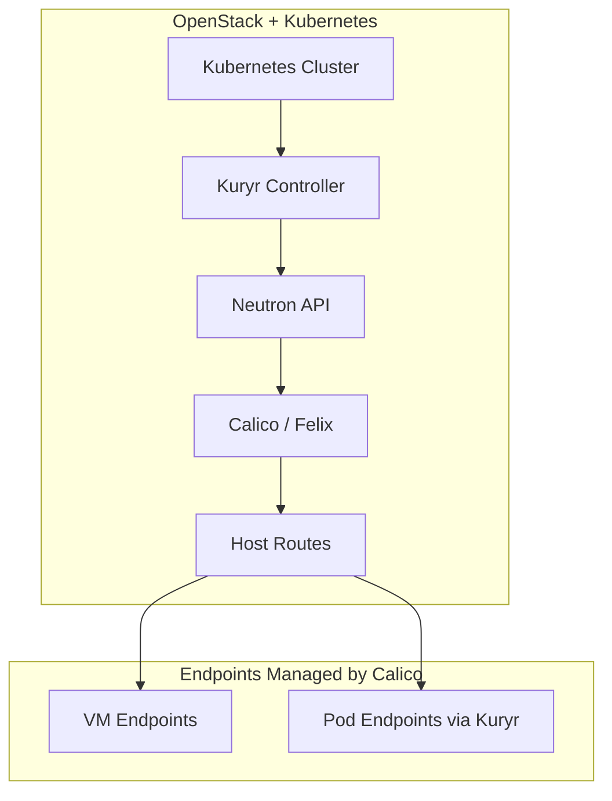

# How to Scale OpenStack Kuryr with Calico

Author: [nawazdhandala](https://github.com/nawazdhandala)

Tags: OpenStack, Calico, Kuryr, Scaling, Kubernetes

Description: A practical guide to scaling OpenStack Kuryr integration with Calico for environments running Kubernetes on OpenStack, covering network coordination, pod-to-VM communication, and performance...

---

## Introduction

Kuryr bridges Kubernetes networking with OpenStack Neutron, allowing pods running on OpenStack VMs to use Neutron-managed networks directly. When Calico is the networking backend for OpenStack, scaling Kuryr requires careful coordination between Kubernetes pod networking, Calico route management, and Neutron API performance.

This guide addresses the scaling challenges that emerge when Kuryr connects Kubernetes clusters running on OpenStack with Calico networking. We cover optimizing Neutron API interactions, managing the increased route table from both VM and pod traffic, and tuning Calico to handle the additional workload endpoints that Kuryr creates.

The key scaling constraint with Kuryr and Calico is that every Kubernetes pod creates a Neutron port, which translates to a Calico workload endpoint. This multiplies the number of endpoints Calico must manage beyond what pure VM networking requires.

## Prerequisites

- OpenStack deployment with Calico networking
- Kubernetes cluster deployed on OpenStack VMs with Kuryr-Kubernetes
- `openstack`, `kubectl`, and `calicoctl` CLI tools configured
- Understanding of both OpenStack Neutron and Kubernetes networking
- Monitoring for both OpenStack and Kubernetes components

## Optimizing Neutron API Performance for Kuryr

Kuryr creates Neutron ports for every pod, which can overwhelm the Neutron API at scale.

```bash
# Check current Neutron port count
openstack port list --project kubernetes -f value -c ID | wc -l

# Monitor Neutron API response times
# Check Neutron server logs for slow queries
sudo grep "took.*seconds" /var/log/neutron/server.log | tail -20
```

Configure Neutron for higher throughput:

```bash
# /etc/neutron/neutron.conf optimizations
# Increase API workers for more concurrent requests
cat << 'EOF' | sudo tee /etc/neutron/neutron.conf.d/kuryr-scale.conf
[DEFAULT]
# Increase API workers to handle Kuryr port creation
api_workers = 8

# Increase RPC workers for internal communication
rpc_workers = 8

# Increase database connection pool
[database]
max_pool_size = 30
max_overflow = 40
EOF

# Restart Neutron server after configuration changes
sudo systemctl restart neutron-server
```

## Tuning Calico for Combined VM and Pod Endpoints

Configure Felix to handle the increased endpoint count from both VMs and Kuryr-managed pods.

```yaml
# felix-kuryr-tuned.yaml
# Felix configuration tuned for Kuryr scaling
apiVersion: projectcalico.org/v3
kind: FelixConfiguration
metadata:
  name: default
spec:
  # Increase iptables mark bits for more endpoints
  iptablesMarkMask: 0xffff0000
  # Increase refresh intervals for large endpoint counts
  iptablesRefreshInterval: 120s
  routeRefreshInterval: 120s
  # Increase max ipset size for large deployments
  maxIpsetSize: 1048576
  # Reduce log verbosity to avoid I/O bottlenecks
  logSeverityScreen: Warning
```

```bash
# Apply Felix configuration
calicoctl apply -f felix-kuryr-tuned.yaml

# Monitor Felix endpoint processing
curl -s http://localhost:9091/metrics | grep felix_active_local_endpoints
```



## Scaling Route Distribution

With Kuryr, the number of routes increases significantly. Configure route reflectors and IPAM to handle the load.

```yaml
# kuryr-ippool.yaml
# Separate IP pool for Kuryr pods
apiVersion: projectcalico.org/v3
kind: IPPool
metadata:
  name: kuryr-pods
spec:
  cidr: 10.100.0.0/16
  # Larger block size for pod density
  blockSize: 24
  natOutgoing: true
  encapsulation: VXLAN
  nodeSelector: all()
---
# Existing VM pool remains unchanged
apiVersion: projectcalico.org/v3
kind: IPPool
metadata:
  name: openstack-vms
spec:
  cidr: 10.0.0.0/16
  blockSize: 26
  natOutgoing: true
  encapsulation: VXLAN
  nodeSelector: all()
```

## Monitoring Kuryr Scale Metrics

```bash
#!/bin/bash
# monitor-kuryr-scale.sh
# Monitor key metrics for Kuryr + Calico scaling

echo "Kuryr + Calico Scale Report - $(date)"
echo "======================================="

echo ""
echo "=== Neutron Ports ==="
echo "Total ports: $(openstack port list --all-projects -f value -c ID | wc -l)"
echo "Kuryr ports: $(openstack port list --project kubernetes -f value -c ID | wc -l)"

echo ""
echo "=== Calico Endpoints ==="
echo "Total endpoints: $(calicoctl get workloadendpoints --all-namespaces -o json | python3 -c 'import json,sys; print(len(json.load(sys.stdin).get("items",[])))')"

echo ""
echo "=== Felix Performance ==="
for node in $(openstack compute service list -f value -c Host | sort -u); do
  endpoints=$(ssh ${node} 'curl -s localhost:9091/metrics 2>/dev/null | grep felix_active_local_endpoints | grep -v "#"' 2>/dev/null)
  echo "${node}: ${endpoints}"
done

echo ""
echo "=== Route Counts ==="
for node in $(openstack compute service list -f value -c Host | sort -u); do
  routes=$(ssh ${node} 'ip route show proto bird | wc -l')
  echo "${node}: ${routes} routes"
done
```

## Verification

```bash
#!/bin/bash
# verify-kuryr-scale.sh
echo "=== Kuryr Scaling Verification ==="

echo "IP Pools:"
calicoctl get ippools -o wide

echo ""
echo "Felix Configuration:"
calicoctl get felixconfiguration default -o yaml | grep -E "(iptablesRefreshInterval|routeRefreshInterval|maxIpsetSize)"

echo ""
echo "Neutron API Health:"
openstack port list --limit 1 > /dev/null 2>&1 && echo "Neutron API: Responsive" || echo "Neutron API: Slow/Unavailable"
```

## Troubleshooting

- **Pod creation slow**: Check Neutron API response times. Kuryr creates a Neutron port for each pod, and slow API responses delay pod scheduling.
- **Felix high CPU usage**: With many endpoints, Felix spends more time computing iptables rules. Consider enabling eBPF dataplane or increasing refresh intervals.
- **Routes not converging**: Check route reflector capacity. Combined VM and pod routes can exceed route reflector memory. Add more reflectors if needed.
- **Neutron port leaks**: Verify Kuryr cleanup on pod deletion. Check for orphaned ports with `openstack port list --device-owner kuryr:bound` and compare with running pods.

## Conclusion

Scaling Kuryr with Calico in OpenStack requires coordinating Neutron API capacity, Calico endpoint management, and route distribution for both VM and pod traffic. By tuning Felix, optimizing Neutron, and monitoring endpoint counts, you can handle the increased load that Kuryr brings to a Calico-based OpenStack deployment. Monitor Neutron port counts and Calico endpoint metrics continuously to stay ahead of scaling limits.
