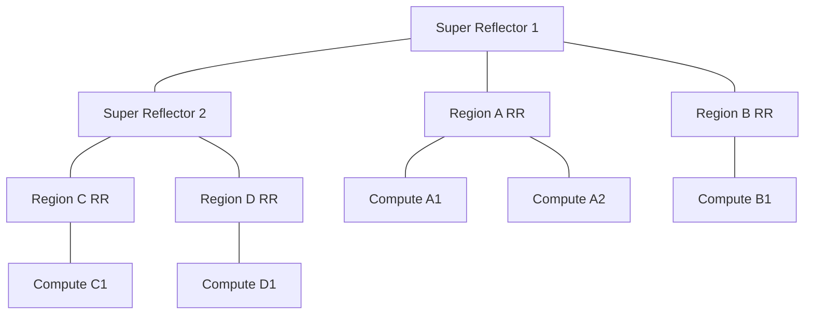

# How to Scale OpenStack Multiple Regions with Calico

Author: [nawazdhandala](https://github.com/nawazdhandala)

Tags: OpenStack, Calico, Multi-Region, Scaling, Networking

Description: Strategies for scaling Calico networking across multiple OpenStack regions, covering route reflector hierarchies, cross-region policy synchronization, and performance optimization for large...

---

## Introduction

Scaling a multi-region OpenStack deployment with Calico introduces challenges beyond what a single-region deployment faces. Cross-region route tables grow with each region added, BGP peering topology becomes more complex, and policy synchronization must remain consistent across an expanding number of regions.

This guide addresses the scaling strategies needed when your multi-region Calico deployment grows from two or three regions to ten or more. We cover hierarchical route reflector topologies, automated policy synchronization, cross-region traffic optimization, and monitoring at multi-region scale.

The key insight for multi-region scaling is that each region should be as self-contained as possible, with cross-region connectivity treated as an exception rather than the default path.

## Prerequisites

- Multiple OpenStack regions with Calico networking (3+ regions)
- BGP connectivity between regions
- A centralized configuration management system (Git, Ansible, etc.)
- Monitoring infrastructure spanning all regions
- Understanding of BGP route reflector hierarchies

## Hierarchical Route Reflector Topology

For multi-region scale, use a two-tier route reflector hierarchy: regional reflectors within each region, and super-reflectors for cross-region routes.

```yaml
# super-reflector.yaml
# Top-tier route reflector for cross-region route distribution
apiVersion: projectcalico.org/v3
kind: Node
metadata:
  name: super-rr-01
  labels:
    route-reflector: "true"
    reflector-tier: "super"
    region: gateway
spec:
  bgp:
    routerID: 172.16.0.10
    routeReflectorClusterID: 244.0.0.1
---
# Regional route reflector (one per region)
apiVersion: projectcalico.org/v3
kind: Node
metadata:
  name: region-a-rr-01
  labels:
    route-reflector: "true"
    reflector-tier: "regional"
    region: region-a
spec:
  bgp:
    routerID: 10.10.0.10
    routeReflectorClusterID: 244.0.0.10
```

Configure the peering hierarchy:

```yaml
# regional-to-super-peer.yaml
# Regional reflectors peer with super reflectors
apiVersion: projectcalico.org/v3
kind: BGPPeer
metadata:
  name: regional-to-super
spec:
  nodeSelector: reflector-tier == 'regional'
  peerSelector: reflector-tier == 'super'
---
# Compute nodes peer only with their regional reflector
apiVersion: projectcalico.org/v3
kind: BGPPeer
metadata:
  name: compute-to-regional
spec:
  nodeSelector: "!has(route-reflector)"
  peerSelector: reflector-tier == 'regional'
```



## Automated Policy Synchronization

Use a GitOps approach to keep policies consistent across all regions.

```bash
#!/bin/bash
# sync-policies.sh
# Synchronize global policies across all regions from Git

POLICY_REPO="/opt/calico-policies"
REGIONS=("region-a" "region-b" "region-c" "region-d")

# Pull latest policies from version control
cd ${POLICY_REPO}
git pull origin main

# Apply to each region
for region in "${REGIONS[@]}"; do
  KUBECONFIG="/etc/calico/regions/${region}/kubeconfig"
  echo "Syncing policies to ${region}..."

  for policy in global-policies/*.yaml; do
    DATASTORE_TYPE=kubernetes KUBECONFIG=${KUBECONFIG} \
      calicoctl apply -f ${policy} 2>&1
    if [ $? -ne 0 ]; then
      echo "  ERROR: Failed to apply $(basename ${policy}) to ${region}"
    fi
  done

  echo "  Applied $(ls global-policies/*.yaml | wc -l) policies"
done
```

## Cross-Region Traffic Optimization

Configure route filtering to minimize cross-region route table size.

```yaml
# region-a-bgp-filter.yaml
# Only advertise aggregate routes cross-region (not individual VM routes)
apiVersion: projectcalico.org/v3
kind: BGPFilter
metadata:
  name: cross-region-filter
spec:
  exportV4:
    # Only export the aggregate region CIDR, not individual blocks
    - action: Accept
      matchOperator: Equal
      cidr: 10.10.0.0/16
    - action: Reject
      matchOperator: In
      cidr: 10.10.0.0/16
```

## Monitoring Multi-Region Scale

```bash
#!/bin/bash
# monitor-multi-region.sh
# Monitor Calico health across all regions

echo "Multi-Region Calico Status - $(date)"
echo "======================================="

REGIONS=("region-a" "region-b" "region-c" "region-d")

for region in "${REGIONS[@]}"; do
  KUBECONFIG="/etc/calico/regions/${region}/kubeconfig"
  echo ""
  echo "--- ${region} ---"

  # Node count
  nodes=$(DATASTORE_TYPE=kubernetes KUBECONFIG=${KUBECONFIG} \
    calicoctl get nodes -o json 2>/dev/null | python3 -c "import json,sys; print(len(json.load(sys.stdin).get('items',[])))")
  echo "  Nodes: ${nodes}"

  # Endpoint count
  endpoints=$(DATASTORE_TYPE=kubernetes KUBECONFIG=${KUBECONFIG} \
    calicoctl get workloadendpoints --all-namespaces -o json 2>/dev/null | python3 -c "import json,sys; print(len(json.load(sys.stdin).get('items',[])))")
  echo "  Endpoints: ${endpoints}"

  # Policy count
  policies=$(DATASTORE_TYPE=kubernetes KUBECONFIG=${KUBECONFIG} \
    calicoctl get globalnetworkpolicies -o json 2>/dev/null | python3 -c "import json,sys; print(len(json.load(sys.stdin).get('items',[])))")
  echo "  Policies: ${policies}"
done
```

## Verification

```bash
#!/bin/bash
# verify-multi-region-scale.sh
echo "=== Multi-Region Scaling Verification ==="

echo "Route Reflector Hierarchy:"
for region in region-a region-b; do
  KUBECONFIG="/etc/calico/regions/${region}/kubeconfig"
  echo "${region} reflectors:"
  DATASTORE_TYPE=kubernetes KUBECONFIG=${KUBECONFIG} \
    calicoctl get nodes -l route-reflector=true -o wide 2>/dev/null
done

echo ""
echo "Cross-Region BGP Peers:"
calicoctl get bgppeers -o wide

echo ""
echo "Policy Consistency:"
# Compare policy counts across regions
for region in region-a region-b; do
  KUBECONFIG="/etc/calico/regions/${region}/kubeconfig"
  count=$(DATASTORE_TYPE=kubernetes KUBECONFIG=${KUBECONFIG} \
    calicoctl get globalnetworkpolicies -o name 2>/dev/null | wc -l)
  echo "  ${region}: ${count} policies"
done
```

## Troubleshooting

- **Cross-region routes missing**: Check the super-reflector BGP sessions. Verify that regional reflectors are peering with super-reflectors correctly.
- **Policy drift between regions**: Check Git sync status. Ensure the policy synchronization script ran successfully in all regions.
- **Route table too large in gateway nodes**: Implement BGP route filtering to aggregate routes. Only advertise region-level CIDRs cross-region.
- **New region not receiving routes**: Verify the new region's reflectors are peering with super-reflectors. Check BGP configuration and AS numbers.

## Conclusion

Scaling Calico across multiple OpenStack regions requires a hierarchical approach to route distribution, automated policy synchronization, and cross-region route optimization. By implementing tiered route reflectors, GitOps-based policy management, and aggregate route advertising, you can scale to many regions while maintaining consistent networking and security policies. Monitor cross-region BGP health and policy consistency as your deployment grows.
