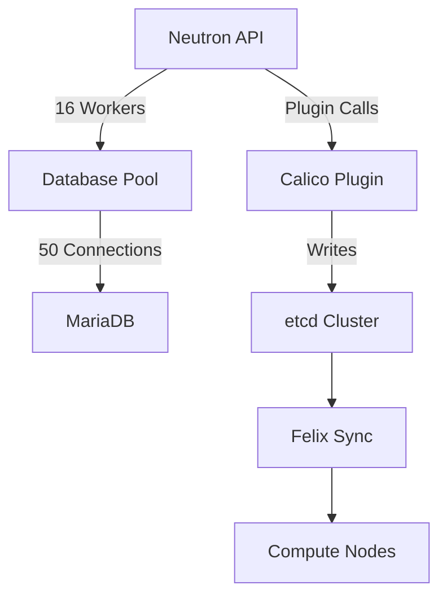

# How to Scale OpenStack Neutron API Integration with Calico

Author: [nawazdhandala](https://github.com/nawazdhandala)

Tags: OpenStack, Calico, Neutron, API, Scaling

Description: A guide to scaling the Neutron API integration with Calico for large OpenStack deployments, covering API worker tuning, database optimization, and datastore performance improvements.

---

## Introduction

As OpenStack deployments grow, the Neutron API becomes a bottleneck when every VM creation, deletion, and security group change must flow through it to reach Calico. Scaling the Neutron-Calico integration requires tuning the API layer, optimizing the database backend, and ensuring the Calico datastore can handle the increased write volume.

This guide covers the practical steps to scale the Neutron API with Calico from hundreds to thousands of concurrent VMs. We address API worker configuration, database connection pooling, Calico datastore performance, and request batching strategies.

The most common scaling bottleneck is not Calico itself but the Neutron API and database layer. Calico's data plane scales well, but the control plane path through Neutron needs attention at scale.

## Prerequisites

- An OpenStack deployment with Calico networking handling 500+ VMs
- Administrative access to Neutron server configuration
- Database server (MariaDB/PostgreSQL) with tuning access
- Calico datastore (etcd) with performance monitoring
- Prometheus or similar monitoring for API metrics

## Scaling Neutron API Workers

Increase API workers to handle more concurrent requests.

```bash
# /etc/neutron/neutron.conf
# Scale API workers based on CPU cores
cat << 'EOF' | sudo tee /etc/neutron/neutron.conf.d/scale.conf
[DEFAULT]
# Set API workers to 2x CPU cores for Calico workloads
# Calico plugin is I/O heavy (etcd writes), so more workers help
api_workers = 16

# Increase RPC workers for internal messaging
rpc_workers = 8

# Increase RPC response timeout for busy clusters
rpc_response_timeout = 120

[database]
# Increase connection pool for more workers
max_pool_size = 50
max_overflow = 60
pool_timeout = 30

# Enable connection recycling
connection_recycle_time = 3600

[oslo_messaging_rabbit]
# Increase RabbitMQ connection pool
rpc_conn_pool_size = 60
EOF

# Apply changes
sudo systemctl restart neutron-server
```

## Optimizing Database Performance

Tune the Neutron database for high-throughput operations.

```bash
# MariaDB/MySQL tuning for Neutron + Calico
cat << 'EOF' | sudo tee /etc/mysql/mariadb.conf.d/99-neutron-scale.cnf
[mysqld]
# Buffer pool should be 70-80% of available memory
innodb_buffer_pool_size = 8G

# Increase concurrent connections
max_connections = 500

# Optimize for write-heavy Neutron workloads
innodb_flush_log_at_trx_commit = 2
innodb_flush_method = O_DIRECT

# Increase thread cache for connection reuse
thread_cache_size = 128

# Query cache (disable for write-heavy workloads)
query_cache_type = 0
query_cache_size = 0
EOF

sudo systemctl restart mariadb
```

## Scaling the Calico Datastore

If using etcd as the Calico datastore, tune it for the increased write volume.

```bash
# etcd performance tuning
# Increase request size limit for large policy sets
cat << 'EOF' | sudo tee /etc/etcd/etcd.conf.d/scale.conf
# Increase snapshot threshold for write-heavy workloads
ETCD_SNAPSHOT_COUNT=50000

# Increase backend quota (default is 2GB, increase for large deployments)
ETCD_QUOTA_BACKEND_BYTES=8589934592

# Auto-compact to reclaim storage
ETCD_AUTO_COMPACTION_RETENTION=1
ETCD_AUTO_COMPACTION_MODE=periodic
EOF

sudo systemctl restart etcd
```

Monitor etcd performance:

```bash
#!/bin/bash
# monitor-etcd-scale.sh
# Monitor etcd performance for Calico scaling

echo "=== etcd Performance Report ==="

# Check cluster health
etcdctl endpoint health

# Check database size
etcdctl endpoint status --write-out=table

# Check request latency
etcdctl check perf --load="m" 2>&1 | head -10

# Count Calico keys
echo ""
echo "Calico keys in etcd:"
etcdctl get /calico --prefix --keys-only | wc -l
```



## Implementing Request Batching

For bulk operations, batch API requests to reduce overhead.

```bash
#!/bin/bash
# batch-port-creation.sh
# Create multiple ports in batch for better performance

NETWORK_ID=$(openstack network show batch-test-net -f value -c id)

# Create ports in parallel using xargs
seq 1 100 | xargs -P 10 -I {} \
  openstack port create \
    --network ${NETWORK_ID} \
    --security-group default \
    batch-port-{} 2>/dev/null

echo "Created 100 ports in parallel"

# Verify all ports were created
openstack port list --network ${NETWORK_ID} -f value -c ID | wc -l
```

## Verification

```bash
#!/bin/bash
# verify-neutron-scale.sh
echo "=== Neutron API Scaling Verification ==="

echo "API Workers:"
ps aux | grep "neutron-server" | grep -v grep | wc -l

echo ""
echo "Database Connections:"
mysql -e "SHOW STATUS LIKE 'Threads_connected';"

echo ""
echo "API Response Time (create network):"
time openstack network create scale-test-net > /dev/null 2>&1
openstack network delete scale-test-net

echo ""
echo "etcd Cluster Health:"
etcdctl endpoint health
```

## Troubleshooting

- **API timeouts under load**: Increase `api_workers` and database `max_pool_size`. Check if the database server CPU or disk I/O is saturated.
- **Database connection exhaustion**: Increase `max_connections` in MariaDB and `max_pool_size` in Neutron. Verify connections are being properly returned to the pool.
- **etcd write latency high**: Check etcd disk I/O. etcd performance is heavily dependent on disk write speed. Use SSDs for etcd storage. Consider a dedicated etcd cluster for Calico.
- **Neutron port creation slow**: Profile the Calico plugin code path. Check if etcd writes are the bottleneck. Consider enabling etcd auto-compaction to reduce database size.

## Conclusion

Scaling the Neutron API integration with Calico requires attention to API workers, database tuning, and Calico datastore performance. By increasing concurrency at each layer and monitoring for bottlenecks, you can support thousands of VMs through the Neutron-Calico integration path. Monitor API response times and database performance continuously as your deployment grows.
